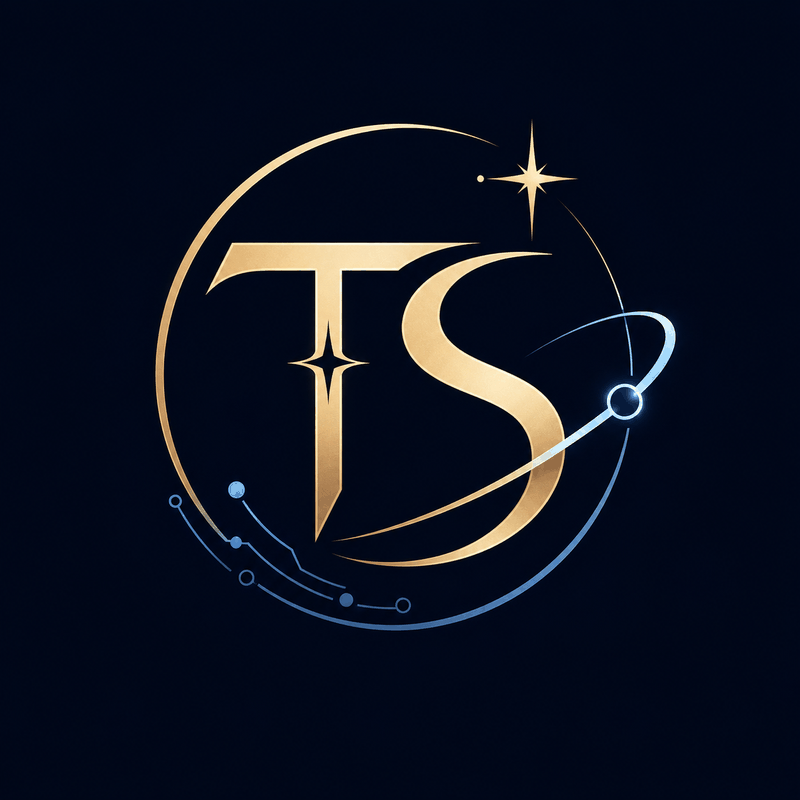

<div align="center">



# Tianshu

**An async, governable, self-improving AI execution platform — organized like an imperial court.**

*[中文 README](README.md) · Tianshu (天枢) is the first star of the Big Dipper — the pivot the sky turns around.*

[](https://github.com/MJ-CJM/tianshu/actions/workflows/ci.yml)
[](https://www.python.org/)
[](LICENSE)
[](https://github.com/MJ-CJM/tianshu/stargazers)

</div>

---

## What is this

Tianshu is an **async, governable, self-improving** AI execution platform. You issue an **Edict** (a task) via Web, API, CLI, Feishu, or Telegram; the system turns that goal into a **schedulable, approvable, auditable, replayable** execution chain, and settles it into execution records, an event timeline, a cost ledger, long-term memory, and supervision reports.

Its organizing metaphor is the six-ministry bureaucracy of Ming-dynasty China: the system is a set of **officials (Personas)**, each with a job — the **Cabinet** plans, the **Ministry of War** executes, the **Censorate** audits, the **Bureau of Transmission** notifies, the **Library** holds memory, the **Ministry of Revenue** tracks cost. The metaphor is just a shell; in code it's cleanly decoupled modules.

```text
Edict → Scheduler → Planner → Agent/DAG/long-task loop
   → Auditor → Notifier → Memory / Profile / Skill growth
```

> Unlike a chat-style "ask-and-answer" agent, Tianshu targets **async, long-horizon, governance-heavy** work: after you issue an edict, a background event chain drives it forward, and every step is logged, interruptible, and replayable.

## Positioning: the supervising office above Claude Code

Claude Code is the knife in your hand when you're at the keyboard. **Tianshu is the office that runs while you're away** — and it works both ways:

- **Claude Code can command Tianshu** — Tianshu is an MCP server (`POST /mcp`), so any MCP host issues edicts, checks status, reads results.
- **Tianshu can dispatch Claude Code** — the *Keqing* (客卿, "guest strategist") executor sends Claude Code or Codex out to work, under full Tianshu governance (approval / audit / budget / cost attribution). Whatever it changes is backed by shadow snapshots — one-click file rollback.

Both directions stay inside the governance frame. It borrows Claude Code's power without competing with it.

## The moat: governance × self-improvement

Most agent frameworks pick one. Tianshu's differentiator is the **intersection**:

- **Governance you can trust with hands off** — tool tiers, a policy pipeline, human approval (sign off from your phone), session rules, and a runtime defense-in-depth layer (outbound secret redaction, per-segment bash risk grading, subprocess clean-env, tiered emergency stop). Power, always under control.
- **Self-improvement that proves it got better** — behavior + code parallel "universes" (snapshot / branch / roll back), **paired sandbox evaluation** with fitness gating and auto-promotion. Evolution is off by default; after a week of clean runs the system *petitions you* to unlock it.

Neither half is unique on its own. The intersection — a platform that both governs tightly and evolves safely — has no complete equivalent on the market.

## Hands-off insurance (the four brakes)

"Dare to let go" only works if letting go is safe. Four brakes:

1. **Budget circuit breaker** — per-edict cost cap, trips on exceed.
2. **Phone approval** — dangerous actions wait for your sign-off in Feishu/Telegram.
3. **Shadow snapshot rollback** — every executor run is snapshotted to an *independent* GIT_DIR (never touches your `.git`); revert file changes with one command.
4. **Factory budget guardrail** — a default daily spend cap ships on; over-limit trips the breaker and notifies you.

## Feature highlights

- **🏛️ Six ministries** — planning / execution / audit / notify / memory / cost officials, coordinating over a shared "court" context.
- **🧠 Memory palace + growth flywheel** — layered memory (Markdown source of truth + SQLite/FTS5 index + snapshots), progressive skill learning, persona profiling. It understands you more the more you use it.
- **🥷 Runtime defense-in-depth (Jinyiwei)** — outbound redaction, per-segment bash grading (blocks `git log; rm -rf /`-style bypasses), clean-env, tiered emergency stop. See [SECURITY.md](SECURITY.md).
- **🌌 Parallel-universe evolution** — capture behavior (and code) as branchable, switchable, comparable snapshots; candidates explored at low traffic, promoted by **fitness** — "palace-flavored git" for self-improvement.
- **📏 Regression evals + failure attribution** — `tianshu evals run` replays historical tasks in a sandbox and scores them, so "it got better" is provable; a 17-class failure taxonomy auto-attributes every failure.
- **🤝 Two-way interop** — commanded by Claude Code (MCP server) *and* dispatches Claude Code/Codex (Keqing executor) — both inside governance.
- **💸 Cost governance** — token metering, budget breakers, attribution by model / task / official.

## Quick start

```bash
# Backend
uv sync --extra all --extra dev
cp .env.example .env   # fill in TIANSHU_LLM_API_KEY
uv run tianshu doctor  # startup self-check
uv run uvicorn tianshu.app:create_app --factory --reload

# Frontend (separate terminal)
cd web && npm install && npm run dev
```

Drive it from Claude Code:

```bash
claude mcp add --transport http tianshu http://localhost:8000/mcp
```

## Cost transparency

A platform that sells cost governance must dare to report its own cost. Typical monthly cost range and the measurement method are in [docs/launch/cost-baseline.md](docs/launch/cost-baseline.md). The factory daily budget guardrail is on by default.

## Governance defaults (privacy first)

| Setting | Default | Toggle |
|---|---|---|
| Telemetry | **off** | `TIANSHU_TELEMETRY=on` (version + startup event only, one env to disable forever) |
| Self-evolution | **off** | unlocked by an in-system petition after threshold |
| OTel tracing | **off** | set `TIANSHU_OTEL_ENDPOINT` |
| Daily budget guardrail | **on**, ¥20 | `TIANSHU_DAILY_BUDGET_GUARDRAIL_CNY` |

"Even telemetry gets approval-level control from you" is the governance stance, not a slogan.

## Contributing

Narrow gate during launch: issues / docs / small fixes welcome; feature PRs need an issue first to align. Best-effort 48h response, no SLA. See [CONTRIBUTING.md](CONTRIBUTING.md) and [SECURITY.md](SECURITY.md).

## ⭐ Star history

If Tianshu got the job done for you, leave a Star — your star lands on the chart below and marks this project's growth.

<div align="center">

<a href="https://star-history.com/#MJ-CJM/tianshu&Date">
  <picture>
    <source media="(prefers-color-scheme: dark)" srcset="https://api.star-history.com/svg?repos=MJ-CJM/tianshu&type=Date&theme=dark" />
    <source media="(prefers-color-scheme: light)" srcset="https://api.star-history.com/svg?repos=MJ-CJM/tianshu&type=Date" />
    
  </picture>
</a>

</div>

## License

MIT. See [LICENSE](LICENSE).
