<div align="center">


# 天枢 · Tianshu

**天枢是一个可治理、可验证、持续成长的自进化 Agent OS。**

*A governable, verifiable Agent OS designed to learn and evolve continuously.*

[](LICENSE)
[](pyproject.toml)
[](https://github.com/MJ-CJM/tianshu/releases)

[English](README.en.md) · [当前实现](docs/CURRENT-STATE.md) · [快速开始](docs/usage/getting-started.md) · [能力事实矩阵](docs/launch/capability-matrix.md)

</div>

## 产品一览

天枢把任务执行、协同决策、知识联络、实验成长和系统治理放进同一个可审计工作区。
以下页面均来自当前真实实现；成熟度标记描述当前支持边界，不代表发布承诺。
[查看完整功能图鉴 →](docs/usage/feature-tour.md) ·
[查看当前实现与验证状态 →](docs/CURRENT-STATE.md)

<p align="center">
  <a href="docs/assets/features/control.jpg">
    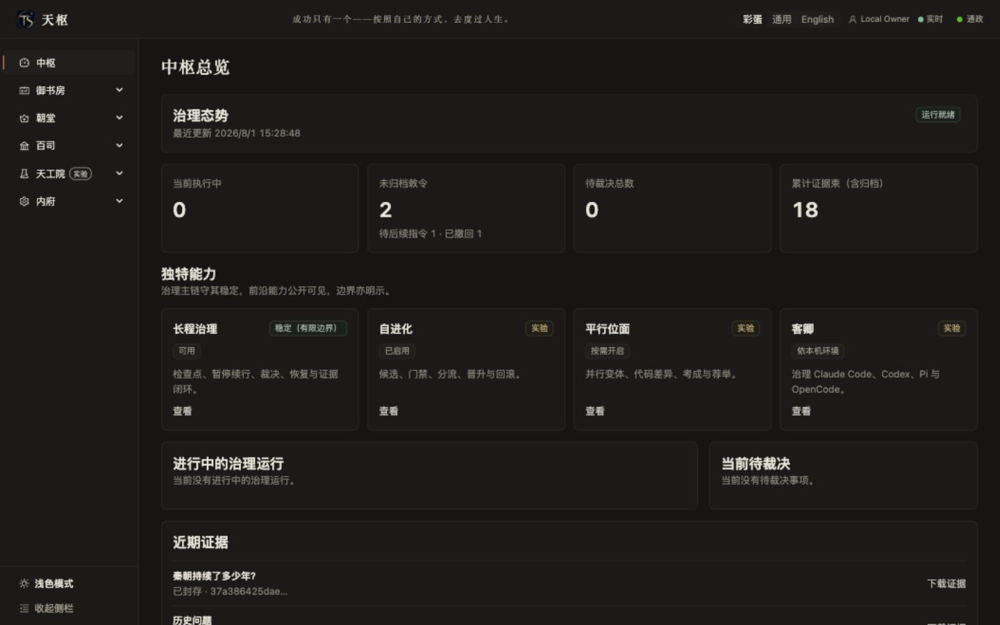
  </a><br>
  <a href="docs/usage/feature-tour.md#中枢总览"><b>中枢总览</b></a> · <code>可用</code><br>
  <sub>以真实运行数、待裁决与证据闭环呈现治理态势，并直达四项独特能力。</sub>
</p>

### 任务与治理

<table>
  <tr>
    <td width="50%" align="center" valign="top">
      <a href="docs/assets/features/task-workspace.jpg">
        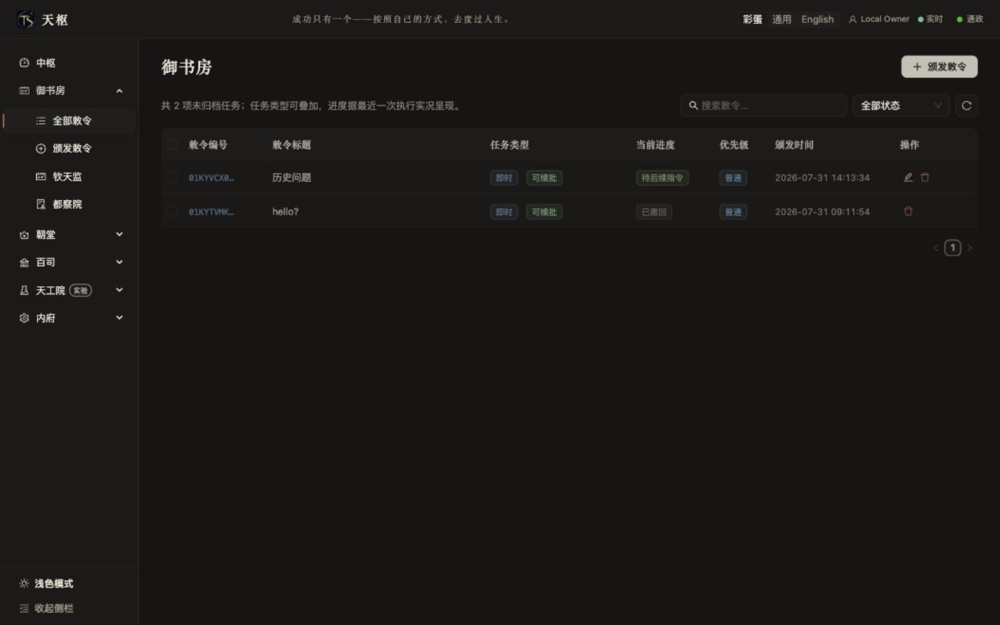
      </a><br>
      <a href="docs/usage/feature-tour.md#御书房"><b>御书房</b></a> · <code>可用</code><br>
      <sub>集中查看立即、定时、长程、对话与客卿任务，以及最近执行事实对应的进度。</sub>
    </td>
    <td width="50%" align="center" valign="top">
      <a href="docs/assets/features/edict-create.jpg">
        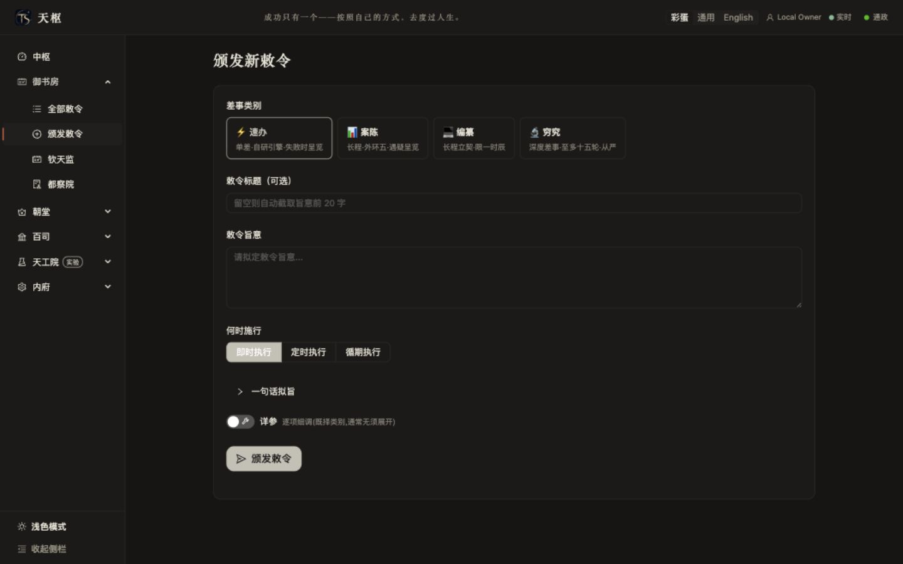
      </a><br>
      <a href="docs/usage/feature-tour.md#颁发敕令"><b>颁发敕令</b></a> · <code>可用</code><br>
      <sub>选择任务类型、执行方式、承办官员与预算，在一个表单中下达任务。</sub>
    </td>
  </tr>
  <tr>
    <td width="50%" align="center" valign="top">
      <a href="docs/assets/features/long-task-governance.jpg">
        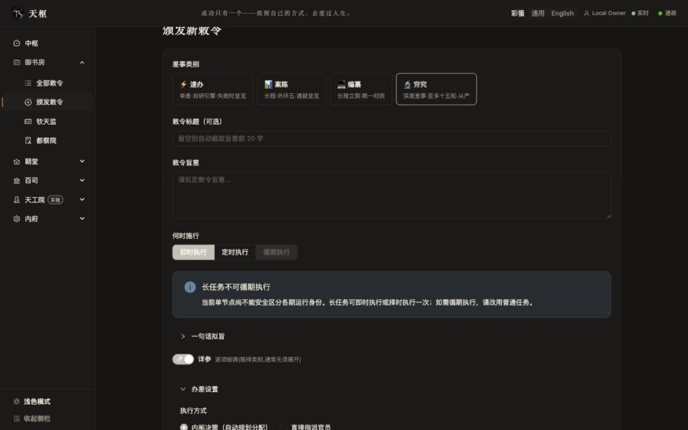
      </a><br>
      <a href="docs/usage/feature-tour.md#长程任务治理"><b>长程任务治理</b></a> · <code>可用·有限边界</code><br>
      <sub>用验收条件、检查点、暂停与恢复、运行中指引和人工裁决管理长任务。</sub>
    </td>
    <td width="50%" align="center" valign="top">
      <a href="docs/assets/features/scheduler.jpg">
        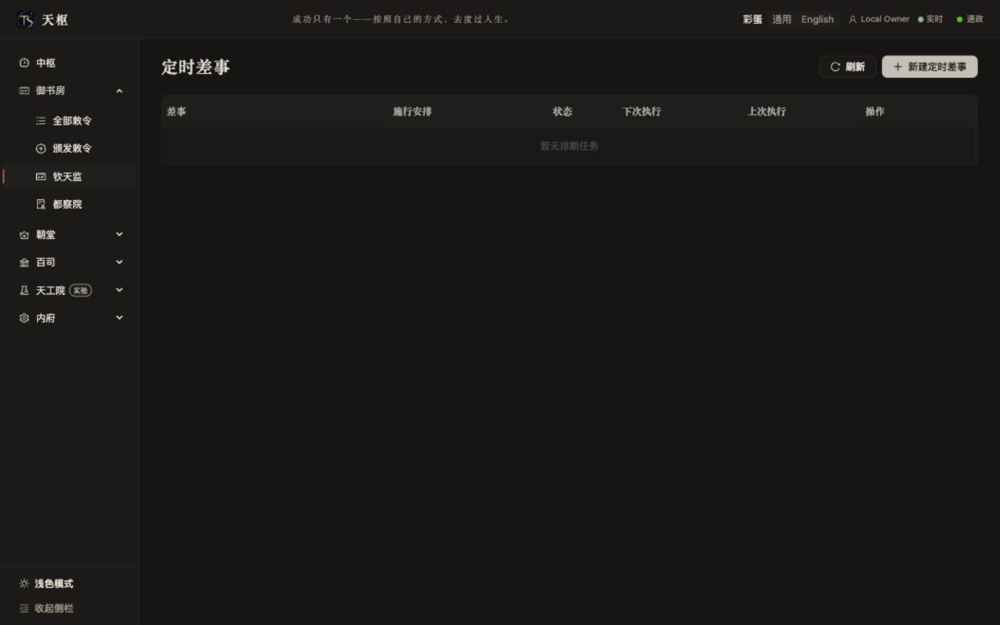
      </a><br>
      <a href="docs/usage/feature-tour.md#钦天监"><b>钦天监</b></a> · <code>可用</code><br>
      <sub>管理单次、Cron 与间隔排期，查看下次执行、状态和运行历史。</sub>
    </td>
  </tr>
  <tr>
    <td colspan="2" align="center" valign="top">
      <a href="docs/assets/features/audit.jpg">
        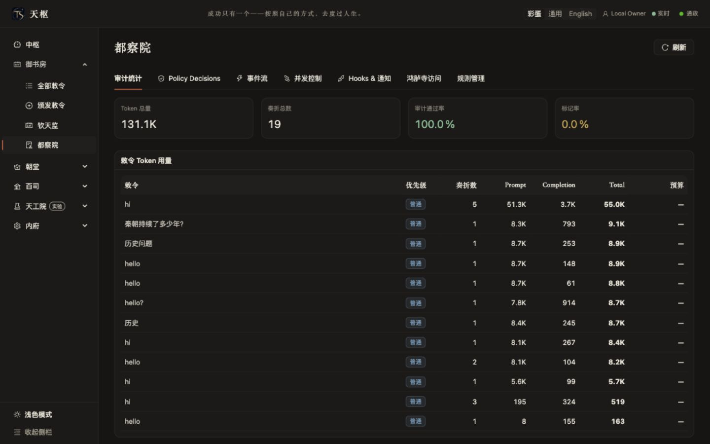
      </a><br>
      <a href="docs/usage/feature-tour.md#都察院"><b>都察院</b></a> · <code>可用</code><br>
      <sub>汇总审计、失败归因、策略与网络记录，让任务行为和证据可追溯。</sub>
    </td>
  </tr>
</table>

### 协同与知识

<table>
  <tr>
    <td width="50%" align="center" valign="top">
      <a href="docs/assets/features/officials.jpg">
        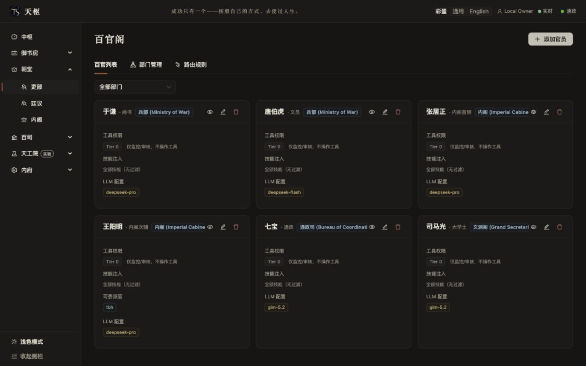
      </a><br>
      <a href="docs/usage/feature-tour.md#百官阁"><b>百官阁</b></a> · <code>可用</code><br>
      <sub>配置官员职责、部门、路由、委派、工具权限、技能与模型。</sub>
    </td>
    <td width="50%" align="center" valign="top">
      <a href="docs/assets/features/consultation.jpg">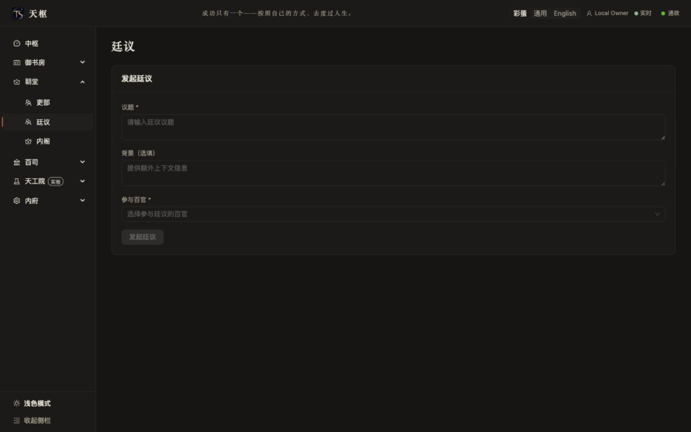</a>
      <a href="docs/assets/features/cabinet.jpg">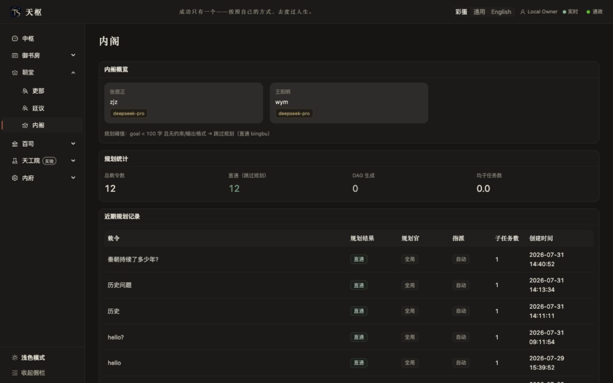</a><br>
      <a href="docs/usage/feature-tour.md#廷议与内阁"><b>廷议与内阁</b></a> · <code>可用</code><br>
      <sub>廷议组织多官员会商；内阁以只读视图呈现规划分派与协同历史。</sub>
    </td>
  </tr>
  <tr>
    <td colspan="2" align="center" valign="top">
      <a href="docs/assets/features/memory.jpg">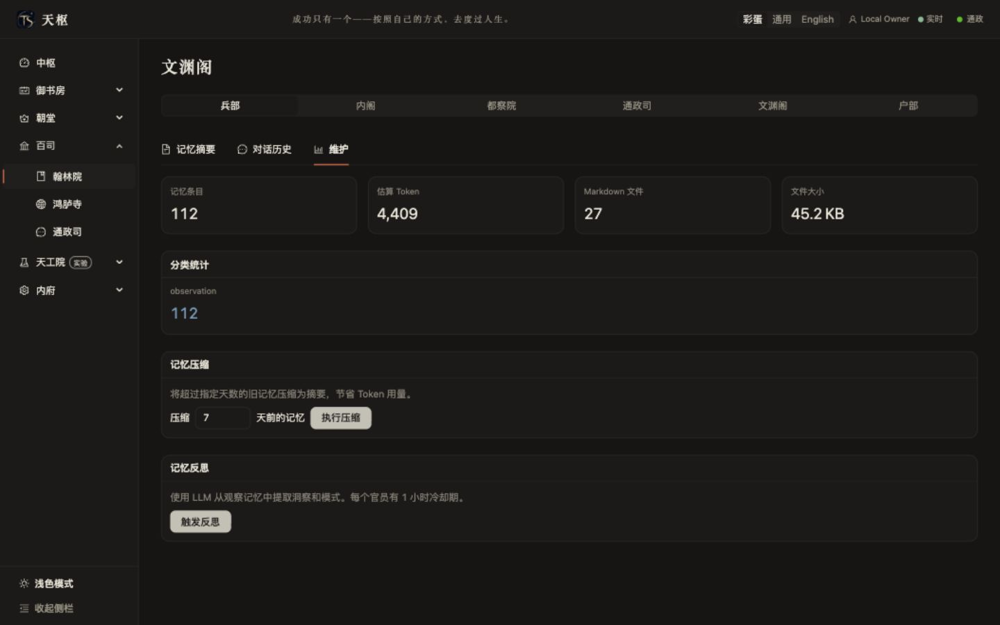</a>
      <a href="docs/assets/features/external.jpg">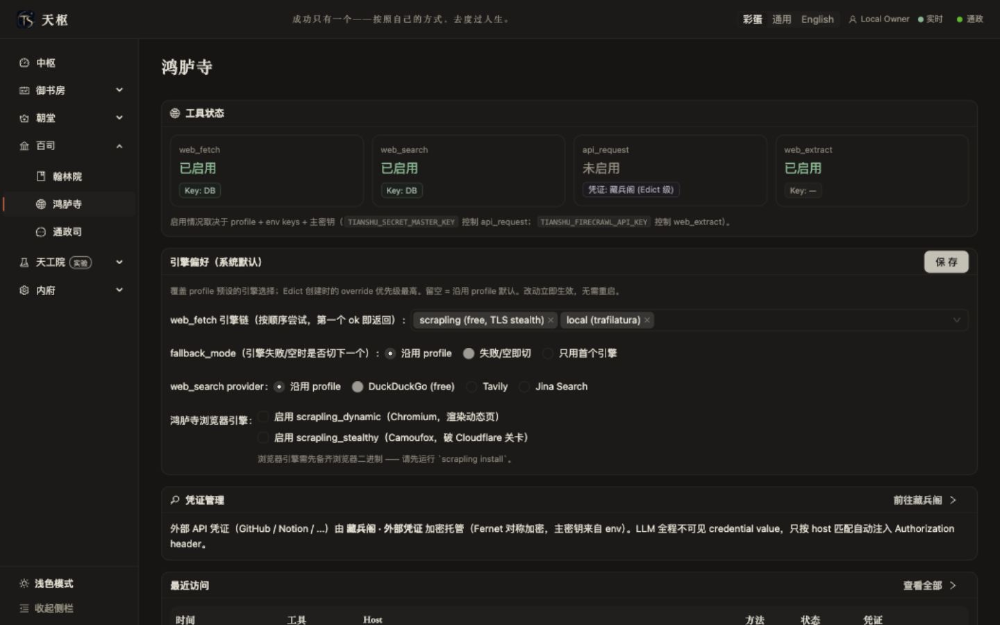</a>
      <a href="docs/assets/features/notifications.jpg">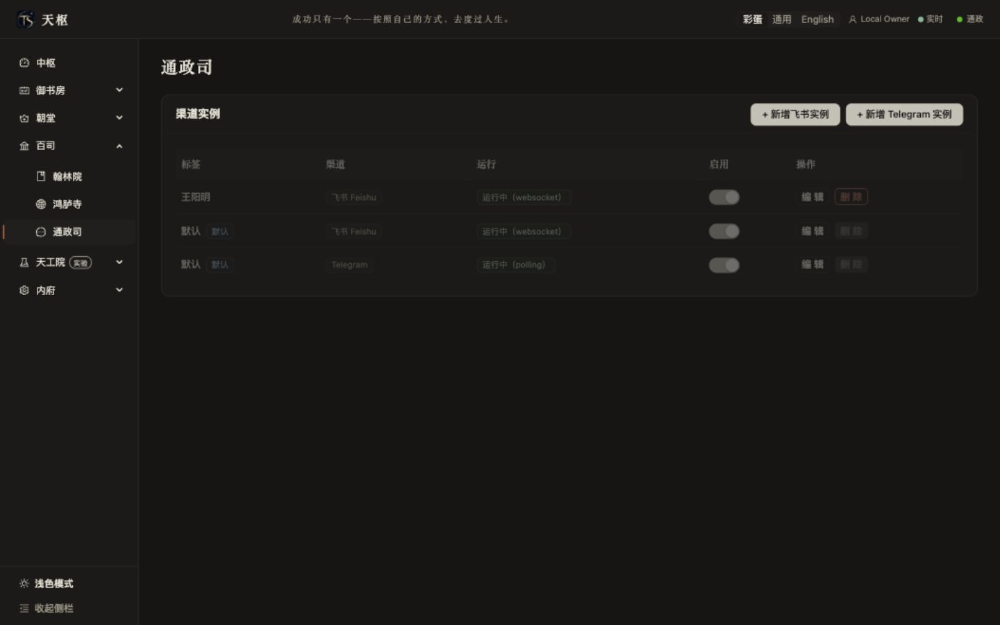</a><br>
      <a href="docs/usage/feature-tour.md#翰林院鸿胪寺与通政司"><b>翰林院与通政体系</b></a> · <code>可用·有限边界</code><br>
      <sub>翰林院管理知识记忆，鸿胪寺承载外部联络，通政司统一消息与通知。</sub>
    </td>
  </tr>
</table>

### 天工院〔实验〕

天工院以「位面」呈现实验空间；演化司、考功司与客卿馆分别承载演化治理、评测和外部 Agent 试验。

<table>
  <tr>
    <td width="50%" align="center" valign="top">
      <a href="docs/assets/features/universes.jpg">
        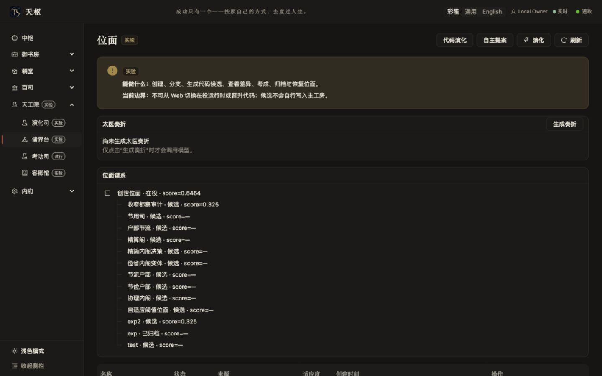
      </a><br>
      <a href="docs/usage/feature-tour.md#位面实验"><b>位面</b></a> · <code>实验</code><br>
      <sub>通过位面谱系隔离实验分支、代码候选、评测、归档与恢复。</sub>
    </td>
    <td width="50%" align="center" valign="top">
      <a href="docs/assets/features/evolution.jpg">
        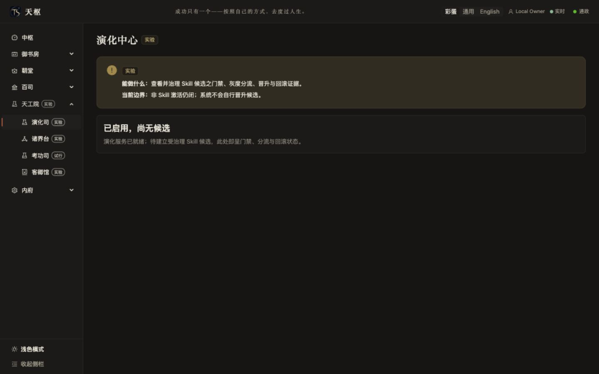
      </a><br>
      <a href="docs/usage/feature-tour.md#演化司实验"><b>演化司</b></a> · <code>实验</code><br>
      <sub>以只读视图查看技能候选、证据门禁、灰度分流、晋升与回滚状态。</sub>
    </td>
  </tr>
  <tr>
    <td width="50%" align="center" valign="top">
      <a href="docs/assets/features/evals.jpg">
        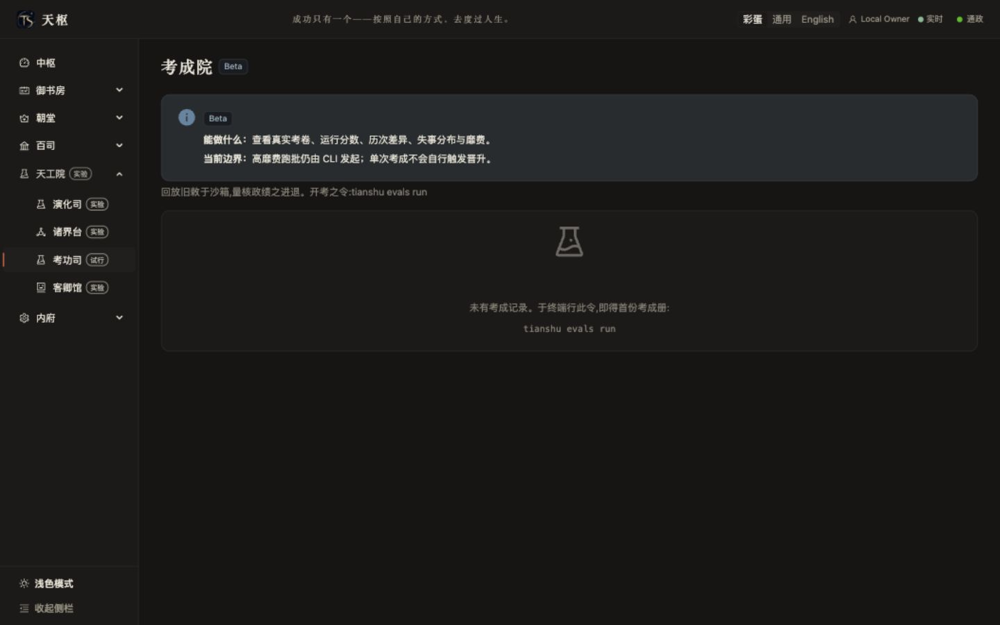
      </a><br>
      <a href="docs/usage/feature-tour.md#考功司试行"><b>考功司</b></a> · <code>试行</code><br>
      <sub>管理评测集并比较得分、成功率、失败分布与历史差异。</sub>
    </td>
    <td width="50%" align="center" valign="top">
      <a href="docs/assets/features/keqing.jpg">
        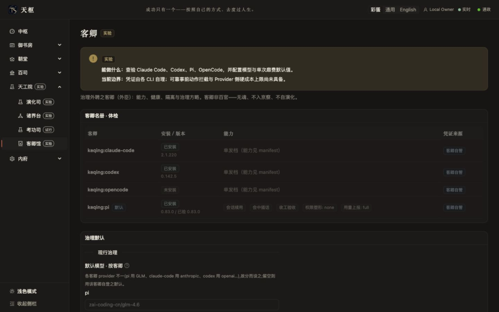
      </a><br>
      <a href="docs/usage/feature-tour.md#客卿馆实验"><b>客卿馆</b></a> · <code>实验</code><br>
      <sub>从当前环境探测 Pi 等外部编码 Agent 的版本、能力、可用性与治理状态。</sub>
    </td>
  </tr>
</table>

### 系统与成本

<table>
  <tr>
    <td width="50%" align="center" valign="top">
      <a href="docs/assets/features/system.jpg">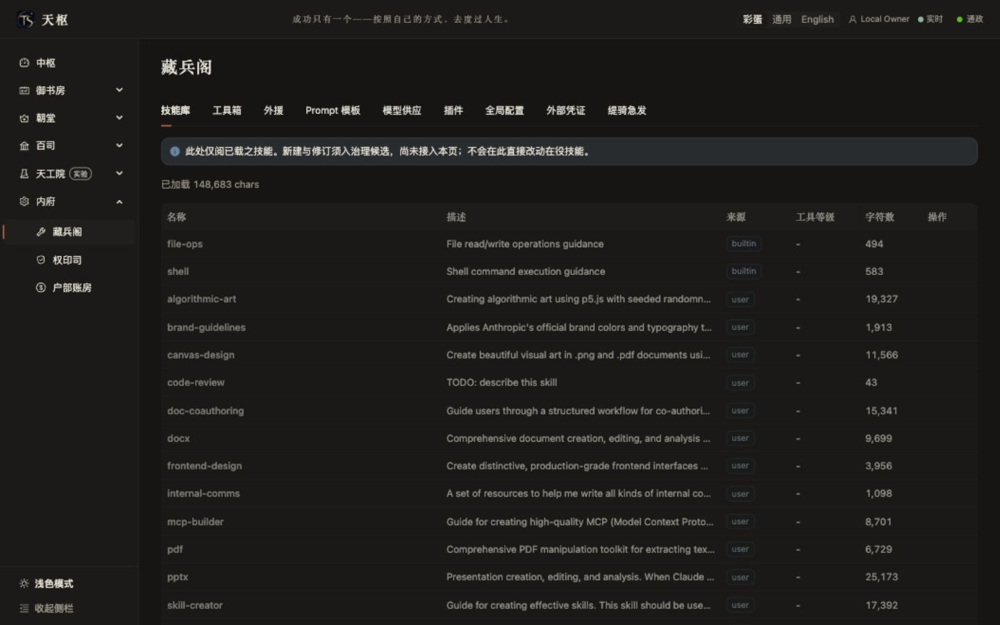</a>
      <a href="docs/assets/features/session-rules.jpg">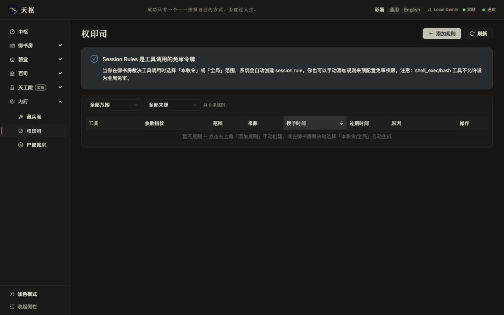</a><br>
      <a href="docs/usage/feature-tour.md#藏兵阁与权印司"><b>藏兵阁与权印司</b></a> · <code>可用·管理能力</code><br>
      <sub>集中管理模型、工具、Skills、插件和凭证，并配置可复用的会话授权规则。</sub>
    </td>
    <td width="50%" align="center" valign="top">
      <a href="docs/assets/features/cost.jpg">
        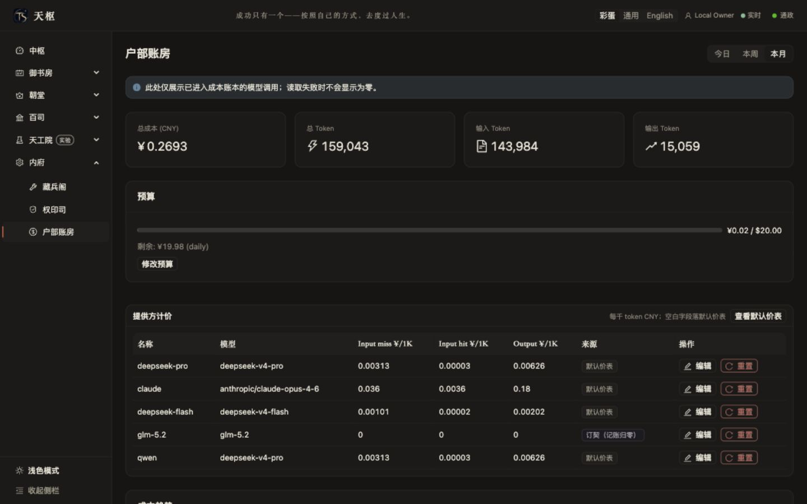
      </a><br>
      <a href="docs/usage/feature-tour.md#户部账房"><b>户部账房</b></a> · <code>可用·有限边界</code><br>
      <sub>查看 Token、Provider 成本、缓存用量和预算，并维护价格口径。</sub>
    </td>
  </tr>
</table>

## 架构总览

天枢把一次任务组织为一条可审计的核心闭环：下旨（Edict）→ 排期（Scheduler）→ 规划
（Planner）→ 执行（Agent/DAG/Outer Loop）→ 审计（Auditor）→ 通知（Notifier）→ 记忆与
成长（Memory/Profile/Skill）。敕令可通过 Web、API、CLI、飞书或 Telegram 下达，系统把
目标转成可调度、可审计、可裁决、可复盘的执行链路。长程任务不依赖 LLM「一次输出即
终态」，而由外层循环反复 actor→checks→critic→completion audit，直到验收通过或预算
耗尽。架构设计、领域模型与各子系统文档见[文档导航](docs/README.md)。

## 能力成熟度

天枢把「敕令（Edict）→ 裁决（Decision）→ 运行 → Evidence → 技能候选 → 门禁 →
分流 → 回滚」组织成一条可复验的本地链路。当前代码与阶段证据覆盖以下能力：

- **可治理**：受管 Native 路径使用持久 Decision、RunState、attempt lease/fencing 和
  effect intent/receipt；已声明且进入账本的恢复边界可耐单节点重启。
- **可验证**：SystemAudit 防篡改链、内容寻址 ArtifactStore 与 Evidence Bundle v1
  记录行为、裁决、产物和边界；严格 verifier 会重算 hash 并核对源码与 exact Wheel。
- **持续成长**：技能候选经过证据绑定的门禁、真实 canary assignment 和 effective
  overlay，再由受控回滚把新流量归零；完整的自进化闭环仍属实验能力。
- **真实桌面产品**：默认导航为中枢、御书房、朝堂、百司、天工院〔实验〕、内府六个
  一级入口。
  御书房以“全部敕令 / 颁发敕令 / 钦天监 / 都察院”统一承载任务、定时调度与审计；
  朝堂包含吏部、廷议、内阁，百司包含翰林院、鸿胪寺、通政司。天工院集中展示演化司、
  诸界台、考功司、客卿馆，其中演化司、诸界台与客卿馆标记“实验”，考功司标记
  “试行”；内府保留藏兵阁、权印司、户部账房。御书房默认展示当前主体可见且未归档的
  全部任务，以可叠加标签区分立即、定时、长程、对话和客卿任务，并显示最新执行事实
  对应的当前进度；旧 `/edicts` 地址兼容跳转到御书房。中枢以四张“独特能力”卡展示
  长程治理、自进化、平行位面和客卿，其中自进化状态来自后端 `evolution_status` 的真实
  投影，不以 mock 数字冒充能力。

以上能力均已在本地完成逐页、逐操作的网页功能点验与现场修复；逐项点击路径与
未验证边界见[Web 全功能点验与修复报告](docs/launch/web-functional-validation-2026-07-31.md)。
历史阶段的完整验证流程与不可变证据归档于 [docs/cc-fable-v1/](docs/cc-fable-v1/)；
逐项能力的成熟度结论见[能力事实矩阵](docs/launch/capability-matrix.md)与
[当前实现](docs/CURRENT-STATE.md)。

## 当前支持边界

- **首个正式目标**：Ubuntu + Python 3.12，本地 desktop Web only；不提供移动端产品承诺。
- **已有本地证据**：最近一次 exact-Wheel 完整验证运行于
  `Darwin/arm64/Python 3.12.12`。这证明本机验证环境，不替代尚待执行的 Ubuntu 外部复验。
- **部署模型**：单机、单节点 SQLite。宿主机管理员可读取数据库、主密钥和进程内明文，
  因而不在当前威胁模型的防护对象内。
- **正式安装路径**：源码 checkout 与同一 checkout 构建的 exact Wheel。官方容器、PyPI、
  GHCR、签名和正式供应链 provenance 均为 `deferred`。
- **MCP**：持久 env/header secret mapping 已密文落库；remote MCP 与 open stdio MCP
  在当前支持面内保持 `disabled`，完整开放安全工作为 `deferred`。
- **演化边界**：managed OpenHands、执行器兼容套件、ROI 与 cost calibration 均为
  `external_pending`；更完整的自动化演化门禁为 `deferred`。

## 本地安装与验证

```bash
git clone https://github.com/MJ-CJM/tianshu.git
cd tianshu
python3.12 -m venv .venv && source .venv/bin/activate
pip install -e .
cp .env.example .env   # 编辑 .env，填写 TIANSHU_LLM_API_KEY 等
cd web && npm install && npm run build && cd ..
TIANSHU_STATIC_DIR=src/tianshu/web/static uvicorn tianshu.app:create_app --factory --port 8000
```

启动后打开 http://127.0.0.1:8000 即可使用 Web UI。前端构建需要 Node.js >= 20。日常开发
推荐一键脚本 `./scripts/local.sh start --dev`（热重载 + 进程托管）；开发模式、环境变量
与部署说明见[快速开始](docs/usage/getting-started.md)。
需要严格复验路径（exact Wheel 安装、黄金 Demo 与 provenance 校验）时，参见
[Lean Developer Preview 使用指南](docs/usage/lean-developer-preview.md)。

## 能力状态

公开文档严格区分：

- `implemented`：已实现且有命名证据；
- `disabled`：当前支持面明确关闭并 fail closed；
- `deferred`：已记录恢复条件，本轮不交付；
- `experimental`：可试用，但协议或支持承诺尚未冻结；
- `external_pending`：缺少指定外部环境或时间窗证据。

当前工作树的功能结论和验证快照先看
[当前实现](docs/CURRENT-STATE.md)；逐项默认值、保证、非保证和证据见
[能力事实矩阵](docs/launch/capability-matrix.md)。延期工作的恢复条件见
[延期路线图](docs/cc-fable-v1/06-deferred-work-backlog.md)。

## 品牌与产品壳层

- **品牌资产**：生产 desktop Web 使用 [`web/public/brand.png`](web/public/brand.png)，
  SHA-256 为 `3f2bb6cfdcac70092fce3a9b8b534c4a0627f444cb9db38a9651087688ace799`。
- **格言**：“成功只有一个——按照自己的方式，去度过人生。”
- **右上五项**：“彩蛋 / 通用 / English / 实时 / 通政”。
- **一级导航**：“中枢 / 御书房 / 朝堂 / 百司 / 天工院〔实验〕 / 内府”六个入口。
- **二级结构**：
  - 御书房——全部敕令、颁发敕令、钦天监、都察院；
  - 朝堂——吏部、廷议、内阁；
  - 百司——翰林院、鸿胪寺、通政司；
  - 天工院——演化司〔实验〕、诸界台〔实验〕、考功司〔试行〕、客卿馆〔实验〕；
  - 内府——藏兵阁、权印司、户部账房。
- **任务入口**：御书房统一承载全部任务、任务进度与待人工介入事项，`/edicts` 仅作
  兼容跳转。

该产品结构已在当前版本落地；原
[审批提案](docs/launch/final-approval-proposal.md)保留为决策过程记录，当前状态以
[当前实现](docs/CURRENT-STATE.md)为准。

## 贡献与安全

贡献前请阅读 [CONTRIBUTING.md](CONTRIBUTING.md) 与
[CODE_OF_CONDUCT.md](CODE_OF_CONDUCT.md)；漏洞报告与单节点/宿主机管理员边界见
[SECURITY.md](SECURITY.md)。用户可见术语统一使用“敕令 / 裁决”；代码、API 与数据库为
兼容保留 `Edict` / `Decree`。

## License

[MIT License](LICENSE)；所含或改编第三方材料的来源与许可证见
[THIRD_PARTY_NOTICES.md](THIRD_PARTY_NOTICES.md)。
