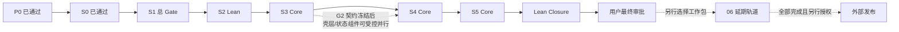

# CC-Fable v1 主执行计划（完整路线 + D8 Lean 覆盖）

> 状态：D8-A `approved_2026-07-14`，当前停在 S1/G1.5 总门禁前。本文档保留
> **完整 G0–G5 技术路线**；
> 切片的技术细节一律以 `codex-v1` 对应 brief/recon/phase plan 为准，不在此复制。
> 当前交付范围由 [05 号文档](./05-lean-developer-preview-scope.md) 覆盖，延期项由
> [06 号台账](./06-deferred-work-backlog.md) 管理。本文与 05 冲突时以 05 为准。

## 1. 阶段总览

| 阶段 | 内容 | 当前状态 | 规模参考 | 出口审批 |
|---|---|---|---|---|
| **P0** | 资产回收与基线重建 | `passed` | 已完成 | 出口条件与台账证据已完成 |
| **P1** | 继承实现复审 | `passed` | 已完成 | 04 号报告完成 |
| **S0** | G1.4b3 governed apply 收口 | `passed` | 已完成 | G1.4b3 报告完成 |
| **P1.R1** | execution gateway 等价拆分 | `passed` | 已完成 | commit `e0bdf74` |
| **S1** | G1.5 Wheel / 离线 Demo / Doctor | 实现完成，**总 Gate pending** | S1.1–S1.5 已完成 | full + slow 黑盒 + G1.5 报告 |
| **S2 Lean** | 审计 / MCP 密文 / 最小公开护栏 | `planned` | 05 §4.2 | Lean 安全底线报告 |
| **S3 Core** | durable governance 与 Evidence | `blocked_by_upstream` | 05 §4.3 | 故障矩阵 + Core Gate |
| **S4 Core** | 正式桌面 Web 三真实页 | `blocked_by_upstream` | 05 §4.4 | automation_passed + 用户终审 |
| **S5 Core** | 受控演化真实路由 | `blocked_by_upstream` | 05 §4.5 | Lean Core Gate |
| **Lean Closure** | 一个黄金 Demo 与最小候选包 | `blocked_by_upstream` | 05 §4.6 | Candidate 报告 + 用户最终审批 |
| **延期轨道** | 完整 S2/S3/S4/S5/S6 | `deferred_by_D8` | 06 号台账 | 逐工作包重新批准 |

## 2. P0 —— 资产回收（新增阶段，codex-v1 没有）

完整方案见 [00-baseline-and-recovery.md](./00-baseline-and-recovery.md)。
一句话：冻结源 clone 的 WIP → bundle/push 备份 → 纯快进迁移 44 个提交到当前
分支 → 重建 venv → 干净基线全绿 → 还原 WIP → 封存源 clone。

**入口**：本包获批。**出口**：00 号文档第 5 节六项条件全满足。

## 2b. P1 —— 继承实现复审（D1 附加条件，只读）

用户批准全量迁移时附加要求："也要看下是否合理，以及是否需要重构"。落实为：

- **对象**：`main..7386cf3` 的 44 个提交（G0–G1.4b2 已审查实现，约 2 万行 net）；
  WIP 部分不在此评审（S0 本身即为其收口与审查流程）。
- **方式**：只读勘察（沿用 codex recon 模式），不改代码。评审维度：
  ① 架构分层与边界是否合理（gateway/executor/storage/models）；
  ② 与既有代码风格/模式的一致性；③ 过度设计或欠设计；④ 安全边界实现质量；
  ⑤ 重构候选清单（按价值/成本分级）。
- **产出**：[04-inherited-code-review.md](./04-inherited-code-review.md)。
- **分流规则**：Critical 发现 → 前置为 S0 修复项；Important 重构建议 → 排入
  对应后续阶段顺路处理或独立小切片；Minor → 记录不排期。
- **时机**：P0 完成后启动，可与 S0 并行（只读与实现并行符合既有纪律）；
  S0 的 Commit A/B 提交前必须消费其 Critical 结论。

## 3. S0 —— G1.4b3 governed apply 收口

**技术契约**（沿用）：`codex-v1/plans/02-s0-g1.4b3-close.md`、
`design/14-g1.4b3-governed-apply-brief.md`、`design/13-g1-root-anchored-filesystem-design.md`、
`evidence/active-s0-core-brief.md`、`DEVELOPMENT-HANDOFF.md`（Commit A/B 文件分组）。

**入口**：P0 完成，WIP 指纹对齐。分支名检查按本包映射：预期
`feat_cc_fable_v1`、HEAD `7386cf3`。

| 切片 | 内容 | 备注 |
|---|---|---|
| S0.1 | 重新冻结并分类当前变更集 | 对照 `codex-v1/STATUS.md` 记录漂移（迁移本身不应产生漂移） |
| S0.2 | 收口持久层与不可变权威绑定（Commit A 前半） | **最优先裁决 V4 疑点**：STATUS 披露"V4 migration callback 被改写但 checksum 冻结"，违反迁移冻结规则——要么恢复 V4 原样、改动放入新迁移，要么给出改写合法性证明；V5 必须保持纯 additive。**P1 复审增补**（[04 号报告](./04-inherited-code-review.md) CRITICAL #1）：同步补 callback 指纹机制——当前 checksum 只算 SQL 文本、callback 源码不入指纹，改写无声通过；Commit A 前另检查 workspace_service 合并后体量（IMPORTANT #7） |
| S0.3 | 收口 anchored fs / Git / apply / rollback（Commit A 后半） | 含 STATUS 披露的 mode 漂移、close_lease 绕锁、receipt 真值三项修复的重验 |
| S0.4 | 收口 REST / Auth / CLI / capability（Commit B） | server-derived actor、token 不泄露、CLI 退出码、能力证据 |
| S0.5 | 单次最终 G1.4b3 Gate | 唯一一次 full `pytest -m "not slow"` + 独立安全/spec/质量审查 C/I=0 + G1.4b3 报告 + clean tree |

**出口**：两个提交（`feat: add governed workspace apply authority` /
`feat: expose governed workspace apply surfaces`）+ full Gate 绿 + 报告入台账 +
工作区干净。

## 3b. P1.R1 —— execution_gateway.py 结构拆分（P1 复审产物，S0 后、S1 前）

[04 号报告](./04-inherited-code-review.md) IMPORTANT #2：`execution_gateway.py`
2,495 行（≥3×体量上限）混 6 个职责群，而 S1（demo provider dispatch）、
S2（stdio admission）都要改它，越晚拆越贵。独立切片：拆为 grants /
policy_models / process_backend / gateway 四模块，**纯移动零行为改动**，以
focused suite + 全部静态门禁 + import 面比对验证等价。其余重构候选按 04 号
报告清单挂靠对应阶段，不新增独立切片。

## 4. S1 —— G1.5 自包含 wheel 与离线体验

**技术契约**：`codex-v1/design/15-g1.5-wheel-demo-doctor-brief.md`、
`16-g1.5-implementation-slices.md`、`17-*`、`18-*`（recon）。

切片：S1.1 不可变 wheel 资源与 manifest；S1.2 overlay precedence 与六 persona
幂等迁移；S1.3 显式零网络 demo provider（live 失败不得回退 demo）；S1.4 结构化
Doctor 与 live/ready 契约；S1.5 repo 外 fresh HOME 黑盒跑通受治理 Demo。

关键事实（冻结）：Logo hash 不变；site-packages 只读；`COURT.md` reset 语义 =
删除 overlay override 自然回退 packaged 资源。

> D8-A 处置：S1.1–S1.5 均已实现，全部保留；当前只做一次 G1.5 总 Gate，
> 不删除 Wheel CI，也不重复已完成切片。

## 5. S2 —— G1.6 公开安全与发布基线

**技术契约**：`codex-v1/design/19-g1.6-security-release-brief.md`、
`20-g1.6-implementation-slices.md`、`21-g1.6-recon.md`。

切片：S2.1 防篡改 SystemAudit 存储；S2.2 scoped 审计读取/导出与安全事件事务
接入；S2.3 MCP 密文迁移与 key rotation；S2.4 远程 MCP SSRF/DNS/redirect/proxy
策略；S2.5 stdio 准入 grant / tool allowlist / drift binding；S2.6 exact-wheel
非 root 容器；S2.7 CI/SBOM/扫描/威胁模型/发布演练 + Developer Preview Gate。

> D8-A 处置：做 S2.1–S2.3，并补“remote MCP 与未审批 stdio 默认禁用”的最小
> fail-closed 护栏及公开能力矩阵。S2.4–S2.7 的完整开放/容器/供应链工作进入 06
> 号台账 P2-A；已存在的 Wheel/sdist CI 不属于延期项，继续保留。

## 6. S3 —— G2 durable governance 与证据

**技术契约**：先 `codex-v1/design/22-g2-recon.md`、`23-g2.1-2-brief.md` 与
`design/24-g2-g5-gap-analysis.md` 第 3 节，再 `plans/12-g2-durable-governance-evidence.md`
（旧计划中的硬编码迁移号/continuation/fencing/Evidence schema 按 recon 修订）。

这是产品定位的支柱：现状裁决等待在内存 `asyncio.Event` 字典里、事件总线是
`create_task`、重启即丢——没有 S3，"可治理、可验证"不成立。

切片：S3.1 冻结 G1 handoff 与动态迁移号；S3.2 Edict Application Service + UoW；
S3.3 durable outbox 与统一 ingress；S3.4 持久 DecisionRequest + 版本化 RunState；
S3.5 全部决策入口收口到 durable 权威；S3.6 attempt/lease/fencing/reconcile/DLQ；
S3.7 side-effect intent/receipt journal；S3.8 durable continuation/resume；
S3.9 planner 修订与质量证据；S3.10 内容寻址 ArtifactStore；S3.11 Evidence
Bundle v1 收口；S3.12 audit/OTel/readiness + durable 通知；S3.13 分布式故障
矩阵与 G2 Gate。

**权威冻结**（沿用）：generic `DecisionRequest`/`Resolution` 是唯一治理权威；
G1 workspace apply authorization 只作为已裁决请求的不可变单向 projection；
禁止第二套批准权威；未绑定 pending legacy authorization 一律 fail closed。

**语义边界**：G2 的"耐重启"是 SQLite 单机语义；PostgreSQL/K8s/多副本明确不做。

> D8-A 处置：S3.1–S3.8、S3.10–S3.11 与核心故障矩阵全部保留；S3.9 只保留
> Evidence 所需的 plan hash/修订原因；S3.12 保留内部 durable 通知、审计、
> correlation 与 readiness，完整 planner 质量体系、OTel 和外部通知进入 06 号 P2-B。

## 7. S4 —— G3 正式桌面 Web（含 UI 工作线索）

**技术契约**：`codex-v1/ui/README.md`（视觉事实源）、`design/24` 第 4 节、
`plans/13-g3-desktop-web-productization.md`、`design/01-web-approval-prototype-design.md`。

### UI 资产的三层角色（对应"UI 的改动是否需要"）

| 层 | 内容 | 处置 |
|---|---|---|
| 已完成实现 | G0 审批原型 `prototypes/tianshu-agent-os/`（6,570 行，13 项原型测试）+ 生产 `web/` 术语/palette 校准（+2,938/−254） | **随 P0 迁移回收**。原型只作参考，静态 Gate 禁止 `web/src` 引用 `prototypes/` 与 `mockData.js` |
| 设计事实源 | `codex-v1/ui/`：12 张 approved 截图、交互审计、状态矩阵、production-palette 副本、negative 反例 | **S4 实现的权威视觉目标**；`historical/` 禁止照搬，`negative/`（"系统可信"卡片）必须避免 |
| 待实施 | 正式三页 + 十四部门 + 质量门 | 即本阶段 S4.1–S4.12 |

**冻结要求**（沿用，不得变更）：`brand.png` byte-for-byte（SHA-256
`3f2bb6cf…ace799`）；格言与右上五项逐字保留；四组十四部门与 `百官阁` 名称不改；
默认深色；治理术语 `裁决`，禁用 `批红/朱批/司礼监代批`；mock 数据与截图数字
不入生产；克制新中式"墨为骨、朱为睛、纸为气"。

切片：S4.1 契约/品牌 hash/测试基线冻结；S4.2 设计系统 + 冻结壳层 + 默认深色 +
lazy routes；S4.3 统一 API error/AuthContext/七类页面状态；S4.4 governance/
evidence/evolution 组件 + onboarding；S4.5 真实中枢总览 `/control`；S4.6 真实
敕令详情（Contract/RunState/Decision/Evidence/下载/受治理 replay）；S4.7 权威
演化中心（G4 前真实路由显示"未启用"）；S4.8 御书房+文书房收敛；S4.9 内阁/廷议/
都察院/权印司收敛；S4.10 百官阁/文渊阁/位面/考成收敛；S4.11 藏兵阁/鸿胪寺/
通政司/户部账房收敛；S4.12 Playwright/A11y/键盘/缩放/视觉/性能/CI 门。

**并行边界**（沿用）：S3 冻结相关 gateway 契约后，至多一个 S4.1–S4.4 纯壳层/
状态组件切片与一个不冲突的 S3 后半切片并行；文件集不相交、owner 具名、
integration owner 唯一；真实页面必须等待具名后端契约。

> D8-A 处置：做 S4.1–S4.7 + 精简 S4.12（壳层、三张真实页、axe/键盘/200%
> 缩放/核心视觉门）；S4.8–S4.11 和完整人工 A11y 进入 06 号 P2-C。十四部门导航、
> Logo、格言、右上角五项、浅色模式和收起侧栏继续保留，延期页面必须诚实标注状态。

**出口**：automation 全绿记 `automation_passed`，页面呈现记
`user_approval_pending` 等待你的最终视觉/交互审批——两者不合并成一个状态。

## 8. S5 —— G4 受控演化与执行器中立

**技术契约**：`codex-v1/design/24` 第 5 节、`plans/14-g4-governed-evolution-executors.md`
（固定迁移号一律动态化）。

现状要点：`route_for_memorial()` 恒返回 champion——当前"自进化"路由是伪的；
晋升 API 可绕过统一门禁。S5 前半就是把这两点变真。

切片：S5.1 统一不可变 candidate + 五域 adapter；S5.2 技能供应链单一
install service；S5.3 evidence-bound fail-closed GateEvaluator；S5.4 唯一
PromotionService（canary/promote/rollback）；S5.5 真实 challenger assignment 与
effective overlay（分布/重启/回滚证明）；S5.6 executor 兼容套件与 Native/
OpenHands 边界；S5.7 真实 pinned OpenHands managed 证据；S5.8 FTS/prompt 预算/
paired ROI；S5.9 校准成本区间与诚实 enforcement 证据；S5.10 G4-A/B/C Gate。

**诚实性规则**（沿用）：代码候选永不自动晋升；OpenHands/真实 provider ROI/
成本校准缺一时保持 `external_pending`，不得本机伪造，不得因此宣称 G4 passed。

> D8-A 处置：做 S5.1–S5.5 + Lean Core Gate，证明候选、门禁、晋升、真实分流与
> 回滚；S5.6–S5.10 完整轨道进入 06 号 P3。Lean Core Gate 不能替代完整 G4-A/B/C，
> 缺少真实 OpenHands/ROI/成本窗口时持续 `external_pending`。

## 9. S6 —— G5 开源发布候选

**技术契约**：`codex-v1/design/24` 第 6 节、`plans/15-g5-open-source-launch.md`。

切片：S6.1 launch schema 与证据状态迁移；S6.2 稳定 Executor SDK/模板/兼容 kit；
S6.3 公共 API demo runner 与证据校验器；S6.4 `leave-it-running` 黄金 Demo；
S6.5 governed skill-evolution Demo；S6.6 same-contract 多执行器 Demo；
S6.7 可复现 core/server/all 与非 root 容器；S6.8 SBOM/NOTICE/provenance/
workflows/社区文件；S6.9 三个独立外部环境验证与最终候选包。

**权限边界**（沿用，任何模式都不变）：repo Public、tag/release、PyPI/GHCR、
branch protection/OIDC、对外宣称 1.0 或自进化闭环——全部需要你在候选完成后
另行明确授权。

> D8-A 处置：完整 S6 进入 06 号 P4；当前只做 05 §4.6 的 Lean Closure：一个
> 黄金 Demo、最小开源文档、Wheel/sdist 候选证据和 Candidate 总报告。SDK、三个
> Demo、官方容器、正式 provenance 与三个独立外部环境不在第一阶段。

## 10. 全局工程纪律（沿用 + 环境映射）

以下沿用 `codex-v1/plans/01-rebaselined-execution.md` 的全局约束，逐条继续有效：
切片软上限（生产 ≤800 行 / 总 diff ≤1,500 行，超限先拆）；每切片
RED → GREEN → focused 回归 → 静态门禁 → 独立 spec+质量双审 → 修完 C/I → 提交 →
台账；迁移号只从真实 `MIGRATIONS[-1]` 动态 `N+1`，冻结既有 checksum/callback；
`migrations.py`、`app.py`、CLI 注册、公共契约、权威服务同一时间单写者；
只有 integration owner 跑 broad/full suite；桌面 Web only；本地 fixture、demo
证据、CI 证据、真实外部证据四者不可互换。

**本环境的映射差异**（相对 codex 原环境）：

| codex-v1 原表述 | 本现场执行方式 |
|---|---|
| `superpowers:*` / subagent 提示 | 非依赖（handoff 已豁免）。按上述 TDD/双审流程执行；独立审查由干净上下文的子代理或人工完成 |
| 台账 `.superpowers/sdd/progress.md` | 改用本包 [PROGRESS.md](./PROGRESS.md)；历史台账只读引用 |
| 分支 `feat_codex_phase_1` | `feat_cc_fable_v1`（P0 迁移后语义等同） |
| Python 命令 | 同样使用 `env -u VIRTUAL_ENV .venv/bin/python`；venv 由 P0.4 以 `uv sync --frozen` 重建；不使用外部 `~/myenv`；避免 `uv run` 隐式改写 `uv.lock` |

## 11. 节奏与量级参考（非承诺）

D8-A 把当前路线收敛为 S1 Gate、S2 Lean、S3 Core、S4 Core、S5 Core 和 Lean
Closure，避免让真实 OpenHands、七日成本窗口、三个外部环境、容器和供应链发布
阻塞第一阶段。各阶段仍需先按当前代码重新 recon 和拆切片，不沿用旧计划给出时间
承诺。延期工作已按 P2/P3/P4 工作包拆入 06 号台账，第一阶段验收后再排期。

## 12. 审批模式（D5-B，经 D8-A 收窄）

用户已批准在 **D8-A Lean 范围内连续实施**：本设计和后续独立实施计划经用户复核后，
Gate 之间不等待人工审批；每个 Gate 仍须完成
自动验收（focused/full suite、静态门禁、独立审查、Gate 报告入台账）后才进入
下一阶段，最终统一交付用户验证。仍单独保留的人工授权点包括：

1. **S4 视觉/交互终审**：三张真实页 automation 绿后记 `user_approval_pending`，
   等待你亲自走查（不阻塞 S5 后端切片的启动）；
2. **外部发布授权**：repo Public、tag/release、PyPI/GHCR、对外宣发——
   候选包完成后逐项等待你的明确指令，绝不自动执行。
3. **延期工作恢复**：从 06 号台账选择工作包、重新核对现场并批准独立计划后才启动。

执行中任何阶段你都可随时叫停或改回逐 Gate 审批（修订 02 号文档 D5 即可）。
