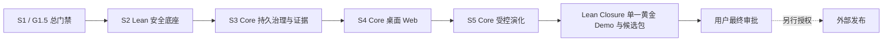

# 方案 A：精简 Developer Preview 范围设计

> 状态：`approved_2026-07-14`
>
> 裁决：D8-A（用户原话："好的，采用方案A"）
>
> 作用：自本裁决起，本文是当前交付范围、延期边界和验收口径的最高优先级说明；
> [01-master-plan.md](./01-master-plan.md) 继续保留完整 G0–G5 技术路线，本文对其做当前版本的范围覆盖；
> 全部延期项的续作顺序、前置条件和验收证据见
> [06-deferred-work-backlog.md](./06-deferred-work-backlog.md)。

## 1. 目标与版本身份

本轮不再以“把完整 G0–G5 的每个工程项一次做完”为目标，而是先交付一个能公开
展示天枢独有价值、又不虚报能力的 **Lean Agent OS Developer Preview Candidate**：

> 天枢是一个可治理、可验证、持续成长的自进化 Agent OS。

这个候选版必须同时证明四件事：

1. **可治理**：请求、裁决、运行、恢复和副作用不依赖进程内瞬时状态；
2. **可验证**：关键行为能追溯到审计、制品和 Evidence Bundle，而不是只看页面状态；
3. **会成长、会进化**：候选生成、门禁、晋升、分流和回滚形成真实闭环；
4. **可使用**：桌面 Web 有真实数据和完整主路径，不用 mock 冒充产品能力。

“Developer Preview”是范围名称，不等于完整 G4/G5 已通过，也不自动授权公开仓库、
发布 tag、PyPI/GHCR、对外宣发或“1.0”声明。

## 2. 设计原则

### 2.1 先证明独有竞争力

优先投入治理权威、Evidence Bundle、受控演化和真实产品主路径；暂不把主要精力耗在
多平台发行、完整容器供应链、全部部门页面和大规模外部指标校准上。

### 2.2 延期不等于删除

完整 G0–G5 计划仍是长期路线图。本文只改变当前版本的“必须完成”集合；延期项保留
原技术设计和进入条件，后续可按触发条件恢复，不在本轮提前实现半成品。

### 2.3 诚实、可失败、可复现

- 缺少真实外部证据的能力必须标为 `external_pending` 或“实验性/未启用”；
- 未实现或延期的执行路径默认关闭并 fail closed，不能静默降级成伪成功；
- 本地 fixture、离线 demo、CI 证据和真实外部 provider 证据不得互换；
- Wheel hash 只记录为某次构建制品证据，不作为跨构建不变量；
- UI 不展示 mock 数字，不用“已启用”包装尚未接通的后端能力。

### 2.4 发布工程与产品闭环解耦

本轮保留已经完成且持续产生价值的 Wheel/sdist 构建和 CI；容器、注册表、多架构、
签名与 provenance 等发行工程延期。延期这些工作不会削弱天枢的核心产品证明。

## 3. 官方支持面

| 维度 | 本轮正式支持 | 本轮不承诺 |
|---|---|---|
| 安装/启动 | 源码 clone 本地启动；CI 构建并验证 Wheel/sdist | PyPI/TestPyPI、GHCR、安装器 |
| 运行目标 | Ubuntu + Python 3.12 为首个正式目标；本地桌面 Web | 多 Python/多 OS 矩阵、移动端 |
| 交互端 | 桌面 Web；保留现有 Logo、十四部门导航、格言、右上角五项和侧栏控制 | 手机端、全部十四部门深度产品化 |
| 执行 | 内置离线受治理 demo；现有 Native 主路径 | managed OpenHands 正式支持、三执行器对比 |
| 发行 | 可复现候选制品与校验证据 | 官方容器、非 root/read-only 镜像、多架构镜像 |
| 外部发布 | 只形成候选包和报告 | repo Public、tag/release、PyPI/GHCR、宣发 |

仓库现有 Dockerfile 在本轮只视为 legacy/experimental 开发资产，不能作为官方安装
方式或验收证据；如果它与当前运行契约漂移，应在文档中明确标注，而不是为通过 Gate
临时包装。

## 4. 当前执行路线

### 4.1 S1：完成当前 G1.5 总门禁

S1.1–S1.5 的实现已经完成，Wheel/sdist、离线 demo、Doctor/readiness 和 fresh HOME
黑盒全部保留。当前只完成一次串行总门禁：

- full `pytest -m "not slow"`；
- 显式 slow Wheel/manifest/fresh HOME 黑盒；
- G1.5 报告、制品 SHA 与已知限制；
- 工作区与审查结论可追溯。

不把已经能捕获真实打包缺陷的 Wheel CI 删除，也不重复实现已通过的 S1 切片。

### 4.2 S2 Lean：安全与公开底线

**本轮必须完成：**

- S2.1 防篡改 SystemAudit；
- S2.2 scoped 审计读取/导出，安全事件与业务写入事务一致；
- S2.3 MCP 密文迁移和 key rotation；
- 最小公开配置护栏：remote MCP 默认禁用；新的未审批 stdio 配置默认禁用；
- 最小威胁模型、能力矩阵与“哪些路径正式支持”的文档。

**本轮延期：**完整 remote MCP SSRF/DNS/redirect/proxy 防线、完整 stdio grant/tool
allowlist/drift binding、exact-wheel 非 root 容器、SBOM/签名/provenance/发布演练。

延期路径必须默认关闭；不得因为完整 S2.4–S2.7 未做就让危险配置自动放行。

### 4.3 S3 Core：持久治理与 Evidence

**本轮必须完成：**

- 单一 Edict Application Service + UoW；
- durable outbox、统一 ingress、持久 DecisionRequest/Resolution；
- 版本化 RunState、attempt/lease/fencing/reconcile/DLQ；
- side-effect intent/receipt journal、durable continuation/resume；
- 内容寻址 ArtifactStore 与 Evidence Bundle v1；
- 内部审计、correlation、readiness 和故障矩阵。

**收窄处理：**S3.9 只保留 Evidence 所需的 plan hash、修订原因和引用；不做完整
planner 质量体系。S3.12 保留内部 durable 通知/审计闭环，不要求完整 OTel 与所有
外部通知渠道。

出口以单机 SQLite 的耐重启、重复投递、隔离失效和恢复证据为准；不宣称
PostgreSQL/K8s/多副本语义。

### 4.4 S4 Core：三张真实页与统一壳层

**本轮必须完成：**S4.1–S4.7，以及精简后的 S4.12：

- 统一设计系统、默认深色、桌面响应式壳层和 lazy routes；
- 保留当前 Logo、顶部格言“成功只有一个——按照自己的方式，去度过人生。”；
- 保留右上角“彩蛋 / 通用 / English / 实时 / 通政”；
- 保留左侧十四部门分组导航、浅色模式和收起侧栏；
- 正式治理用语统一为“裁决”，禁用“批红/朱批/司礼监代批”；
- 中枢总览、敕令详情、演化中心三张真实页面接权威 API；
- 七类页面状态、错误和权限状态不得用 mock 兜底；
- axe、键盘、200% 缩放和核心视觉矩阵进入自动化门禁。

**本轮延期：**S4.8–S4.11 的十四部门全部深度收敛，以及 VoiceOver 等需要人工外部
设备/环境的完整 A11y 终验。

延期部门的导航和现有页面可以保留，但必须真实说明“已有能力 / Preview / 尚未接入”，
不能复制三张核心页的数据或制造“系统可信”类空洞卡片。

### 4.5 S5 Core：让“自进化”成为真实路由

**本轮必须完成：**S5.1–S5.5：

- 不可变 candidate 与五域 adapter；
- 单一技能安装服务；
- evidence-bound、fail-closed GateEvaluator；
- 唯一 PromotionService（canary/promote/rollback）；
- 真实 challenger assignment 和 effective overlay，并证明分布、重启和回滚。

本轮增加一个 **Lean Core Gate**，验证候选不能绕过门禁、晋升后才进入真实分流、
失败能回滚且证据链闭合。这个 Gate 不等于完整 G4-A/B/C Gate。

**本轮延期：**S5.6–S5.9 的完整执行器兼容套件、managed OpenHands、Native/
OpenHands 对照、100+ outcome ROI、七日成本窗口和完整校准。对应能力持续标记
`external_pending`，不得写成“G4 passed”。

### 4.6 Lean Closure：最小开源候选闭环

完整 S6 延期，本轮只做以下闭环：

1. 一个离线、受治理、可验证、可重复运行的黄金 Demo；
2. Demo 串联“敕令 → 裁决 → 运行 → Evidence → 候选 → 门禁 → 分流/回滚”；
3. 最小开源文档：README、LICENSE、SECURITY、CONTRIBUTING、能力矩阵和限制；
4. Wheel/sdist 候选制品、manifest/SHA 与复现实录；
5. Lean Developer Preview Candidate 总报告与用户验收清单；
6. 执行已批准的 D7 最小仓库卫生：停止跟踪 `.idea/*.iml` 等个人 IDE 项目文件，
   独立小提交处理，不借机清理无关历史文件。

本轮不做稳定 Executor SDK/adapter kit、三个黄金 Demo、官方容器、正式 SBOM/
provenance、三个独立外部环境验证。

## 5. 竞争力与证据映射

| 对外可讲的差异点 | 必须拿出的产品证据 | 禁止的替代物 |
|---|---|---|
| 治理不是聊天记录，而是可执行权威 | durable DecisionRequest/Resolution、RunState、fencing、统一裁决入口 | 内存 event、页面 badge、手工日志 |
| 验证不是“任务完成”，而是证据链 | intent/receipt、ArtifactStore、Evidence Bundle、可下载制品 | 单一 success 字段、截图 |
| 进化不是改 Prompt，而是受控晋升 | candidate、GateEvaluator、PromotionService、真实 challenger 分流和回滚 | 永远返回 champion、绕过门禁的晋升 API |
| 新中式不是换皮，而是信息架构 | 十四部门导航、三核心真实页、克制视觉、统一“裁决”术语 | mock 数字、历史宫廷权力隐喻、浮夸装饰 |
| 可安装不是只在源码树跑通 | exact-wheel fresh HOME 黑盒、Doctor、离线 demo、制品 SHA | 依赖 repo root、隐式联网、未验证 Dockerfile |

## 6. 验收标准

候选版只有同时满足以下条件，才可交用户最终审批：

- S1/G1.5 总门禁完成，Wheel/sdist 与 fresh HOME 证据可复现；
- S2 Lean 的审计、密文和 fail-closed 配置底线完成，无未解释 Critical；
- S3 Core 的重启/重复/隔离/恢复故障矩阵通过，Evidence Bundle 可校验；
- S4 三张真实页完成自动化门禁，视觉状态为 `user_approval_pending`；
- S5 Lean Core Gate 证明候选、门禁、晋升、分流和回滚为真实路径；
- 单一黄金 Demo 从 UI/API 到证据链闭合，不依赖网络和 mock；
- README、SECURITY、CONTRIBUTING、LICENSE、能力矩阵和限制互相一致；
- D7 最小仓库卫生完成，个人 IDE 工程文件不进入候选变更集；
- 所有延期项都在报告中逐项标注，不把 `external_pending` 计为 passed；
- 未执行任何需要额外授权的公开发布动作。

候选通过后只表示“可以提交用户审批”，不表示已经公开发布。

## 7. 延期清单与恢复触发条件

本节是范围摘要；供后续 coding agent 直接接手的逐项工作包、原切片映射、交付物和
完成模板，以 [06 号延期工作台账](./06-deferred-work-backlog.md) 为准。

| 延期项 | 何时恢复 |
|---|---|
| Docker/容器 CI、非 root/read-only、GHCR、多架构 | 用户决定把官方容器列为一等安装方式 |
| PyPI/TestPyPI、OIDC、签名、SLSA、正式 SBOM/provenance | 用户批准公开发行准备或第三方分发 |
| 多 Python/OS 矩阵 | 首个正式目标稳定，出现第二个明确支持目标 |
| 完整 remote MCP/stdio 开放能力 | 需要把远程/第三方 MCP 作为默认公开功能；开放前先补完整 S2.4/S2.5 |
| 全量 OTel 与所有外部通知渠道 | 出现跨进程/远程运维或正式 SLO 需求 |
| S4.8–S4.11 十四部门深度收敛 | 三核心页完成用户终审后，按真实使用频率排序推进 |
| managed OpenHands、执行器对照、ROI/成本校准 | 可获得固定版本、真实 provider、足量 outcome 和连续观察窗口 |
| 稳定 SDK、三个 Demo、三个外部环境 | 准备对第三方开发者承诺兼容性和正式发布 |

## 8. 取舍与风险

- **更快证明核心价值**，代价是安装便利性和供应链完备度暂时弱于成熟发行项目；
- **演化闭环可信**，但首版只证明 Native/离线核心路径，不宣称执行器中立已经完结；
- **Web 主路径可用**，但十四部门并非全部深度产品化；
- **证据边界清晰**，但完整 OTel、外部通知和企业级多副本治理仍是后续工作；
- **不做容器并不删除 Wheel CI**：后者已经是当前打包正确性的高价值回归门。

这些限制必须进入最终能力矩阵和候选报告，而不是只留在内部计划中。

## 9. 权限与变更控制

- D8-A 取代 D4-A，成为当前交付范围；D4 的完整 G0–G5 保留为长期路线图；
- D5 的“连续实施”仅在本文的 Lean 范围内继续有效；
- UI 仍保留用户终审，外部发布仍保留单独明确授权；
- 若要把任何延期项重新列为本轮必须完成，先修订 D8 与本文，再调整执行计划；
- 若实现发现核心闭环必须依赖某个延期项，先提交证据和最小替代方案，不静默扩 scope。
