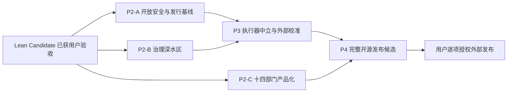

# 方案 A 延期工作台账（第二阶段及以后）

> 状态：`deferred_by_D8_2026-07-14`
>
> 用途：第一阶段 Lean Developer Preview Candidate 完成后，供后续 coding agent
> 直接续作。本文只管理 D8 延期项，不改变
> [05-lean-developer-preview-scope.md](./05-lean-developer-preview-scope.md) 的第一阶段范围。

## 1. 使用规则

延期不是取消。每个工作包只有在满足“恢复触发条件”后，才从本台账进入新的已批准
执行计划。后续 agent 不得只看到完整 G0–G5 旧计划就自动把全部延期项并回当前范围。

续作时按以下顺序恢复现场：

1. 读 [PROGRESS.md](./PROGRESS.md)，确认 Lean Candidate 的真实完成点和最新 HEAD；
2. 读 [05 号范围设计](./05-lean-developer-preview-scope.md)，确认第一阶段实际承诺；
3. 读本文，选择一个获批工作包；
4. 回到 [01-master-plan.md](./01-master-plan.md) 和对应 `docs/codex-v1` brief/plan
   恢复技术细节；
5. 先做现场 recon，动态核对迁移号、公共契约、测试基线和已完成能力；
6. 为所选工作包写独立实施计划并获得批准，再开始编码；
7. 每个证据必须标明来源：本地 fixture、离线 demo、CI、真实外部环境不可互换。

本文中的优先级是建议恢复顺序，不是当前实施授权。

## 2. 总体续作路线



推荐主序为 **P2-A → P2-B → P2-C → P3 → P4**。P2-B 与 P2-C 在契约和文件集
不冲突时可并行，但必须具名 integration owner；P4 不能早于 P3 的正式 Gate。

## 3. 工作包索引

| ID | 工作包 | 原计划映射 | 优先级 | 规模 | 主要解锁能力 |
|---|---|---|---|---|---|
| P2-A1 | Remote MCP 公开安全 | S2.4 | 最高 | M | 可安全开放远程 MCP |
| P2-A2 | stdio MCP 准入与漂移绑定 | S2.5 | 最高 | M | 可安全开放第三方本地 MCP |
| P2-A3 | 官方 exact-wheel 容器 | S2.6、S6.7 部分 | 高 | M | 官方容器安装路径 |
| P2-A4 | 供应链与发行安全基线 | S2.7、S6.8 部分 | 高 | L | 可进入公开制品发布准备 |
| P2-A5 | 多 Python/OS 验证矩阵 | S6.7 扩展 | 中 | M | 扩大正式支持面 |
| P2-B1 | Planner 完整修订与质量证据 | S3.9 未纳入 Lean 的部分 | 高 | M | 计划质量可评估、可比较 |
| P2-B2 | 完整 OTel、SLO 与外部通知 | S3.12 未纳入 Lean 的部分 | 中 | L | 远程运维与跨进程可观测性 |
| P2-C1 | 政务核心部门深度收敛 | S4.8–S4.9 | 高 | L | 御书房到治理部门完整产品流 |
| P2-C2 | 能力/知识/绩效部门深度收敛 | S4.10–S4.11 | 高 | L | 十四部门从导航壳层变成真实产品 |
| P2-C3 | 完整人工 A11y 与视觉终验 | S4.12 延期部分 | 中 | M | 更完整桌面可访问性声明 |
| P3-D1 | Executor 兼容套件与 SDK 边界 | S5.6 | 最高 | L | 执行器中立的可测试契约 |
| P3-D2 | managed OpenHands 真实证据 | S5.7 | 最高 | L/外部 | 第二执行器正式证据 |
| P3-D3 | ROI、成本与校准 | S5.8–S5.9 | 高 | XL/时间窗 | 可诚实比较演化收益与成本 |
| P3-D4 | 完整 G4-A/B/C Gate | S5.10 | 最高 | M | 才能宣称完整 G4 passed |
| P4-E1 | Launch schema 与稳定扩展契约 | S6.1–S6.3 | 最高 | L | 第三方可依赖的公共接口 |
| P4-E2 | 三个黄金 Demo | S6.4–S6.6 | 高 | L | 覆盖治理、技能进化、执行器中立 |
| P4-E3 | 完整可复现发行包 | S6.7–S6.8 | 最高 | L | core/server/all、容器、SBOM、provenance |
| P4-E4 | 三个独立外部环境验证 | S6.9 | 最高 | L/外部 | 完整 G5 候选证据 |
| P4-E5 | 外部发布与社区启动 | S6 出口授权 | 用户授权 | 外部动作 | repo/tag/PyPI/GHCR/宣发 |

规模仅用于拆分：M 通常需要多个可独立验收切片；L/XL 必须先重新设计并拆计划，
不能作为单个大提交执行。

## 4. P2-A：开放安全与发行基线

### P2-A1 Remote MCP 公开安全（S2.4）

**恢复触发条件**：产品决定把 remote MCP 从默认禁用改为可配置公开能力。

**前置条件**：Lean S2 的密文、SystemAudit、能力矩阵和默认 fail-closed 护栏已通过；
先核对 MCP 配置、DNS 解析和 HTTP 客户端的当前实现，禁止沿用旧 recon 的路径假设。

**交付物：**

- URL scheme、host、port、IP range 与凭据策略；
- DNS rebinding、解析结果漂移、redirect 链和 proxy 环境变量治理；
- loopback、link-local、metadata、私网和保留地址策略；
- 每次连接的安全审计、稳定错误码和 Doctor/readiness 证据；
- 允许列表与拒绝列表的冲突规则。

**验收证据**：SSRF/DNS/redirect/proxy 对抗矩阵；解析前后绑定测试；禁止地址和
redirect 越界 fail closed；日志不泄露 token/URL secret。

**未完成前禁止宣称**：“支持安全的远程 MCP”。remote MCP 必须继续默认关闭。

### P2-A2 stdio MCP 准入与漂移绑定（S2.5）

**恢复触发条件**：需要让第三方或用户自定义 stdio MCP 成为正式能力。

**前置条件**：SystemAudit 和 durable governance 已稳定；进程执行入口只有一个受控
authority，不能从 Web/CLI 绕过。

**交付物：**

- 显式 grant、actor/scope 绑定与撤销；
- command/argv/env/cwd/executable digest 漂移绑定；
- tool allowlist 与工具清单变更审批；
- 启动、退出、超时、信号、输出上限和秘密脱敏；
- Doctor、capability matrix、审计事件与回滚路径。

**验收证据**：grant 复用、命令漂移、PATH 劫持、env 注入、工具清单漂移、重启后
撤销等对抗测试；所有未审批配置默认禁用。

### P2-A3 官方 exact-wheel 容器（S2.6、S6.7 部分）

**恢复触发条件**：用户明确把容器列为一等安装和发布方式，而非开发便利脚本。

**前置条件**：exact-wheel fresh HOME 黑盒持续通过；已确定 core/server/all 哪个变体
进入镜像；Dockerfile 的 legacy 状态已清理或替换。

**交付物：**

- 从同一 sdist 构建 Wheel，再只从该 Wheel 安装的 multi-stage 镜像；
- 非 root 用户、只读根文件系统、可写目录最小化；
- health/readiness、信号、优雅退出、HOME/overlay 与 volume 契约；
- 离线 demo 镜像与生产镜像的明确隔离；
- 容器 CI 黑盒和镜像大小/启动时间基线。

**验收证据**：无源码树、无构建工具的最终层运行；read-only + tmpfs；非 root；
fresh volume；Doctor/readiness；受治理 Demo；镜像内 package manifest 对齐。

### P2-A4 供应链与发行安全基线（S2.7、S6.8 部分）

**恢复触发条件**：准备向公共注册表发布制品或对第三方承诺可验证供应链。

**前置条件**：P2-A3（如发布容器）和发行变体冻结；LICENSE/NOTICE/依赖许可策略明确。

**交付物：**

- Wheel/sdist/镜像的 SBOM、依赖与 secret 扫描；
- 最小权限 workflow、固定 action、OIDC 设计；
- 制品签名、attestation/provenance 和校验说明；
- TestPyPI/GHCR 演练方案、回滚/撤回方案；
- 威胁模型与发布 runbook。

**验收证据**：从干净 tag/source archive 重建；SBOM 与实际制品对齐；签名和
attestation 可独立验证；workflow 权限审计无 Critical。

**权限边界**：演练不等于允许真正上传；PyPI/GHCR/tag 仍需用户逐项授权。

### P2-A5 多 Python/OS 验证矩阵

**恢复触发条件**：出现第二个明确用户群或平台承诺，不能因为“通常兼容”就主动扩张。

**建议顺序**：Ubuntu/Python 3.12 基线 → Python 3.11/3.13 → macOS；Windows 只有
路径、进程、信号和依赖契约完成专项 recon 后再决定。

**验收证据**：每个正式组合必须通过安装、Doctor、非 slow suite、最小 Web 构建和
黄金 Demo；允许 experimental 组合失败，但能力矩阵必须如实区分。

## 5. P2-B：治理深水区

### P2-B1 Planner 完整修订与质量证据（S3.9）

**恢复触发条件**：Lean Evidence 闭环稳定，需要比较“计划是否真的变好”而不只是
记录 plan hash。

**交付物**：版本化 planner 输入/输出契约；revision lineage；失败分类；基线、候选
和人工修订的可比质量证据；计划变更与 Decision/Evidence 的引用关系。

**验收证据**：固定语料的确定性/允许差异边界；重试和恢复不丢 revision；质量指标
不能只用 LLM 自评；失败样本保留且可复算。

### P2-B2 完整 OTel、SLO 与外部通知（S3.12）

**恢复触发条件**：进入跨进程、远程部署或正式运维，出现明确 SLO 和告警责任人。

**交付物**：trace/span/metric/log 语义；correlation ID 贯穿 ingress、决策、run、
intent/receipt、outbox；采样和 PII/secret 策略；外部通知 durable delivery、重试、
DLQ、ack；最小 dashboard 与 SLO runbook。

**验收证据**：重启、重复通知、下游超时、采样和 exporter 不可用故障矩阵；遥测
失败不能阻断核心治理事务，也不能静默吞掉 durable 通知。

## 6. P2-C：十四部门完整产品化

### P2-C1 政务核心部门深度收敛（S4.8–S4.9）

覆盖御书房、文书房、内阁、廷议、都察院、权印司。每个页面必须先明确真实用户任务、
后端权威、空/错/禁用/加载/部分可用状态，再实现 UI；禁止把同一列表换标题复制到
六个部门。

**验收证据**：部门专属主任务端到端通过；动作权限与裁决路径一致；URL 可直达和
刷新；无 mock；键盘/缩放/axe；视觉与 approved 新中式壳层一致。

### P2-C2 能力/知识/绩效部门深度收敛（S4.10–S4.11）

覆盖百官阁、文渊阁、位面、考成、藏兵阁、鸿胪寺、通政司、户部账房。按真实使用
频率排序恢复，不要求一次八页同时开工。

建议先做与核心差异最相关的藏兵阁（候选/技能供应链）、考成（Evidence/绩效）和
户部账房（成本事实）；其余页面只有具名业务契约后再做。

**验收证据**：同 P2-C1，并增加跨部门引用一致性（同一 run/candidate/artifact 不得
出现不同状态真值）。

### P2-C3 完整人工 A11y 与视觉终验

**恢复触发条件**：十四部门完成或准备对外做正式桌面可访问性声明。

**交付物**：VoiceOver 主路径、焦点顺序与可见性、动态内容播报、减弱动效、高对比、
系统字体/语言切换、主流桌面浏览器矩阵；补齐非核心页面的视觉回归。

**验收证据**：自动化结果与人工测试记录分开；人工未执行项标 `external_pending`，
不能用 axe 绿替代 VoiceOver 结论。

## 7. P3：执行器中立与外部校准

### P3-D1 Executor 兼容套件与 SDK 边界（S5.6）

**恢复触发条件**：计划支持第二个真实执行器或向第三方开放 adapter。

**交付物**：稳定最小 Protocol/SDK、contract tests、capability negotiation、取消/
超时/流式事件/制品/错误映射、版本兼容策略；Native adapter 必须先通过同一套件。

**验收证据**：至少两个实现运行相同契约测试；不允许对 OpenHands 写隐藏旁路；能力
缺失必须显式降级或拒绝。

### P3-D2 managed OpenHands 真实证据（S5.7）

**恢复触发条件**：P3-D1 稳定，能够固定真实 OpenHands 版本、镜像/依赖和 provider。

**交付物**：生命周期管理、隔离、凭据、网络、workspace、取消/回收、资源上限、
制品映射和审计；版本 pin 与升级策略。

**验收证据**：真实 managed 运行，不接受 fake adapter；异常退出、网络故障、取消、
超时、重启恢复和资源清理；证据包能区分 Native 与 OpenHands。

### P3-D3 ROI、成本与校准（S5.8–S5.9）

**恢复触发条件**：有稳定的真实 provider、固定评测集和足够观察预算。

**交付物**：FTS/prompt/token/时间/成功率定义；paired outcome 设计；至少 100 个有效
outcome 的门槛；七日或经批准的等价成本窗口；置信区间、失败样本和 enforcement
策略；数据快照可复算。

**验收证据**：champion/challenger 同任务配对；成本和质量共同报告；选择偏差、重试、
缓存和人工介入单独披露；窗口不足继续 `external_pending`。

### P3-D4 完整 G4-A/B/C Gate（S5.10）

只有 P3-D1–D3 全部通过，才能执行完整 G4 Gate。Gate 报告必须区分：

- A：候选、证据绑定、门禁与晋升权威；
- B：至少两个真实执行器的同契约证据；
- C：ROI/成本/回滚的真实外部校准。

任一轨道缺证据时不得宣称完整 G4 passed；Lean Core Gate 的通过记录继续保留，但
不能替代本 Gate。

## 8. P4：完整开源发布候选

### P4-E1 Launch schema 与稳定扩展契约（S6.1–S6.3）

**前置条件**：完整 G4 Gate 通过，公共概念和状态不再频繁改名。

**交付物**：launch/capability/evidence schema 状态迁移；稳定 Executor SDK/模板/
兼容 kit；公共 API demo runner；Evidence 校验器；兼容性和废弃策略。

**验收证据**：旧 schema 升级、未知字段、版本不兼容和降级路径；第三方只读文档即可
跑通最小 adapter/demo，不依赖仓库内部模块。

### P4-E2 三个黄金 Demo（S6.4–S6.6）

1. `leave-it-running`：长运行、重启、裁决、恢复和 Evidence；
2. governed skill evolution：候选、门禁、晋升、分流和回滚；
3. same-contract multi-executor：Native/OpenHands 同契约可比较执行。

每个 Demo 都必须有固定输入、离线/在线边界、预期制品、验证器、失败注入和重跑说明；
禁止以视频或截图替代可执行证据。

### P4-E3 完整可复现发行包（S6.7–S6.8）

**交付物**：core/server/all 安装变体；官方 non-root/read-only 容器；锁定依赖；
Wheel/sdist/镜像一致性；SBOM、NOTICE、provenance、签名；最小权限 workflows；
SECURITY/CONTRIBUTING/治理和发布 runbook。

**验收证据**：source archive → 制品 → fresh environment → 三 Demo 全链路；每个制品
可验证来源、依赖和摘要；仓库源码树不是隐式运行依赖。

### P4-E4 三个独立外部环境验证（S6.9）

**前置条件**：候选制品冻结，不再边测边改功能。

环境必须彼此独立，不能共享开发机 venv/HOME/cache/secrets。至少覆盖源码/Wheel、
官方容器和第二正式平台或云环境；每次保留环境事实、命令、版本、结果、制品 hash
和失败处置。

### P4-E5 外部发布与社区启动

这是外部状态变更，不因 P4-E1–E4 完成而自动授权。逐项等待用户批准：

- 仓库设为 Public；
- 创建 tag/release；
- 上传 PyPI/TestPyPI；
- 推送 GHCR/多架构镜像；
- 开启 branch protection/OIDC/签名策略；
- 对外宣发“1.0”“完整自进化闭环”或同等表述。

发布后另建运营台账跟踪 issue 模板、响应 SLA、漏洞披露、版本节奏和兼容性承诺。

## 9. 每个工作包的完成模板

后续 agent 在 `PROGRESS.md` 记录以下字段；缺任一项不得写“complete”：

```text
work_package:
approved_scope:
entry_commit:
design_or_plan:
implementation_commits:
focused_tests:
broad_gate:
security_or_failure_matrix:
artifact_or_external_evidence:
independent_review:
known_limits:
capability_matrix_change:
exit_status:
next_unblocked_package:
```

`artifact_or_external_evidence` 不适用时要解释原因，不能留空；外部证据尚未获得时写
`external_pending`，并保留下一次恢复所需的固定版本、输入、预算和环境条件。

## 10. 第二阶段启动检查表

第一阶段完成后，启动任何延期工作前必须重新确认：

- [ ] 用户已经验收 Lean Candidate，并明确选择本次恢复的工作包；
- [ ] 工作区、分支、HEAD、upstream 与 dirty tree 已记录；
- [ ] `PROGRESS.md`、05 号范围和本文没有状态冲突；
- [ ] 当前公共 API、迁移尾号、测试数量和构建链已重新探测；
- [ ] 所选工作包未与另一并行任务共享单写者文件；
- [ ] 已写可验收的独立计划和回滚点；
- [ ] 外部 provider、时间窗、费用或发布动作已获得对应授权；
- [ ] 未恢复的延期路径继续 fail closed，能力矩阵仍如实标注。

满足这些条件后，第二阶段才能从“延期台账”转为“获批执行计划”。
