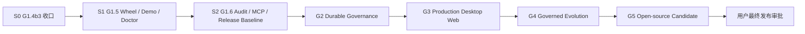

# G0–G5 实施索引

## 总依赖

G3 的测试基础、视觉 token、壳层和纯展示组件可在 G2 gateway contract 冻结后与
G2 后半受控并行；真实 Control Center、Edict Detail 和 Evolution write flow 必须等待
对应 G2 API。

## 阶段索引

| 阶段 | 当前状态 | 目标 | 必读文件 | 出口 |
|---|---|---|---|---|
| G0 | `passed` | 事实、术语、能力、原型、迁移/备份基线 | `plans/10-*`、UI approved | 已完成，不重开 |
| S0/G1.4b3 | `in_progress` | governed apply 权威、REST/CLI/capability 收口 | `plans/02-*`、`design/13-*`、`14-*`、active brief | 两提交、full Gate、报告、clean tree |
| S1/G1.5 | `planned` | exact wheel、overlay、显式离线 Demo、Doctor/readiness | `design/15-*` 至 `18-*` | fresh HOME 完成 governed demo |
| S2/G1.6 | `planned` | SystemAudit、MCP 安全、容器、CI/SBOM、威胁模型 | `design/19-*` 至 `21-*` | Developer Preview Gate |
| G2 | `blocked_by_upstream` | durable decision/run/attempt/effect/evidence/notification | 先 `design/22-*`、`23-*`，再 `plans/12-*` | 故障矩阵与 Evidence Gate |
| G3 | `blocked_by_upstream` | 正式桌面 Web、真实三页、十四部门、质量门 | `ui/README.md`、`plans/13-*` | automation green + 最终用户审批 |
| G4 | `blocked_by_upstream` | 真实 candidate/challenger/promotion/managed adapter/ROI/cost | `plans/14-*` | G4-A/B/C + 外部证据 |
| G5 | `blocked_by_upstream` | SDK、三 Demo、发行/供应链/外部验证 | `plans/15-*` | release candidate，等待发布授权 |

## S0：当前恢复任务

以 [DEVELOPMENT-HANDOFF](./archive/DEVELOPMENT-HANDOFF.md) 为准。不要重复实现；先验证暂停前
WIP 修复，再完成 Commit A、Commit B、单一 full Gate 和 G1.4b3 report。

## S1/G1.5 切片

1. immutable wheel resources 与 manifest；
2. overlay precedence 与六个默认 persona migration；
3. 显式 deterministic demo provider；
4. structured Doctor 与 live/ready；
5. exact-wheel fresh HOME 黑盒。

关键事实：Logo hash 不变；site-packages 只读；live provider 失败不能回退 demo。

`COURT.md` 的 reset 语义已冻结：删除 data-root overlay 中的 override，让读取按
overlay precedence 自然回退到当前 packaged 资源。不得把 packaged bytes 复制进
overlay。测试必须覆盖 override 不存在时的幂等、fallback 内容、后续重新覆盖和
packaged digest 不变。

## S2/G1.6 切片

1. tamper-evident SystemAudit；
2. scoped audit API 与安全事件事务接入；
3. MCP ciphertext migration/key rotation；
4. remote MCP SSRF/DNS/redirect/proxy policy；
5. stdio grant/tool allowlist/drift binding；
6. exact-wheel non-root container；
7. CI/SBOM/scans/threat model/release dry-run。

## G2 切片

1. 冻结完整 G1 handoff 与动态 migration prefix；
2. Edict Application Service + Unit of Work；
3. durable outbox 与统一 ingress；
4. persistent Decision + versioned RunState；
5. 所有 decision adapter 收口；
6. attempt/lease/fencing/reconcile/DLQ；
7. side-effect intent/receipt journal；
8. durable continuation/resume；
9. planner revisions/replan evidence；
10. ArtifactStore；
11. Evidence Bundle v1；
12. audit/OTel/readiness + durable notifications；
13. fault matrix 与 G2 Gate。

执行前必须修订旧 plan 的硬编码 migration、continuation、fencing、Evidence schema 和
notification lifecycle 问题，详见 `design/22-g2-recon.md`。

G2 governed-apply 权威已冻结：generic `DecisionRequest`/`Resolution` 是唯一治理
权威；G1 token-bound workspace apply authorization 只作为已裁决请求的不可变单向
projection，由 `WorkspaceService` 原子消费。G2 启用后禁止任何公共路径另发第二套
批准权威；历史已消费 receipt 保留为证据，未绑定的 pending legacy authorization
必须 fail closed。实现 migration/backfill、单权威架构、重启和 API 兼容测试。

## G3 切片

1. 品牌/UI/API contract 与测试基线；
2. 新中式设计系统、默认深色、壳层和 lazy routes；
3. AuthContext/API error/七类 page states；
4. governance/evidence/evolution components + onboarding；
5. real Control Center；
6. real Edict Detail；
7. authoritative Evolution Center；
8. 敕令部门；
9. 政要部门；
10. 百官部门；
11. 外朝部门；
12. Playwright/A11y/visual/performance/CI。

G0 图是目标构图，不是生产数据源。G4 未开启真实路由时，演化页显示 disabled，不能
用静态 Canary 进度冒充运行事实。

## G4 切片

1. unified candidate + five adapters；
2. guarded skill supply chain；
3. fail-closed GateEvaluator；
4. sole PromotionService；
5. real assignment/overlay/distribution/rollback；
6. executor compatibility + Native/OpenHands boundary；
7. real pinned managed evidence；
8. FTS/prompt budget/paired ROI；
9. calibrated cost + enforcement truth；
10. G4-A/B/C Gate。

外部 OpenHands、真实 provider ROI 与成本校准缺一时保持 `external_pending`。

## G5 切片

1. launch schema/state transitions；
2. stable SDK/template/compat kit；
3. public API demo runner/evidence verifier；
4. leave-it-running Demo；
5. governed skill-evolution Demo；
6. same-contract multi-executor Demo；
7. reproducible profiles/container；
8. SBOM/license/provenance/workflows/community；
9. independent external validation/release candidate。

实际 Public/tag/PyPI/GHCR 需要新的用户授权。
