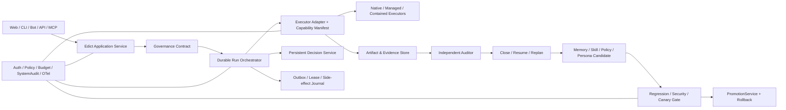

# 产品定位与目标架构

## 一句话定位

天枢是一个可治理、可验证、持续成长的自进化 Agent OS。

它不是通用聊天壳、低代码工作流画布或只会调用工具的 Agent；核心价值是让高风险、
长时间、多执行器任务在明确契约下运行，并留下可独立验证、可恢复、可晋升/回滚的证据。

## 核心差异点

| 差异点 | 用户可见结果 | 技术闭环 |
|---|---|---|
| 可治理 | 执行前看见能力、权限、风险和预算；危险动作进入持久裁决 | Governance Contract、Policy、Decision、ExecutionGateway |
| 可验证 | 结果不是聊天文本，而是可下载、可重放、带哈希的证据包 | ArtifactStore、Evidence Bundle、receipt、独立 Auditor |
| 故障后仍可治理 | 重启后任务、裁决、attempt 和恢复状态仍存在 | RunState、outbox、lease/fencing、side-effect journal |
| 持续成长 | 记忆、技能、persona 和策略成为有来源、可评测候选 | Candidate、provenance、paired evaluation、token budget |
| 受控进化 | challenger 真正影响运行，但强门未过绝不晋升 | assignment、GateEvaluator、PromotionService、rollback |
| 执行器中立 | 同一契约作用于 Native 与外部执行器，能力不足时 fail closed | managed/contained/observed capability truth + compat kit |
| 组织化 Agent OS | 四组十四部门保持稳定职责，而非退化成泛化菜单 | 中枢总览 + 部门 read model + 权威应用服务 |

## 目标架构

## 关键边界

- 所有入口调用同一个 Edict application boundary，不各自编排数据库和事件。
- tool、plan、outer-loop 和 promotion 决策共享持久 Decision domain，以 `kind` 区分。
- shell、acceptance、MCP stdio 和外部执行器都经过 ExecutionGateway。
- 外部执行器按 `managed / contained / observed` 分级；事后 JSONL 不等于事前阻断。
- 源工作区默认不被直接修改：source → staging → restore point → canonical diff → governed apply。
- SQLite 单节点语义稳定前，不扩到 PostgreSQL/Kubernetes/多副本。
- “exactly once”只用于有 intent/receipt/idempotency 且故障矩阵证明的边界。
- 代码候选永不自动晋升；紧急 override 是独立高风险裁决。

## G0–G5 如何共同证明定位

| Gate | 证明内容 | 未通过时禁止宣称 |
|---|---|---|
| G0 | 术语、能力矩阵、迁移/备份和 UI 方向诚实 | 完整产品已经具备 |
| G1 | 身份、安全执行、workspace apply、可安装/自检基础 | 可安全公开部署 |
| G2 | 裁决/任务耐重启、支持边界无重复有效副作用、Evidence Bundle | “敢放手”与可独立验证 |
| G3 | 三张真实桌面页面、十四部门、E2E/A11y/性能 | 正式产品演示 |
| G4 | 真实 challenger、强门、rollback、外部 managed adapter | 自进化闭环成立 |
| G5 | SDK、三 Demo、可复现制品、供应链和外部验证 | 1.0 与正式开源发布 |

## 主要代码域

| 代码域 | 责任 |
|---|---|
| `src/tianshu/models` | 稳定领域 schema/value objects |
| `src/tianshu/storage` | migrations、repositories、事务和持久事实 |
| `src/tianshu/executor` | capability、gateway、workspace、adapter、process boundary |
| `src/tianshu/gateway` | REST/WS/MCP/Bot 适配，不拥有业务权威 |
| `src/tianshu/scheduler` | 时间调度；G2 后 execution ownership 由 attempt/lease 决定 |
| `src/tianshu/universe` / `evolution` | candidate、assignment、gate、promotion、rollback |
| `src/tianshu/memory` / `persona` / `skills` | 成长素材、来源、预算、评测和候选供应链 |
| `web/src` | 桌面治理界面，只消费权威 API |

完整设计见 [Agent OS optimization design](./design/00-agent-os-optimization-design.md)。
