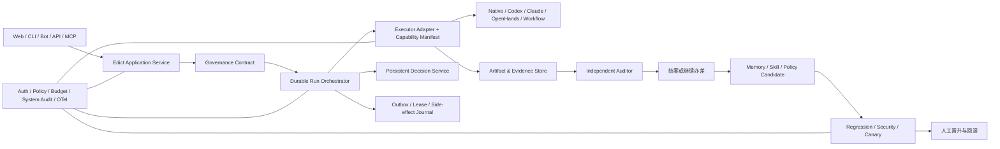

# 天枢开源 Agent OS 全面优化设计

> 状态：待用户审批。本文只定义目标、边界和验收，不授权实现。

## 一、结论先行

天枢的固定定位为：

> **天枢是一个可治理、可验证、持续成长的自进化 Agent OS。**

面向开源社区的完整表达为：

> **天枢不是另一个会调用工具的 Agent，而是让受支持的 Agent 在明确能力边界内办事、用证据交差，并在门禁下持续成长的开源 Agent OS。**

推荐以“可举证的 Agent 委托治理内核”切入市场，以“自进化 Agent OS”建立长期品类。第一卖点是“敢放手”，第二卖点是“有证据”，第三卖点是“会成长但不会乱改”。

这里的 `Agent OS` 指本地优先的 Agent 治理 control plane/runtime，不是操作系统内核，也不是另一套通用 Agent 框架。单独的 HITL、记忆、checkpoint、评测或“会学习”都已不是独有能力；天枢要建立的是这些机制被同一契约、证据和晋升纪律串成闭环后的组合差异。

当前最重要的工作不是继续增加横向功能，而是先闭合四个缺口：

1. **发布安全**：身份、远程访问、命令执行和 MCP 管理必须有真实边界。
2. **可靠恢复**：裁决、长任务、事件投递和副作用必须耐重启、可幂等。
3. **证据协议**：任务完成、策略裁决和演化晋升必须能导出、复现和追溯。
4. **产品收口**：三张核心页面必须成为现有功能的统一入口，而不是另起一套平行 UI。

## 二、目标、用户与边界

### 2.1 目标用户

- 已经使用 Codex、Claude Code、OpenHands 或工作流框架的重度 AI 用户。
- 需要同时运行多个异步、长周期、高风险任务的个人开发者和小团队。
- 比“模型更聪明”更在意权限、预算、恢复、审计和进化可控的人。

### 2.2 核心用户结果

- 用户离开电脑后，任务仍在明确权限和预算内推进。
- 执行器声称完成时，系统能用独立证据判断是否真的完成。
- 系统能够从任务中学习，但每次记忆、技能、策略、人格或代码变化都可评测、可裁决、可回滚。
- 更换执行器时，治理契约、证据结构和审计标准保持一致；实际可强制的边界由执行器能力清单声明，强制能力不足时拒绝执行。

### 2.3 当前范围

- 桌面 Web 是当前 UI 唯一交付面；本轮不设计或开发手机端。
- 保留现有 Logo、顶部标语、语言模式、实时/通政状态、四组十四部门、主题切换和侧栏收起。
- 生产后端、CLI、飞书、Telegram 和 MCP 属于功能方案范围，但不扩展新的移动 App 或新渠道。
- 内部 `Decree` 模型和现有 API 暂作兼容；面向用户的治理动作统一称为 `裁决`。

## 三、路线选择

| 路线 | 优势 | 主要问题 | 选择 |
|---|---|---|---|
| 通用 Agent 框架优先 | 开发者容易理解 | 与 LangGraph、CrewAI、Microsoft Agent Framework 正面竞争 | 不选择 |
| 个人 Agent 与记忆优先 | 容易做出陪伴感 | Hermes、Letta 已占据记忆、多渠道和持续目标心智 | 不选择 |
| 治理、验证与受控进化优先 | 与现有敕令、策略、预算、审计、位面高度一致 | 需要把已有机制变成硬证据和强演示 | **推荐** |

天枢不与竞品比较模型数、工具数、渠道数或角色数，而比较五个问题：

1. Agent 获得了什么授权；
2. 任务是否真的完成；
3. 崩溃、超预算或危险动作时能否可靠停住并恢复；
4. 自我修改是否经过回归、安全评测、灰度和人工晋升；
5. 不同执行器是否遵守同一治理与证据协议。

## 四、行业对照与差异边界

| 项目 | 主战场 | 天枢策略 |
|---|---|---|
| [LangGraph](https://docs.langchain.com/oss/python/langgraph/overview) | 持久化图运行时、检查点和人在回路 | 接入为工作流执行器，不重造图运行时 |
| [CrewAI](https://docs.crewai.com/en/concepts/flows) | 角色化多 Agent 与 Flows | 治理其工作流，不以角色数量竞争 |
| [Dify](https://github.com/langgenius/dify) | 低代码画布、RAG、应用发布和插件生态 | 不追通用画布、RAG 平台和模型市场 |
| [OpenHands Software Agent SDK](https://docs.openhands.dev/sdk/index) | 类型化动作/事件、工作区、安全策略和可远程部署的编码 Agent 运行时 | 优先验证为首个全符合外部客卿，不复制其编码 Agent 与运行时 |
| [Hermes](https://hermes-agent.nousresearch.com/docs/user-guide/features/memory) | 多渠道个人 Agent、记忆、技能和后台成长 | 强调所有成长先评测再晋升 |
| [Letta](https://docs.letta.com/letta-agent) | 长期记忆、状态 Agent 和持续目标 | 把记忆变化也纳入证据与演化门禁 |
| [Microsoft Agent Framework 1.0](https://devblogs.microsoft.com/agent-framework/microsoft-agent-framework-version-1-0/) | 已 GA 的 Python/.NET Agent 与工作流运行时，覆盖 checkpoint、HITL、middleware、skills、DevUI 和 Claude Code SDK 等集成 | 不与其争夺通用运行时；聚焦跨执行器的裁决证据、能力分级与受控进化产品闭环 |

### 4.1 天枢的四个可交付差异

| 差异 | 必须成为的产品能力 | 必须拿出的证据 |
|---|---|---|
| 可治理 | 契约、风险、权限、预算、裁决、急停、回滚 | 危险动作被阻断；预算触顶停住；所有裁决有主体和理由 |
| 可验证 | Evidence Bundle、独立审计、失败归因、可复现验收 | 执行器缺证据时不能结案；补齐后才通过 |
| 持续成长 | 候选 diff、回归、安全评测、Canary、人工晋升、回滚 | 坏候选被门禁拒绝；好候选有可量化提升和回滚点 |
| Agent OS | Executor Adapter、能力清单、事件、策略、证据和生命周期协议 | 同一敕令换执行器后契约与证据结构不变；强制能力不满足时 fail closed |

## 五、三个闭环与最小产品契约

### 5.1 治理环

`敕令契约 → 风险与预算 → 策略/人工裁决 → 受控执行 → 熔断/暂停/回滚`

必须回答：谁授权、授权什么、有效多久、允许在哪执行、花费上限是多少、发生异常如何停住。

### 5.2 验证环

`验收标准 → 执行产物 → Evidence Bundle → 独立审计 → 结案/驳回 → 失败归因`

必须遵守：执行者不能自证完成；审计结论必须引用具体证据；结案可复现。

### 5.3 成长环

`候选变更 → 离线回归 → 安全评测 → Canary → 人工晋升 → 持续观测 → 回滚`

必须遵守：没有来源、diff、评测、样本和回滚点的变化不能晋升；代码变化永不自动晋升。

### 5.4 Agent OS 最小契约

- `GovernanceContract`：目标、验收、执行器、权限、网络、工作区、预算、期限和恢复策略。
- `RunState`：可版本化、可恢复的任务、阶段、裁决、checkpoint 和副作用状态。
- `EvidenceBundle`：产物、变更、验证、策略、成本、审计和环境证据。
- `ExecutorAdapter`：向执行器下发同一契约，接收其能够提供的结构化事件、产物和用量。
- `ExecutorCapabilityManifest`：声明 `managed / contained / observe-only` 等级，以及逐工具拦截、硬成本上限、工作区/网络/凭证隔离、执行前恢复点、暂停恢复和结构化事件能力；契约的强制能力不能被满足时拒绝运行。
- `EvolutionCandidate`：来源、对象、diff、基线、评测、样本、回滚点和晋升状态。
- `SystemAuditEvent`：面向系统级操作的追加式审计记录。

## 六、当前事实基线

### 6.1 已有强项

- 现有 Web、API、CLI、飞书、Telegram 和 MCP 最终围绕 Edict 主链工作。
- 已有策略分级、预算、急停、clean-env、影子快照、审计、失败归因、记忆、技能和位面基础。
- 生产 Web 已包含 18 个 page module；三页审批稿已证明中枢总览、敕令详情和演化中心的产品叙事成立。
- CI 已覆盖后端 lint/type/import contract/pytest，以及前端 lint/typecheck/Vitest/build。
- 已采用 SQLite 单节点、React 18、Ant Design 5 和 Vite，适合先把单机可信闭环做深。

### 6.2 当前发布阻断项

- `src/tianshu/config.py` 默认监听 `0.0.0.0`，`src/tianshu/app.py` CORS 全开放，未形成统一认证层。
- WebSocket、REST、MCP 和管理面没有统一 `Principal/AuthContext`。
- `ApprovalManager` 的关键等待状态仍保存在内存字典与 `asyncio.Event` 中，重启后无法恢复。
- acceptance bash/lint 通过 `create_subprocess_shell` 直接执行，未统一进入策略与沙箱边界。
- 现有 Claude Code/Codex headless 客卿只能在进程和工作区外围治理：JSONL 工具事件属于执行后观测，不能证明每个工具调用在执行前经过策略或人工裁决；Codex 成本也不能形成实时硬上限。
- 客卿工作区尚未形成“源版本 → 隔离 staging → 执行前恢复点 → 执行后 diff → 受治理 apply”的闭环，当前影子快照不能作为首次执行前回滚保证。
- MCP 管理 API 能提交 stdio command；安全性依赖部署者自觉，默认策略不够保守。
- Docker 发行物只安装 `.[cli]`，资源、persona、server extras 和非 root 运行还未形成可重复交付。
- `/health` 只返回固定 `ok`，无法代表 DB、scheduler、sandbox 和关键依赖是否可用。
- 前端只有两个单元测试文件，缺少核心治理旅程 E2E。

### 6.3 当前产品可信度风险

- 原型仍有 `批红 / 审批` 等旧称，需统一为 `裁决`。
- `系统可信 98.7%` 没有可验证口径，应改为治理合规率或证据完整率。
- 技能候选 `置信度 0.91` 缺少校准与样本，应改为证据数量、复用成功率和失败样本。
- Canary 未达到样本门槛时仍可直接批准晋升，与受控演化叙事冲突。
- 生产裁决组件把 actor 固定为 `user`，高风险授权缺少真实身份、理由、到期和影响预览。
- 多个 query 将失败或缺失数据映射为 `[] / 0`；页面可能把“接口失败”误显示为“系统没有问题”。
- 户部的周期筛选只作用于 summary，趋势却基于当前分页记录；预算进度同时显示 `¥spent / $budget`，口径与币种不一致。
- 文渊阁把六个 persona 写死在前端，不能反映动态组织和 fresh install 状态。
- 原型把生产侧栏的 `百官阁` 改成了 `百官图`，与“原部门不改名”的审批约束冲突；现有 Design QA 的通过结论也未覆盖术语和演化门禁问题，需要重做。
- README、版本、launch checklist 和实验能力之间存在事实漂移，需要稳定/实验/规划能力矩阵。

## 七、目标架构

### 7.1 边界原则

- 不进行全仓“Clean Architecture”改造，只抽取当前风险最大的应用服务和协议边界。
- Web/API/CLI/Bot/MCP 统一调用一个 Edict 应用服务，不在适配层各自编排存储和事件。
- tool call、outer loop 和 plan review 共享持久裁决领域，通过 `kind` 区分。
- shell、acceptance checks、MCP stdio 和 Universe 变体执行共享 `ExecutionGateway + Policy + Sandbox`。
- 外部执行器分为 `managed / contained / observe-only`：只有具备可阻塞 pre-tool hook 且通过兼容性测试的 managed adapter 才能宣传逐工具治理；contained adapter 只承诺外围隔离、超时、OS 资源、工作区 diff 和结果审计。
- Governance Contract 声明 mandatory capabilities；适配器能力不足时必须 fail closed，不能以“事后看到 tool event”冒充“事前阻断”。
- 事件 outbox 和通知 delivery 可共享 lease/attempt 基础原语，但保留各自业务状态机。
- SQLite 单节点语义稳定前，不进入 PostgreSQL、Kubernetes 或多副本调度。

## 八、功能模块优化清单

| 模块 | 目标状态 | 主要优化 | 优先级 |
|---|---|---|---|
| 入口与身份 | 本地默认安全；远程显式开启 | AuthContext、首启 token、CORS/Origin、WS/MCP 鉴权、幂等键 | P0 |
| Edict 入口 | 所有入口同一应用服务 | 统一校验、身份、correlation、idempotency、事务 outbox | P0/P1 |
| Scheduler/EventBus | 崩溃后可恢复且不重复 | submitted 恢复、claim/lease、retry、DLQ、reconciler | P0/P1 |
| Planner/DAG | 计划可审、质量可量化 | 静态 DAG 保持；plan amend/replan 率进入 Evals；不做动态图 | P1 |
| 执行器 | 能力诚实且强制边界不可绕过 | Capability Manifest、ExecutionGateway、managed/contained 分级、context window、ArtifactStore | P0/P1 |
| 工作区与变更 | 源工作区默认不被直接修改 | source/base revision、隔离 staging、执行前恢复点、diff artifact、受治理 apply/merge | P0/P1 |
| 长任务 | 任意阶段可暂停/恢复 | 版本化 RunState、持久裁决、best output、steer、history、checkpoint | P0/P1 |
| 治理安全 | 关键 guardrail fail closed | trusted-local/secure-remote、mandatory/advisory、沙箱能力门、系统审计 | P0 |
| 证据与审计 | 每次结案可复现 | Evidence Bundle、独立审计引用、导出、哈希、环境与成本证据 | P0/P1 |
| 记忆与画像 | 有质量基准、有 token 预算 | 默认 persona seed、索引重建、召回 benchmark、分层 token budget | P0/P1 |
| 技能 | 所有入口同一供应链安全 | SkillInstallService、来源/hash/版本/回滚、API 不绕过 guard | P0/P1 |
| 自进化 | 真实流量、真实门禁、可回滚 | per-run challenger 路由、指标归因、最小样本、人工 veto | P1 |
| 渠道 | 可恢复投递、可扩展适配 | DeliveryOutbox、AttemptLedger、退避/DLQ、ChannelAdapter | P1 |
| MCP | 最小权限与明确能力授予 | 远程管理默认关、command allowlist、capability grant、secret 脱敏 | P0/P1 |
| 可观测性 | 一条 trace 重建整条敕令 | correlation、全链 span、队列/裁决/成本/渠道指标、readiness | P0/P1 |
| 成本 | 从账本升级为治理信号 | 预算预测、熔断解释、质量/安全/成本同屏对照 | P1 |
| 部署 | fresh wheel/container 可运行 | package resources、server extra、非 root、锁定依赖、备份恢复 | P0 |
| 开源工程 | 标签到制品可复现 | metadata、wheel/container smoke、SBOM、安全扫描、E2E、release workflow | P0/P1 |

## 九、桌面 Web 信息架构

### 9.1 全局外壳冻结区

- 使用现有 `web/public/brand.png` Logo，不重绘。
- 顶部中央保留“成功只有一个——按照自己的方式，去度过人生。”。
- 右上角保留 `彩蛋 / 通用 / English / 实时 / 通政`。
- 左侧保留四组十四部门，在其上新增 `中枢总览`。
- 左下角保留浅色/深色模式和收起/展开侧栏。
- 默认深色；浅色模式保持完整可用。
- 四组名称、十四个部门名称、顺序和分组均不得改动；生产名称 `百官阁` 不改为 `百官图`。
- 主题与侧栏折叠控件的位置不动；本轮只允许在原部门列表上方增加 `中枢总览`，并重构右侧治理内容区。
- 新增 `/control`；`/` 重定向到 `/control`，`/approvals` 作为御书房 canonical 路由，保留旧深链兼容。

### 9.2 导航与页面矩阵

| 入口 | 推荐路由 | 页面职责 |
|---|---|---|
| 中枢总览 | `/control`，根路由逐步引导至此 | 跨部门态势、待裁决、预算、证据健康、成长门禁 |
| 御书房 | `/approvals` | 敕令列表、治理收件箱、进行中任务与待裁决事项 |
| 文书房 | `/scheduler` | 即时/定时/周期任务、运行记录、错过与恢复状态 |
| 内阁 | `/cabinet` | 计划审阅、复杂度、预算/时长预估和重规划质量 |
| 廷议 | `/consultation` | 多视角立场、强制反对意见、条件和证据纪要 |
| 都察院 | `/audit` | 审计结论、违规、策略命中、系统审计和 Evidence Bundle |
| 权印司 | `/session-rules` | 权限、策略、有效期、作用域、变更 diff 和撤销 |
| 百官阁 | `/personas` | 官员、能力矩阵、健康、权限和生命周期 |
| 文渊阁 | `/memory` | 记忆来源、召回、保留、修订、画像和 provenance |
| 位面 | `/universes` | 候选血缘、差异、Canary、晋升和回滚 |
| 考成 | `/evals` | 回归、安全、失败分类、质量/成本对照 |
| 藏兵阁 | `/system` | 模型、工具、技能、MCP、插件和全局配置 |
| 鸿胪寺 | `/hongluisi` | 现有网页检索引擎与凭证；扩展客卿连接、能力等级和健康 |
| 通政司 | `/tongzheng` | 渠道、通知级别、免打扰、投递尝试和失败 |
| 户部账房 | `/cost` | 预算、成本、预测、归因和熔断记录 |

所有页面必须把 `无数据`、`接口失败`、`无权限`、`服务不可用` 和 `数据陈旧` 分开呈现，不得以空数组或数字 0 代替错误状态。

### 9.3 三张核心页面

#### 中枢总览

- 顶层只显示五个需要操作或判断的指标：运行中、待裁决、预算、证据完整率、异常/恢复。
- `系统可信` 改为有口径的 `治理合规率` 或 `证据完整率`，可下钻分子分母和时间窗。
- 主区域按“现在要做什么”排序：高风险裁决、异常恢复、即将超预算、进行中敕令、演化候选。
- 成长脉动显示来源和样本，不显示未经校准的置信度。

#### 敕令详情

- 固定展示 Governance Contract：执行器、能力等级、可/不可强制项、权限、网络、预算、期限、workspace 和恢复策略。
- contained 客卿不得展示“逐工具已裁决”或“实时硬成本上限”；只显示实际生效的外围管控和事后证据。
- 页面结构统一为：概况、计划、执行脉络、证据、变更、裁决、成本、结案。
- 高风险裁决显示命令、边界、预计影响、恢复点和必须填写的理由。
- Evidence Bundle 分为产物、变更、验证、策略、成本、环境和审计证据，可导出、可复现。
- 执行者不能直接把自己的输出标记为独立验收通过。

#### 演化中心

- 统一承载记忆、技能、策略、人格和代码候选；按对象类型筛选。
- 强门禁未满足时，晋升按钮禁用；紧急覆盖必须进入单独高风险裁决并写理由。
- champion/candidate 对照必须显示样本、基线版本、阈值、变化和回滚点。
- `置信度` 改为证据强度、样本数和通过/失败分布。
- 真实 per-run challenger 路由接通前，不展示已发生的灰度比例。

### 9.4 十四部门 Page Contract

| 部门 | 必须收口的产品能力 | 当前优先级 |
|---|---|---|
| 御书房 | 统一治理收件箱；actor 来自 AuthContext；高风险/永久授权显示影响、到期、恢复方式并要求理由 | P0 |
| 文书房 | 错过/恢复、上次运行、重试、lease/DLQ 和历史，而不只是 list/cancel | P1 |
| 内阁 | 计划审阅、复杂度、预算/时长预估、amend/replan diff 与质量 | P1 |
| 廷议 | 立场、条件、证据和强制反对意见持久化，不能只存在当前页面状态 | P1 |
| 都察院 | 任务审计、系统审计和接口故障分栏；拉取失败不能显示为 0 个异常 | P0/P1 |
| 权印司 | scope、expiry、参数指纹、diff、理由和撤销；高风险规则默认有限期 | P0 |
| 百官阁 | 人员/部门/模板/详情按可测试职责拆分；权限变化有治理 diff；错误不显示成“无官员” | P1/P2 |
| 文渊阁 | persona 来自后端；区分空库/失败/未初始化；展示 provenance、复用结果、保留、token 成本和索引重建 | P1 |
| 位面 | 后端权威晋升门、真实 challenger 路由、来源/diff/样本/回滚；配置切换也进入裁决 | P0 |
| 考成 | 回归、安全、失败分类和质量/成本对照；缺失与失败不渲染为 0 | P1 |
| 藏兵阁 | 模型/工具/技能/MCP/插件分层；MCP 管理展示 capability、command、env、风险和审计，远程默认不允许任意 stdio | P0/P1 |
| 鸿胪寺 | 保留检索引擎/凭证，再增加客卿 Manifest、符合性、连接和健康；contained CLI 不伪装成全治理 | P1 |
| 通政司 | 通知级别、免打扰、delivery attempts、重试、不确定结果和 DLQ | P1 |
| 户部账房 | summary/trend/records/export 共用同一 filter；CNY 一致；增加预测、归因、熔断与预算超额量 | P1 |

所有页面共享 `PageDataState`：`loading / success-empty / success-data / stale / error / permission-denied / service-unavailable`。错误态显示 correlation id 和重试入口；stale 状态禁用高风险写操作。

## 十、UI 设计系统

### 10.1 视觉语言

- 继续“墨为骨、朱为睛、纸为气”，但把 `朱批` 叙事统一改为 `朱砂强调`。
- 墨/纸/灰构成 95% 以上界面；朱砂只用于风险、当前选择、主裁决动作和键盘焦点。
- 标题使用宋体气质，正文使用高可读黑体/系统字体，数字和代码使用等宽字体。
- 卡片靠边线、层级和留白区分，不使用霓虹、宫殿纹样、重金色、玻璃拟态或重阴影。
- 设计 token 覆盖字号/字重/行高、4/8/12/16/24/32 间距、页面宽度、紧凑/舒适密度、风险动作、动效时长与 reduced-motion；不只定义颜色。

### 10.2 组件原语

- `PageHeader`、`MetricCard`、`GovernanceStatus`、`RiskTag`。
- `GovernanceContractCard`、`DecisionPanel`、`EvidenceBundlePanel`。
- `AuditTimeline`、`ExecutionProgress`、`EvolutionGate`、`ComparisonTable`。
- `LoadingState`、`EmptyState`、`ErrorState`、`PermissionDeniedState`、`UnavailableState`、`StaleDataState`。
- `ConfirmDangerousAction` 必须显示影响、恢复点和理由输入，不使用普通确认框替代。

### 10.3 可访问性与性能

- 核心流程目标为 WCAG 2.2 AA；正文不低于 13px，操作文字不低于 14px。
- 状态不得只靠颜色；必须有文字或图标。
- 覆盖键盘顺序、可见焦点、对话框焦点锁与返回、状态播报和 200% 缩放；axe serious/critical 为 0，并做 VoiceOver 抽检。
- 所有重页面按路由懒加载；DAG、时间线、大表格和图表按需加载。
- 生产验收记录初始 JS、路由 chunk、LCP 和交互延迟，性能预算在首轮基线后冻结。

## 十一、开源产品化

### 11.1 首次安装

- 扩展现有 `tianshu doctor`：检查配置、LLM/mock、DB、端口、沙箱、依赖和写权限。
- 提供无真实密钥的 mock/demo provider，确保新用户能先跑通治理闭环。
- 在定义的环境、网络和硬件下记录 p50/p95，clean clone 到首个受治理敕令 p95 目标不超过 15 分钟。
- fresh wheel 和 fresh container 都必须包含默认 persona、内建技能、Web 静态资源和明确 extras。

### 11.2 事实能力矩阵

- README 和文档将能力标记为 `稳定 / 实验 / 规划`。
- 未接通真实路由、恢复或门禁的能力不得使用完成式宣传。
- 明确 trusted-local 与 secure-remote 支持边界、平台沙箱矩阵和单节点限制。
- 对每个客卿公开 Capability Manifest；当前 headless CLI 的 `pre_tool_interception / hard_cost_cap / pre_run_restore_point` 在未实现前必须标为 false。
- 不宣称企业级合规、绝对安全或自动证明正确。

### 11.3 工程与社区

- 发行元数据补齐 readme、license、authors、classifiers 和 project URLs。
- CI 增加 wheel 安装、fresh container smoke、依赖/代码安全扫描、SBOM、coverage floor 和核心 Web E2E。
- 发行使用 frozen lock，明确 core/server/all（含 MCP）组合；增加 Git 历史 secret scan、第三方 license/NOTICE、制品 provenance/attestation 和仓库卫生门。
- 增加 CODE_OF_CONDUCT、Issue/PR 模板、release workflow 和兼容性矩阵。
- skills、channels、tools、MCP 分别保留领域模型，但共享最小 manifest、provenance、health 和 enable/disable 生命周期。
- 供应链和回滚模型稳定前，不建设公开技能市场。
- 分阶段发布：G1 后 Developer Preview 只承诺治理基础；G3 后 Governance Preview 承诺可治理/可验证；G4/G5 通过后才发布 1.0 并宣称自进化闭环。

## 十二、三个标志性 Demo

### 12.1 离席办差

Web 下达真实代码任务并设置预算和验收；执行器在隔离 staging 工作。managed adapter 的逐工具危险动作等待裁决；contained CLI 只在进程启动、网络/工作区授权和最终 apply/merge 边界等待裁决。独立验收引用测试、哈希和产物证据发现缺失测试并拒绝结案，补齐后才通过，最后展示成本、裁决、Evidence Bundle 和回滚。

### 12.2 臣请自我优化

首个公开 Demo 只演示技能候选：展示来源和 diff；好候选通过回归和安全评测后进入 Canary，达到样本门槛并经人工晋升；坏候选被门禁拒绝；晋升版本可以回滚。记忆、策略、人格和代码复用同一协议，但代码不自动晋升，也不作为首发自改演示。

### 12.3 同旨异客卿

同一 Governance Contract 分别交给内置执行器、一个通过全符合测试的外部执行器和一个 contained CLI；界面明确展示各自能力覆盖与被禁用的强制项，再横向比较质量、安全、证据完整度和成本，证明“同一标准、不同强制深度、能力不足即拒绝”。

## 十三、核心指标

北极星指标：

> **每周通过独立验收、没有已知未授权风险且处于预算内的受治理敕令数量。**

配套指标：

- 安装到首个受治理结果的 p50/p95，并记录操作系统、硬件和网络条件。
- 北极星同时公布启动任务总数、风险等级和复杂度分层，防止用大量小任务刷高。
- 受治理任务成功率、Evidence Bundle schema 完整率、强制检查重放率、哈希校验率和审计分歧率。
- 每个成功敕令需要的人类关注分钟数。
- 崩溃恢复成功率和重复有效副作用数量；零重复只适用于已接入 receipt/idempotency 的 managed 边界和定义故障点。
- 裁决等待 p50/p95、超预算率、预算触顶后的实际超额量和恢复时长。
- 候选相对 champion 的质量、安全和成本净增益。
- Executor Adapter 各能力位的兼容性套件通过率，以及因 mandatory capability 不满足而正确拒绝的次数。

## 十四、明确不做

- 不做通用低代码画布、RAG 平台、模型市场或应用商店。
- 不重造 Agent Loop、图运行时、通用工作流框架、编码 Agent、终端 TUI 或浏览器引擎。
- 不把多 Agent 角色扮演、渠道数量、插件数量作为核心竞争力。
- 不建设动态 Swarm 或复杂自治组织。
- 不在可靠恢复完成前投入 PostgreSQL、Kubernetes、HA 和多租户。
- 不在记忆 benchmark 前引入向量数据库。
- 不允许代码候选自动晋升。
- 不在本轮开发手机端。

## 十五、审批项

用户批准本方案即表示同意：

1. 固定“可治理、可验证、持续成长的自进化 Agent OS”定位；
2. 以安全发布和可靠恢复优先于新增横向功能；
3. 以 Governance Contract、Evidence Bundle、带 Capability Manifest 的 Executor Adapter 和 Evolution Candidate 为四个核心协议；
4. 固定现有品牌壳与四组十四部门（含 `百官阁`）侧栏，只新增中枢总览并重构主内容；
5. 产品治理动作统一为“裁决”，旧称只保留在内部兼容实现；
6. 当前只做桌面 Web，不做手机端；
7. 按配套主路线图逐门验收，未通过上一道门不进入下一阶段。
