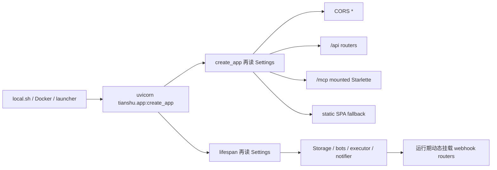
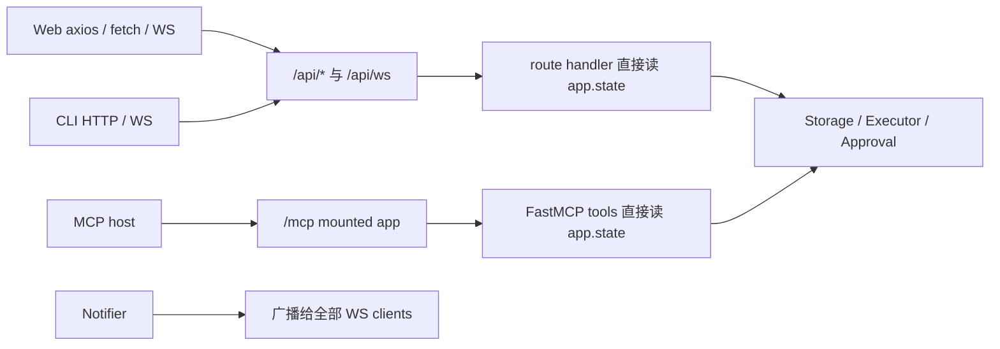

# G1 Phase 1.1 身份与运行模式勘察

> Snapshot: 2026-07-11，基于当前 dirty worktree 的只读源码勘察。本文只覆盖 Phase 1.1：`trusted-local / secure-remote`、Principal/AuthContext、REST/WS/MCP/CLI/Web 身份传播、Host/Origin/CORS、令牌生命周期和 TLS 反代边界；没有修改生产或测试代码。Tianshu 当前未被 GitNexus 索引，调用链由源码、测试和本地已安装依赖直接核对。

## 1. 结论先行

Phase 1.1 的**平台统一身份与运行模式目前是零实现**，不是“已有认证需要补强”；渠道 Webhook 自有校验属于可复用的独立边界，不能代替平台认证：

- 默认监听在 `0.0.0.0`，本地脚本、Universe launcher 和 `.env.example` 也延续该默认。
- FastAPI CORS 为 `allow_origins=["*"] / allow_methods=["*"] / allow_headers=["*"]`。
- REST、WebSocket 和挂载的 MCP Server 都没有统一认证；WS 在握手后立即注册到全局广播集合。
- MCP 明确关闭 DNS rebinding 防护。
- CLI、Web axios、三组独立 `fetchJson`、一个 SSE `fetch` 和 WS 均不携带凭证。
- 当前没有 `Principal`、`AuthContext`、auth token/session 表、token issue/rotate/revoke API 或 auth 测试。

因此最小正确落点不是“给 `/api` 加一个 HTTP dependency”，而是一条覆盖 HTTP + WebSocket + mounted ASGI app 的**纯 ASGI 安全边界**，并配一套持久、只存 hash 的 opaque token/session 生命周期。还必须先统一 `TianshuSettings`：当前 `create_app()`、`lifespan()` 和静态资源挂载分别重新读取 Settings，安全配置可能在同一进程中漂移。

建议把 1.1 拆成四个连续 TDD 小门，全部通过才算 G1.1 完成：

1. **模式与入口门**：统一 Settings；默认 loopback；Host/Origin/TLS proxy 启动校验；冻结 route matrix。
2. **身份与令牌门**：Principal/AuthContext、持久 token/session、issue/refresh/rotate/revoke、REST + WS 鉴权。
3. **客户端与 MCP 门**：Web cookie/session、axios/fetch/SSE/WS、CLI HTTP/WS、MCP Host/Origin/auth/scopes。
4. **不可绕过门**：动态 Webhook 豁免、Universe 变体安全兼容门、Docker/脚本/文档和全量回归。

## 2. Phase 1.1 计划要求与当前事实

Master roadmap 1.1 要求：

- 输出 `Principal` 和 request-scoped `AuthContext`，覆盖 REST、WS、MCP、CLI、Web 和系统审计。
- 明确 `trusted-local` / `secure-remote`；远程模式没有身份和 Origin policy 时不能启动。
- 冻结 static、liveness、readiness、webhook、REST、WS、MCP 的 route matrix，并定义 token issue/rotation/revoke 与 TLS reverse-proxy 边界。
- 默认只监听 loopback；secure-remote 匿名 REST/WS/MCP 返回 401/403；不允许的 Origin/Host 被拒。
- Web、WS、CLI 可携带/刷新凭证；Universe launcher 默认 loopback；secure-remote 没有受信 TLS proxy 时拒绝服务。

当前事实：

| 事实 | 代码证据 | 影响 |
|---|---|---|
| 全局 host 默认 `0.0.0.0` | `src/tianshu/config.py:25` | 默认即暴露所有接口，不满足 G1 |
| 启动脚本另有 `0.0.0.0` fallback | `scripts/local.sh:234` | 只改 Settings 不会改变常用启动路径 |
| Universe launcher 另有 `0.0.0.0` fallback | `src/tianshu/universe/launcher.py:36` | 进化/重启后可能重新扩大监听面 |
| `.env.example` 明示 `TIANSHU_HOST=0.0.0.0` | `.env.example:8` | 新用户会复制不安全默认 |
| CORS 全开 | `src/tianshu/app.py:142-147` | CORS 不是认证；浏览器 Origin 也无边界 |
| Settings 被读取三次 | `src/tianshu/app.py:40`、`:186`，launcher 另读 env | middleware/static/lifespan 可能使用不同快照，不适合安全配置 |
| REST routers 全量挂在 `/api` | `src/tianshu/app.py:148-168` | 适合用统一 ASGI 边界保护；逐 router 加 dependency 易漏 |
| `/health` 固定返回 `ok` | `src/tianshu/app.py:170-172` | 只有 liveness，没有 readiness；应保留兼容 alias |
| WS 无身份，accept 后进入全局广播集合 | `src/tianshu/gateway/api.py:24-33`、`src/tianshu/notifier/notifier.py:43-64` | 任意连接可接收所有事件；HTTP-only dependency 无法覆盖 |
| MCP 是 mounted Starlette app | `src/tianshu/app.py:174-180` | FastAPI router dependency 覆盖不到 `/mcp`，必须 ASGI middleware 或 MCP 原生 verifier |
| MCP 显式关闭 DNS rebinding protection | `src/tianshu/gateway/mcp_server.py:44-57` | Host/Origin 当前完全委托部署者；与 G1 目标相反 |
| MCP 提交者硬编码为 `mcp` | `src/tianshu/gateway/mcp_server.py:66-72` | 无法审计到真实主体；后续需从 AuthContext 派生 |
| CLI HTTP 不加凭证 | `src/tianshu/cli/client.py:11-47` | 所有 helper 和 `get_client()` 都匿名 |
| CLI watch 单独建立 WS，不加 header | `src/tianshu/cli/commands/watch.py:69-78` | 只改 `cli/client.py` 仍漏 WS |
| Web axios 无 request auth/refresh | `web/src/api/client.ts:4-40` | 401 只弹 toast，不会刷新/重试/进入 auth state |
| 浏览器 WS 只用 URL | `web/src/hooks/useWebSocket.ts:4-8,38-82` | 浏览器原生 WebSocket 不能自定义 Authorization；不能照搬 axios 方案 |
| Web 有三个独立 `fetchJson` | `web/src/api/memory.ts:3-8`、`providers.ts:10-15`、`cost.ts:3-8` | 会绕过 axios credential/refresh interceptor |
| 画像合成 SSE 直接 `fetch` | `web/src/components/persona/ProfileTab.tsx:45-61` | streaming 路径也会绕过统一 client |
| Docker helper 把端口发布到所有宿主接口 | `scripts/docker.sh:54-60` | 即使容器内需要 `0.0.0.0`，宿主默认也应绑定 `127.0.0.1` |
| 自进化部署用变体 worktree 覆盖 `tianshu.app` | `src/tianshu/universe/launcher.py:18-53`、`universe/deployer.py:65-100` | 变体可回到没有 G1 auth 的 app；认证边界会被“自进化”绕过 |

## 3. 当前调用路径

### 3.1 当前启动与应用装配



`create_app()` 与 `lifespan()` 没有共享 Settings 对象。建议改为：

```text
create_app(settings: TianshuSettings | None = None)
  -> settings = settings or TianshuSettings()
  -> validate static security config
  -> app.state.settings = settings
  -> install middleware / routers / static / MCP using same settings

lifespan(app)
  -> settings = app.state.settings
  -> wire storage
  -> wire AuthService and verify secure-remote has an active identity
  -> wire remaining services / dynamic webhook route registry
```

这也让测试可以显式注入模式，不必靠全局 env 串联。

### 3.2 当前请求链



当前没有任何一层生成主体或 request correlation。`EdictCreateRequest.submitter`、`DecreeCreateRequest.actor` 和 `ToolDecisionRequest.actor` 还可由客户端直接提交；即使加了认证，如果后端仍信这些字段，系统审计主体仍可伪造。

### 3.3 Webhook 是特殊入口

- Feishu/Telegram webhook routers 在 `lifespan → wire_channel_bots → ChannelBotManager.start_instance()` 中动态挂载，路径可来自 env 或 DB 实例配置。
- Feishu 自有签名/token/allowlist/dedup/rate-limit；Telegram 自有 webhook secret/allowlist。它们应从平台 Bearer auth 豁免，但**不能匿名无校验**。
- 豁免不能只硬编码 `/feishu/webhook`、`/telegram/webhook`：多实例和 DB 可配置自定义 path。
- 当前运行中 `reload_instance()` 对已存在 bot 只调用 `bot.reload()`，不会重新 attach 一个改变后的 webhook path；Phase 1.1 冻结 route matrix 时必须同时决定“webhook path 是否允许热改”。建议 secure-remote 下 path 变化需重启，或由独立固定 webhook dispatcher 路由转发，避免 auth 豁免与 FastAPI route 列表漂移。

## 4. 建议冻结的 route matrix

### 4.1 目标矩阵

| Surface | 路径/方法 | trusted-local | secure-remote | 备注 |
|---|---|---|---|---|
| Static shell | `GET/HEAD /`、`/assets/*`、SPA GET fallback | 匿名 local | 匿名 | 登录壳必须能加载；仍做 Host/Origin 检查 |
| Liveness | `GET /health`（legacy）、`GET /health/live` | 匿名 | 匿名 | 只返回进程存活，不泄露依赖详情 |
| Readiness | `GET /health/ready` | 匿名 | 匿名 | 只返回 200/503 + 最小状态；详细诊断另放受保护 API |
| Auth discovery | `GET /api/auth/mode` | 匿名 | 匿名 | 仅模式、是否需登录、公开 issuer；不返回 token/identity 列表 |
| Session bootstrap | `POST /api/auth/session`、`POST /api/auth/refresh` | 可用 | 匿名入口但凭据校验 + rate limit | exchange/refresh 本身不能要求已有 access token |
| Logout/me | `DELETE /api/auth/session`、`GET /api/auth/me` | local principal | 已认证 | logout 撤销当前 session family |
| Token management | `/api/auth/tokens*` | local owner | admin scope | issue/rotate 的 secret 只返回一次；list 只返 metadata |
| Provider webhooks | 运行时注册的 exact POST paths | provider 验证 | provider 验证 | Bearer 豁免；Feishu/Telegram 自身校验必须 fail closed |
| REST | 其余 `/api/**` | 自动 `local:owner` Principal | Bearer 或 HttpOnly session | 缺失/无效 401；scope 不足 403 |
| WebSocket | `/api/ws` | 自动 local principal | HttpOnly session；CLI 可 Bearer header | 缺失 4401/HTTP 403；Origin 失败 4403 |
| MCP | `GET/POST/DELETE /mcp/**` | 自动 local service | Bearer，至少 `mcp:read` / `mcp:submit` | 启用 MCP transport Host/Origin 防护 |
| OpenAPI/docs | `/docs`、`/redoc`、`/openapi.json` | local | 保护或 secure-remote 关闭 | 不能因 static GET fallback 意外公开 schema |
| Unknown unsafe method | 非上述路径的 POST/PUT/PATCH/DELETE | deny | deny | 默认拒绝，防未来新增 root-level 管理路由绕过 |
| CORS preflight | `OPTIONS` | 只允许 local origin pattern | 只允许 exact configured origins | preflight 可无 bearer，但 Origin policy 先通过 |

### 4.2 状态码与协议

- HTTP 缺失/无效凭证：`401`，带 `WWW-Authenticate: Bearer`；身份有效但 scope 不足：`403`。
- Host 不允许：建议 `421 Misdirected Request`；Origin 不允许：`403`；secure-remote 未经有效 HTTPS 边界：`426` 或 `403`，全项目固定一种。
- WebSocket 在 accept 前拒绝；使用 `4401` / `4403` close code，测试允许 ASGI server 映射为 HTTP 403。
- MCP 不返回 200 内嵌“未授权”业务 payload，必须在 JSON-RPC handler 前得到标准 401/403。
- 认证错误必须包含 correlation id，但不回显 token、hash、cookie 或“token 是否存在”的可枚举细节。

## 5. 建议的最小身份与令牌设计

### 5.1 不做完整 IAM

G1.1 的最小边界应保持单节点/单 owner 产品定位；不在本阶段引入 OAuth 社交登录、SSO、组织/租户、多用户 RBAC 或公开注册。需要的是稳定主体、可撤销凭证和客户端区分，而不是一套企业 IAM。

建议 `src/tianshu/models/principal.py`：

```text
Principal
  id: str                         # 稳定 id，如 local:owner / user:owner / service:mcp
  kind: local | human | service | webhook
  display_name: str
  scopes: frozenset[str]

AuthContext
  principal: Principal
  method: trusted-local | bearer | session-cookie | webhook
  credential_id: str | None       # 不含 secret
  client_kind: web | cli | mcp | api | webhook | system
  correlation_id: str
  remote_addr: str | None         # 经 trusted proxy 解析后的地址
```

模型应 `extra="forbid"`、frozen；`AuthContext` 不可从请求 body 构造。提供：

```text
get_auth_context(request_or_websocket) -> AuthContext
get_current_auth_context() -> AuthContext | None
bind_auth_context(context) -> context manager
```

HTTP/WS 放在 `scope["state"]` / `request.state`，同时仿照 `kernel/ambient.py` 用 ContextVar 传播到应用服务和 MCP tool。必须用 `try/finally reset()`，避免并发请求串主体。

### 5.2 Token/session 选择

推荐**高熵 opaque token + SQLite 只存 hash**，不要为单节点系统新造 JWT/PASETO，也不要把认证 token 放进现有可逆 Fernet 网络凭证库：

- token 格式可为 `tsu_<public_id>_<32-byte-random-secret>`；用 public id 索引、`sha256`/HMAC hash 常量时间比对。secret 是服务端生成的 256-bit 随机值，禁止接受低熵自定义 secret。
- token secret 只在 issue/rotate 成功响应中返回一次；数据库、事件、日志、列表 API 都只保留 metadata/hash。
- PAT 用于 CLI/MCP/automation；Web 输入 PAT 后交换成短期 HttpOnly session，不把长期 PAT 写入 `localStorage/sessionStorage`。
- Web access cookie：`HttpOnly + Secure + SameSite=Strict + Path=/api`，可随浏览器 WS handshake 自动发送；refresh cookie 仅限 refresh path，刷新时 rotation。
- REST 接受 `Authorization: Bearer`（CLI/MCP/API）或 Web session cookie。禁止 query-string token，避免 access log、代理和截图泄漏。
- refresh token replay：旧 refresh 被使用后标 `replaced_by`；再次使用旧 token 时撤销整个 session family。
- revoke/rotate 必须跨重启生效；只在内存存 token 或只靠“改 env + 重启”不满足 roadmap。

为了做到这一点，roadmap 1.1 的文件清单还缺少持久化落点。至少需要一个版本化 migration 和 auth repo，例如：

```text
auth_tokens(
  token_id PK,
  principal_id,
  principal_kind,
  display_name,
  token_kind,        # pat | access | refresh
  family_id,
  secret_hash,
  scopes_json,
  client_kind,
  issued_at,
  expires_at,
  revoked_at,
  replaced_by,
  last_used_at
)
```

可把短期 access 做 opaque row，也可由一个独立、不可泄漏的 server signing key签发；最小正确实现优先全部 opaque，接受单节点每请求一次索引查询。不要每次请求同步更新 `last_used_at` 造成 SQLite 写锁；按时间窗口节流或异步累计。

### 5.3 建议 AuthService 接口

```text
authenticate_bearer(raw_token, client_kind) -> AuthContext | None
authenticate_session(raw_cookie) -> AuthContext | None
issue_pat(actor, label, scopes, expires_at) -> OneTimeIssuedToken
exchange_pat(raw_pat, client_metadata) -> SessionPair
refresh_session(raw_refresh) -> SessionPair
rotate_pat(token_id, actor) -> OneTimeIssuedToken
revoke_token(token_id, actor) -> None
revoke_session_family(family_id, actor) -> None
list_tokens(actor) -> list[TokenMetadata]
```

建议 auth endpoints：

```text
GET    /api/auth/mode
POST   /api/auth/session
POST   /api/auth/refresh
DELETE /api/auth/session
GET    /api/auth/me
GET    /api/auth/tokens
POST   /api/auth/tokens
POST   /api/auth/tokens/{token_id}/rotate
DELETE /api/auth/tokens/{token_id}
```

`auth.py` 不宜同时容纳 model、repo、API 和 middleware。保持 roadmap 主文件，同时新增 `gateway/auth_api.py` 和 `storage/auth_repo.py`，否则安全边界会成为新巨型文件。

### 5.4 `trusted-local` 语义

- 默认 host 改为 `127.0.0.1`（Settings、launcher、local script、`.env.example`、docs 一起改）。
- anonymous local 请求由 middleware 生成固定 `local:owner`，而不是 `None`，这样后续审计链不需要分支。
- Host/Origin 仍校验，以防本机浏览器 DNS rebinding；local Origin 可允许 `http://localhost:*`、`http://127.0.0.1:*`、`http://[::1]:*`，不能继续 CORS `*`。
- trusted-local 如果显式绑定非 loopback，应 fail startup，或要求一个名称非常明确的容器边界 override。Docker 内部确实常需 `0.0.0.0`，但 `scripts/docker.sh` 的宿主发布必须默认 `127.0.0.1:${port}:8000`。

### 5.5 `secure-remote` 与 TLS proxy

建议配置字段（名称在详细计划中冻结一次）：

```text
TIANSHU_SECURITY_MODE=trusted-local|secure-remote
TIANSHU_HOST=127.0.0.1
TIANSHU_PUBLIC_BASE_URL=https://tianshu.example.com
TIANSHU_ALLOWED_HOSTS=tianshu.example.com
TIANSHU_ALLOWED_ORIGINS=https://tianshu.example.com
TIANSHU_TRUSTED_PROXY_CIDRS=127.0.0.1/32,...
TIANSHU_ACCESS_TOKEN_TTL_SECONDS=900
TIANSHU_REFRESH_TOKEN_TTL_SECONDS=2592000
```

secure-remote 启动前必须验证：

- public base URL 是 HTTPS，不能带 userinfo/query/fragment；allowed Host/Origin 非空、无 `*`。
- trusted proxy CIDRs 非空且不允许全网 wildcard；仅从这些源接受 `Forwarded` / `X-Forwarded-*`。
- DB 中至少有一个未过期、未撤销、具 admin scope 的身份凭证；否则拒绝启动。
- protected request 的 effective scheme 必须是 HTTPS。App 无法在启动时证明外部 proxy 真的在线，因此能诚实证明的是“配置完备 + 只信指定 proxy + 请求期强制 HTTPS”，不能宣传自动验证了代理证书和可达性。
- reverse proxy 文档必须要求保留 Host、设置 `X-Forwarded-Proto=https`、清洗客户端自带 forwarded headers、限制到 backend 的网络访问。

## 6. 统一 ASGI 安全边界

### 6.1 为什么不能只用 FastAPI dependency

- `/mcp` 是 mounted Starlette app，router dependency 不覆盖。
- WebSocket 需要在 accept 前鉴权。
- static、health、webhook 和 preflight 需要显式 route policy。
- `BaseHTTPMiddleware` 不覆盖 WS，且可能影响 ContextVar/streaming；本项目有 SSE 和 MCP streaming，因此应写纯 ASGI middleware。

建议 `gateway/auth.py` 提供：

```text
SecurityBoundaryMiddleware(
  app,
  settings,
  auth_service_provider,   # 请求时从 app.state 获取，startup 前 secure mode fail closed
  route_policy,
  webhook_path_provider,
)
```

执行顺序应由测试冻结：

```text
trusted proxy normalization
  -> Host validation
  -> Origin validation / CORS
  -> TLS requirement
  -> route classification
  -> authenticate + scope authorize
  -> bind AuthContext + correlation id
  -> route / mounted app
  -> response security headers
```

如果 AuthService 在 secure-remote 请求到达时不可用，返回 503/拒绝 WS，不能降级匿名。认证 middleware 应包住 mounted MCP 和后续动态 router。

### 6.2 Host/Origin 复用点

- Starlette/FastAPI 自带 `TrustedHostMiddleware`、`CORSMiddleware` 可复用，但 Origin policy 还需覆盖 WebSocket，且 trusted proxy normalization 必须在它们之前。
- 本地安装的 `mcp 1.27.1` 的 `TransportSecuritySettings` 已支持 `enable_dns_rebinding_protection / allowed_hosts / allowed_origins`；当前代码主动关闭。应使用同一 Settings 生成 MCP security config，避免 MCP 与 REST 两套 allowlist。
- MCP `FastMCP` 也支持 `token_verifier`/`AuthSettings`。若启用，必须让 adapter 委托同一个 AuthService，不能再建第二套 token 数据源；全局 ASGI middleware仍是 Principal/AuthContext 的 canonical 边界。

## 7. 客户端落点

### 7.1 Web

推荐新增 `web/src/api/auth.ts` 与轻量 `AuthProvider`：

- 页面先取 `/api/auth/mode`；trusted-local 直接进入；secure-remote 显示登录门。
- PAT exchange 后只保留 HttpOnly cookie；前端 state 只保存 `Principal` metadata。
- axios `withCredentials=true`；401 使用**single-flight refresh**，并且每个请求最多 retry 一次；403 不 refresh。
- 抽出 `authFetch()`，迁移 `memory.ts`、`providers.ts`、`cost.ts` 和 `ProfileTab` SSE。否则“统一 client 已支持 auth”的验收是假的。
- 避免每个并发 query 的 401 都弹 toast；auth error 交给全局状态，业务错误才 notification。
- WebSocket 使用同源 HttpOnly access cookie，不把 token 放 query 或 subprotocol。`onclose(4401)` 触发一次 refresh 后重连；`4403` 停止重试并暴露 permission state；普通网络失败才指数退避。

当前 `useWebSocket()` 每个调用点都会建立自己的连接，`AppLayout`、`SupervisionReportCard`、`OuterLoopTimeline` 都会用它。G1.1 应把它收敛为一个 provider/shared connection，否则 token refresh 与重连会形成多个竞态连接。

### 7.2 CLI

`src/tianshu/cli/client.py` 需要成为唯一 credential-aware HTTP client，但还要同时修：

- `get_client()` 被 cost/provider/plugin 命令直接调用；默认 headers 必须同样包含 Bearer。
- `watch.py` 是独立 WS 路径，使用 `websockets.sync.client.connect(..., additional_headers={"Authorization": ...})`。
- 支持 `TIANSHU_API_TOKEN` 作为 automation/PAT；若严格满足“CLI 可刷新”，还需 `tianshu auth login/logout/whoami` 和 `0600` credential file（env token 优先，文件次之），不能只改一个 env 值后称为 refresh。
- 401 时 access session 可刷新并 retry 一次；PAT 401 直接清晰失败。错误输出不得打印 Authorization、cookie 或 refresh body。
- secure-remote 继续使用 httpx 默认 TLS verification；若支持自建 CA，只接受显式 CA bundle，禁止 `verify=False` 便利开关。

建议新增：`src/tianshu/cli/commands/auth.py`、`tests/cli/test_auth_client.py`；修改 `cli/main.py` 注册命令。

### 7.3 MCP

- trusted-local 保持现有 5 tools 行为，兼容 `tests/gateway/test_mcp_server.py`。
- secure-remote 对 `/mcp/**` 在 JSON-RPC 前验证 Bearer；read tools 要 `mcp:read`，`submit_edict` 要 `mcp:submit`。
- `submitter="mcp"` 改为 AuthContext principal id/client kind；保留 source/producer 为 `mcp`。
- 启用 `TransportSecuritySettings`，Host/Origin 来自统一配置；不再用注释把 Host 校验完全推给反代。
- 若将来提供标准 MCP OAuth metadata，可用 FastMCP 原生 `TokenVerifier/AuthSettings` 对接同一 AuthService；G1.1 不必为此引入外部 IdP。

## 8. 精确文件落点

### 8.1 roadmap 已列且必须改

| 文件 | 最小改动 |
|---|---|
| `src/tianshu/models/principal.py` | Principal/AuthContext/scopes/frozen models |
| `src/tianshu/gateway/auth.py` | pure-ASGI boundary、ContextVar、route policy、Host/Origin/TLS/auth helpers |
| `src/tianshu/config.py` | security mode、loopback default、allowlists/proxy/TTL validators |
| `src/tianshu/app.py` | 单一 Settings 注入、auth wiring、严格 CORS、health split、auth router、middleware ordering |
| `src/tianshu/gateway/api.py` | WS 从 state 取 AuthContext；拒绝未认证；finally unregister |
| `src/tianshu/gateway/mcp_server.py` | shared auth/scopes、transport security、principal-derived submitter |
| `src/tianshu/universe/launcher.py` | loopback default、secure mode launch validation、变体 auth compatibility gate |
| `src/tianshu/cli/client.py` | token/session headers、refresh-once、TLS/secret-safe errors |
| `web/src/api/client.ts` | credentials、single-flight refresh、401/403 state |
| `web/src/hooks/useWebSocket.ts` | shared connection、cookie auth、4401 refresh、4403 stop |
| `.env.example` | 安全默认与 secure-remote 示例；不得放示例真 token |

### 8.2 roadmap 漏列但实际必需

| 文件 | 原因 |
|---|---|
| `src/tianshu/models/__init__.py` | 兼容 re-export Principal/AuthContext（若项目约定需要） |
| `src/tianshu/gateway/auth_api.py` | token/session API 与 middleware 分离 |
| `src/tianshu/storage/auth_repo.py`、`storage/facade.py` | 持久 token/session CRUD；只存 hash |
| `src/tianshu/storage/schema.py`、`migrations.py`、migration ledger tests | rotate/revoke 跨重启；N-1 数据保全；roadmap 文件清单目前不完整 |
| `src/tianshu/bootstrap/wiring_storage.py` 或新 auth wiring | Storage 后构造 AuthService，并验证 active admin identity |
| `src/tianshu/gateway/bot_manager.py` / channel runtime config | 动态 webhook exact-path registry；path 热改策略 |
| `src/tianshu/web.py` | static/docs fallback 必须服从 route matrix，不能吞掉 protected/public 路径 |
| `src/tianshu/cli/commands/watch.py` | CLI WS Bearer |
| `src/tianshu/cli/commands/auth.py`、`cli/main.py` | CLI login/refresh/logout/whoami，满足 literal acceptance |
| `web/src/api/auth.ts`、AuthProvider/Login gate | Web session state；不能把逻辑塞进 axios 单文件 |
| `web/src/api/memory.ts`、`providers.ts`、`cost.ts` | 三套 raw fetch 绕过 auth |
| `web/src/components/persona/ProfileTab.tsx` | SSE raw fetch 绕过 auth |
| `web/src/components/layout/AppLayout.tsx` | 单一 WS provider/auth gate |
| `web/vite.config.ts` | dev proxy cookie/WS 行为回归；local origin 口径 |
| `scripts/local.sh` | 默认 loopback、secure mode 启动提示/失败透传 |
| `scripts/docker.sh` | 默认 `-p 127.0.0.1:${port}:8000` |
| `Dockerfile` | 容器内部 bind 与 host publish 边界说明；readiness healthcheck |
| `tests/conftest.py` | 测试 Host `test/testserver` 与显式 settings 注入，防全量测试被 Host gate 误伤 |
| `docs/ops/secure-remote.md`（new） | TLS proxy、Host/Origin、token bootstrap/rotation/revoke、应急回退 |
| `docs/usage/getting-started.md`、`frontend-dev.md`、`scripts/README.md`、README env tables | 清除 `0.0.0.0` 默认与无 auth 示例漂移 |

## 9. 可复用机制

- `TianshuSettings` 已是 Pydantic Settings，可加跨字段 `model_validator`；现有逗号分隔配置风格可用于 Host/Origin/proxy CIDR，但应统一解析 helper。
- `kernel/ambient.py` 的 ContextVar bind/reset 模式可直接复用为 request-scoped AuthContext。
- `security/redact.py` 已遮蔽 Bearer/JWT/泛化 TOKEN，`tools/mcp/redact.py` 也有 MCP 错误窄场景脱敏；auth 仍应避免先把 secret 写入日志再依赖 redact 补救。
- Feishu 已有 `hmac.compare_digest`、签名/token、bounded rate window 和 allowlist；Telegram 有 constant-time webhook secret。可复用语义与测试思路，但不要让 platform auth 依赖 channel 包。
- G0 已建立版本化 migration/backup/restore 基线，auth token 表应走同一路径，不能在启动时 ad-hoc `CREATE TABLE`。
- `mcp 1.27.1` 已提供 `TransportSecuritySettings` 与 `FastMCP(token_verifier=..., auth=...)`，无需自造 MCP Host/Origin 解析或第二份 bearer parser。
- `.env`、`.tianshu/` 已在 `.gitignore`；CLI credential file 应放 `.tianshu` 或用户配置目录并强制 mode 0600。
- Vite 已代理 `/api` 和 WS，production Web 同源；非常适合 HttpOnly cookie，不需要引入跨域 token storage。

## 10. 关键风险与兼容点

### 10.1 最高风险：Universe 可替换认证代码

`launcher.py` 把变体 worktree 的 `src` 放到 `PYTHONPATH` 首位，然后 exec `tianshu.app:create_app`。这意味着 secure-remote 上一次代码晋升可以直接启动一个没有 Phase 1.1 auth 的旧/恶意 app。只在变体 app 内实现认证并不构成不可绕过边界。

G1.1 最小处置：

- secure-remote 时 launcher 拒绝任何没有 `security_boundary_version >= 1` 的 worktree；在 G4 受治理代码晋升完整落地前，最保守的是 secure-remote **禁止从 worktree 启动 production app**。
- 长期把 remote ingress auth 放在不可由 Universe 变体修改的 launcher/sidecar proxy 边界，并让变体 manifest + gate 证明兼容；不能只靠变体自报。
- `health_ok()` 只测匿名 `/health`，无法证明新版本 auth 仍有效；部署验收至少增加匿名 protected route 必须 401、有效 token 必须 2xx 的 security smoke。

### 10.2 Settings 与测试兼容

- 当前大量测试用 `base_url="http://test"` 或 TestClient 默认 Host `testserver`。Host gate 开启后，测试必须显式注入 test allowlist；不要把 `test/testserver` 加进生产默认 allowlist。
- 当前测试会 `async with lifespan(app)` 手动驱动，lifespan 内重新读取 env。将 Settings 固定到 `app.state` 后能降低 flakiness，但要更新 fixture。
- `build_mcp_server(app)` 被独立 FastAPI fixture 直接调用；新参数需可注入且 trusted-local default 保持旧测试行为。

### 10.3 Web/WS 兼容

- 浏览器 WS 不能设 Authorization header；query token 会泄漏，subprotocol token 也会进入代理 header。HttpOnly cookie 是当前同源架构的最小安全解。
- 现有三个组件可能各建一条 WS；auth refresh 后若同时重连会放大竞态和负载。必须共享连接。
- Cookie auth 必须与 strict Origin/SameSite 一起上线；只加 cookie 而保留 CORS `*` 会引入 CSRF/跨站风险。
- `ProfileTab` 是 streaming response；不要用会缓冲整个响应的 wrapper 破坏 SSE。

### 10.4 Webhook 兼容

- 平台 bearer middleware 如果默认保护所有 POST，会误杀 Feishu/Telegram；如果默认放行 root POST，会给未来 root 管理路由留旁路。必须 exact dynamic registry + default deny。
- Feishu 当前空 encrypt key/token 会跳过相应验证；secure-remote webhook 模式应要求签名或 verification token 配齐。Telegram 已对空 secret fail closed。
- channel path 热改与 FastAPI 动态 route attachment 需要单独规则，不能仅更新 auth allowlist。

### 10.5 主体伪造

- 当前 REST body 中的 `submitter`、`actor` 可伪造。G1.1 至少要让系统生成 canonical actor；为兼容可保留字段但标 deprecated/ignored，或只在 trusted-local legacy 模式映射。
- Feishu/Telegram 的 actor 必须来自已验证 sender id，不来自 card/body 中任意字段。
- MCP producer/source 可继续是 `mcp`，但主体必须是 token principal。

### 10.6 代理与网络

- 不能信任任意 `X-Forwarded-For/Proto`；只接受 configured proxy CIDR，否则攻击者可伪造 HTTPS/loopback 来源。
- `TrustedHostMiddleware` 只解决 Host，不是认证；CORS 只约束浏览器，不约束 curl/MCP。
- secure-remote 后端最好只对 proxy 网络可达。App 校验不能替代防火墙/容器网络；文档必须说明这一事实边界。

### 10.7 Token 运维

- token secret 只显示一次带来“丢失即重新签发”的运维语义；UI/CLI 必须写清。
- rotate 要定义旧 token 是否零宽限。安全默认建议新 token 签发成功即撤销旧 token；若做短宽限必须结构化记录和可配置上限。
- emergency revoke 不能依赖失效的 Web session；保留 local loopback CLI break-glass 流程，但不能把固定后门 token写进代码。
- 登录/refresh endpoint 需 bounded rate limit；client IP 必须经 trusted proxy 解析。

## 11. TDD 测试矩阵

### 11.1 `tests/gateway/test_auth.py`

| 类别 | 失败测试 |
|---|---|
| defaults | `TianshuSettings().host == 127.0.0.1`；默认 mode 为 trusted-local；CORS 不含 `*` |
| config fail-closed | secure-remote 缺 public HTTPS URL、allowed host/origin、trusted proxy、active admin credential 任一项都启动失败 |
| one settings snapshot | create_app 注入的 Settings 与 lifespan/static/MCP 使用同一对象/值 |
| trusted local | 无 token 的 `/api/edicts` 可访问，AuthContext 为 `local:owner` |
| REST secure | anonymous/bad/expired/revoked token 401；valid 2xx；scope 不足 403 |
| route matrix | static、liveness、minimal readiness public；docs/openapi protected/disabled；unknown root POST deny |
| host/origin | allowed accepted；bad Host 421；bad Origin 403；CORS preflight 只允许 configured origin |
| TLS proxy | untrusted forwarded headers 被忽略；trusted proxy + proto=https accepted；plain protected request rejected |
| context isolation | 并发两主体不串 request.state/ContextVar；完成后 ContextVar reset |
| actor integrity | body `actor/submitter=admin` 不能覆盖 AuthContext principal |
| error hygiene | token/refresh/cookie 不出现在响应、caplog、exception repr |

### 11.2 token/storage tests

建议新增 `tests/storage/test_auth_tokens.py` 与 migration regression：

- issue 只返回一次 secret，DB 无 plaintext；lookup constant-time path/索引可用。
- access/refresh expiry 边界（冻结时钟）。
- refresh rotation 成功，旧 refresh replay 撤销 family。
- rotate PAT 后旧 token 失效、新 token有效；revoke 跨 Storage reopen/进程重启仍生效。
- list API 只有 id/label/scopes/timestamps，不含 hash/secret。
- N-1 → N migration 保留全部 G0 数据，backup/restore 仍通过；迁移幂等。
- 并发 refresh 只有一个成功；无双重有效 replacement。

### 11.3 `tests/gateway/test_ws_auth.py`

- trusted-local anonymous WS 仍连接并收消息。
- secure-remote anonymous/invalid/expired/revoked session 在 accept 前拒绝（4401/403）。
- valid HttpOnly cookie 与 CLI Bearer header 均可连接；AuthContext principal 可见。
- bad Origin 4403；allowed Origin 连接。
- disconnect/认证失败后 Notifier 不保留 dead client。
- 两个并发 WS principal 不串 context；后续多用户前明确当前广播仍是 owner-wide。

### 11.4 `tests/gateway/test_mcp_auth.py`

- trusted-local 现有 initialize/tools/list/tools/call 全兼容。
- secure-remote `/mcp/` anonymous/bad token 401，且在 JSON-RPC tool 执行前终止。
- `mcp:read` 可 list/get，不可 submit；`mcp:submit` 可提交，submitter 是 principal id。
- bad Host 421、bad Origin 403；MCP DNS rebinding protection 不再 disabled。
- token 被 revoke 后新请求立即失败；MCP response/error/log 无 secret。
- `mcp` extra 未安装时 core app 仍启动，auth 模块不能顶层强依赖 MCP。

### 11.5 CLI tests

建议 `tests/cli/test_auth_client.py`：

- env PAT 和 credential file 都加 Authorization，env 优先；`get_client()` 和 helper 一致。
- `watch` 给 WS 加 additional header；https URL 转 wss。
- access 401 只 refresh/retry 一次；并发/递归不无限 retry；PAT 401 不假刷新。
- token 不出现在 stderr/stdout/respx assertion failure message。
- credential file 权限 0600；logout 清理；自建 CA bundle传给 httpx；无 `verify=False`。
- default API URL 仍 loopback；health public 不需要 token也不误带 refresh。

### 11.6 Web Vitest

- `api/client.test.ts`：cookie credentials；N 个并发 401 只发 1 个 refresh；原请求各 retry 一次；403 不 refresh；auth 失败不产生 N 个 toast。
- `authFetch.test.ts`：memory/providers/cost/SSE 都经过 credential/refresh；stream body 不被缓冲。
- `useWebSocket.test.ts`：4401 refresh 后只重连一次；refresh 失败停；4403 停；普通断网指数退避；unmount 清 timer/socket。
- AuthProvider：trusted-local 无登录门；secure-remote 未登录显示 gate；me/logout/expired session 状态正确。
- 断言 token 不写 localStorage/sessionStorage/query string。

### 11.7 launcher/scripts/container

- `tests/universe/test_launcher.py`：default host loopback；secure config invalid fail；secure-remote worktree 无 security manifest 拒绝；main compatible 可启动。
- deploy smoke：匿名 `/api/*` 必须 401 + valid token 2xx，不能只测 `/health`。
- `tests/scripts/test_local_sh.py`：未设 host 时传 127.0.0.1；secure config failure 快速打印日志并清理进程。
- docker script unit/smoke：默认 publish `127.0.0.1:${port}:8000`；只有显式 publish host 才扩大。
- reverse proxy smoke：正确 Host/Origin/forwarded proto 通过；伪造 forwarded header失败。

### 11.8 全量回归

- 现有 gateway/API/Feishu/Telegram/MCP tests 在 trusted-local 下保持通过。
- `pytest -m "not slow"`、ruff/mypy/import-linter；Web lint/typecheck/Vitest/build。
- slow Universe sandbox health 仍可在 isolated loopback/eval mode 启动；eval child 不继承 secure-remote token/session。
- 浏览器人工验证：production static 同源、Vite dev proxy、WS 实时、session expiry/refresh/logout、深浅色和侧栏不受影响。

## 12. 建议实现顺序与门禁

1. 写 config/route-matrix 失败测试；统一 Settings；改 loopback defaults；严格 Host/Origin/CORS；保留 `/health` alias。
2. 加 Principal/AuthContext 和纯 ASGI middleware；trusted-local 先通过全量旧测试。
3. 走版本化 migration 加 token/session repo；写 issue/refresh/rotate/revoke 和重启/并发测试。
4. secure-remote REST + WS；将 canonical actor/submitter 从 AuthContext 派生。
5. Web AuthProvider、axios single-flight、authFetch、shared WS；覆盖 raw fetch/SSE。
6. CLI HTTP/WS/login-refresh；MCP shared verifier/scopes/transport security。
7. 动态 webhook registry；secure webhook config fail-closed；path 热改策略。
8. launcher/Universe security compatibility gate、Docker/local scripts、TLS reverse proxy文档和真实 smoke。
9. 全量验证 + 独立安全 review；通过后才能宣布 G1.1 complete。

不得在中途用以下表述提前验收：

- “CORS 已收紧，所以有鉴权”；
- “反代有密码，所以应用已 secure-remote”；
- “REST 有 Bearer，所以 WS/MCP 也安全”；
- “token 可改 env，所以支持 rotate/revoke”；
- “Web axios 有 interceptor，所以所有 Web 请求都带凭证”；
- “变体通过 `/health`，所以自进化后认证边界仍存在”。
