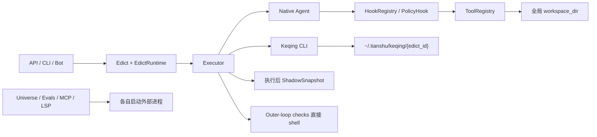

# G1 Phase 1.2–1.4 执行与工作区边界勘察

> Snapshot: 2026-07-11，基于当前 dirty worktree 的只读源码勘察。本文只覆盖 Governance Contract、Executor Capability Manifest、ExecutionGateway 与 WorkspaceService；不修改生产代码，也不把规划能力当作已实现能力。

## 1. 结论先行

Phase 1.2–1.4 不能按“新增四个类、把几处 `subprocess` 包起来”处理。当前真正要收口的是三条跨层主链：

1. **契约链**：Edict/Acceptance/PolicyProfile 目前是分散字段，没有稳定的 requested/effective contract，也没有能力缺口的 fail-closed 解析。
2. **执行链**：源码中有 14 个直接 subprocess 启动点、2 个 `os.exec*` 进程替换点，另有 MCP SDK 间接启动 stdio server；策略、clean-env、timeout、sandbox、审计并非同一入口。
3. **工作区链**：Native 工具固定捕获启动时的全局 `settings.workspace_dir`，Keqing 则使用每个 Edict 一个空目录。两者都没有“source/base revision → per-run staging → pre-run restore point → canonical diff → governed apply”的闭环。

因此建议把 G1.2–G1.4 作为一条连续迁移实现，但保持三个独立验收门：

- **G1.2 契约门**：合同与 Manifest 可序列化、可持久、可兼容旧 Edict；mandatory 能力缺失时在任何副作用前拒绝。
- **G1.3 执行门**：所有任意命令和外部进程启动都经统一请求与强制 guard；AST 门禁阻止新增旁路。
- **G1.4 工作区门**：所有执行路径只拿到 per-run staging；源工作区只在独立、再次授权的 apply 阶段改变。

在 1.3 和 1.4 全部通过前，**Native 不能升级为 managed 参考实现**；Claude Code/Codex headless CLI 即使拥有 staging、clean-env 和外围 timeout，仍只能是 `contained + experimental`。

## 2. 当前主链与已有可复用资产

### 2.1 当前执行流



### 2.2 可以保留并复用的基础

- `EdictRuntime` 已含 timeout、迭代/并发、token/cost budget、策略 profile、网络 host allowlist 与 executor 选择，可作为 legacy mapper 的输入。
- `AcceptanceCriteria` 已覆盖 bash/lint/rubric、deadline、迭代与升级策略，可直接进入 Governance Contract 的 acceptance 子模型。
- Native Agent 的已注册非 T0 工具调用会先经过 `HookRegistry.BEFORE_TOOL_CALL → PolicyHook → PolicyEngine`，hook 超时/异常已对 BEFORE_TOOL_CALL 做 fail-secure。
- `safe_path()` 与 `WorkspaceBoundaryRule` 对显式 `path/cwd/file_path` 参数有路径穿越防护。
- `build_clean_env()`、Keqing adapter 自身凭证白名单、出站 redact、Estop、BashSafetyRule 都可以下沉为 ExecutionGateway 的 guard/环境策略输入。
- Keqing adapter 已有 argv 构造与 JSONL 归一化；Universe 已有 git worktree、Gate、SandboxRunner；ShadowSnapshot 已验证独立 `GIT_DIR` 的快照和恢复语义。这些应被吸收到新边界，而不是全部推倒重写。

### 2.3 当前必须先修正的事实

| 事实 | 代码证据 | 对 G1 的影响 |
|---|---|---|
| Web 会提交 `runtime.executor` 与 `runtime.policy_profile`，但后端 `EdictRuntimeRequest` 没有这两个字段；Pydantic 默认静默忽略 extra | `web/src/components/edict/EdictForm.tsx`、`src/tianshu/models/api.py`；实测 model dump 只剩 timeout 等已声明字段 | 当前 UI 选择客卿/策略模板不会真正生效。修复后行为会突然改变，必须作为兼容迁移显式测试，不能悄悄上线 |
| Native 工具闭包固定捕获启动时的全局 workspace | `bootstrap/wiring_tools.py` → `tools/builtins.py` | 仅新增 WorkspaceService 不会让 Native 改 staging；必须引入 per-run workspace context/provider |
| PolicyHook 使用固定全局 workspace root | `bootstrap/wiring_executor.py`、`executor/policy_hook.py` | 工具即使切到 staging，策略仍可能按源目录判断，产生错误放行/拒绝 |
| Keqing 目录键是 `edict_id`，不是 run/memorial | `executor/keqing/executor.py` | retry、follow-up 或并发执行会共享目录，diff/证据和恢复点串线 |
| Keqing 影子快照发生在执行结束后，失败只告警、不阻断 | `executor/executor.py::_snapshot_keqing` | 不能满足 pre-run restore point；也不能证明崩溃前已有恢复点 |
| `WorkspaceBoundaryRule` 不解析 shell 命令内容 | `tools/policy_rules/workspace_boundary.py` | `shell_exec` 从 workspace cwd 启动，但仍有宿主权限访问/写入绝对路径；当前“工作区边界”不是强隔离 |
| PolicyEngine 单条规则异常/超时会 abstain，全部 abstain 默认 allow | `tools/policy.py` | 必须引入 mandatory/advisory guard 分类；不能把所有 guard 都沿用现有 fail-open 规则语义 |
| Outer-loop acceptance check 直接 `create_subprocess_shell`，且不传 cwd/env/policy | `executor/orchestrator/checks.py` | 验收命令可绕过 clean-env、staging、sandbox 与命令策略 |
| `lark_cli` 未显式传 env，继承父进程完整环境 | `tools/lark_cli.py` | 与统一 secret-control 目标冲突；参数还可能被写进 result details，需要安全审计视图 |
| Universe 的实际评估装配使用宿主 `SandboxRunner`；`ContainerRunner` 仅有测试、未接线 | `bootstrap/wiring_universe.py` | 当前隔离端口/DB 不是安全沙箱；secure-remote 下不能降级宿主运行 |
| MCP stdio 子进程由 MCP SDK 间接启动 | `tools/mcp/transport.py::_open_stdio` | AST 搜不到该启动点；必须有专门的 Gateway transport 适配和审计例外，不能漏算 |

## 3. Direct subprocess / process-launch inventory

AST 扫描当前 `src/tianshu` 得到 **14 个直接 subprocess 启动点**，再加 **2 个 `os.exec*` 进程替换点**。MCP SDK stdio 是第 17 个运行时进程边界；维护脚本另计，不属于服务运行时。

| 位置 | 当前用途与现状 | 目标处置 |
|---|---|---|
| `tools/builtins.py:38` | `shell_exec`，任意 shell；有 clean-env/60s timeout，但只杀 shell、不保证杀子孙进程 | **必须迁移**到 Gateway；显式 `ShellCommand`，策略先看完整命令，工作区与 sandbox 强制 |
| `executor/orchestrator/checks.py:27` | acceptance bash/lint，直接 shell；无 cwd/env/policy | **第一批迁移**；只允许 contract 中冻结的 check，在 staging 内执行 |
| `executor/keqing/executor.py:89` | Claude/Codex CLI，clean-env + 外围 timeout；stderr 未并发 drain，进程组/子孙清理不完整 | **必须迁移**到长驻/流式 Gateway handle；仍标 contained |
| `tools/lark_cli.py:108` | 外部 lark-cli；有 argv/timeout/交互命令拦截，但继承完整 env | **必须迁移**；受工具策略与 Gateway clean-env 双门控制 |
| `tools/mcp/transport.py`（SDK 间接） | `stdio_client()` 内部拉起任意配置 command | **必须迁移**为 Gateway 管理的 stdio transport；SDK spawn 是明确、可审计的低层例外 |
| `universe/gate.py:55` | compile/import/pytest 门禁，宿主执行并继承环境 | **必须迁移**；candidate contract + staging + no-network sandbox |
| `universe/sandbox.py:91` | 启动评估 Uvicorn；隔离端口/DB，但继承宿主 env、共享 OS/网络 | **必须迁移**到 Gateway `start()`；secure-remote 无可用强沙箱则拒绝 |
| `universe/sandbox_container.py:109` | docker/container wrapper；当前未在生产装配使用 | 合并为 Gateway sandbox backend，或删除重复实现；不能保留“看似有容器但未接线”的双轨 |
| `tools/grep.py:88` | 只读 ripgrep；有 safe path 和 timeout，但环境/审计独立 | 迁移 Gateway，或列为固定只读 adapter 例外；建议迁移以保持 AST 门简单 |
| `lsp/diagnostics.py:78` | advisory basedpyright；失败静默降级 | 迁移 Gateway，声明 advisory；失败需留下 audit gap，而不是无痕消失 |
| `executor/shadow_snapshot.py:63` | 固定 git 命令，执行后快照/回滚 | 由 WorkspaceService/Git backend 接管；兼容旧 snapshots API，随后退役重复类 |
| `universe/code_store.py:50` | git worktree/branch/diff/remove | 收敛到受审计的固定 GitWorkspaceBackend；禁止调用方传任意 git argv |
| `universe/code_mutator.py:170` | git add/commit/rev-parse | 同上；mutation 只操作 candidate staging |
| `universe/evolver.py:399` | git rev-parse 生成 baseline key | 同上，或固定只读 git adapter 例外 |
| `evals/runner.py:45` | git rev-parse 描述 target | 同上，低风险固定只读命令 |
| `universe/deployer.py:67` | `os.execv` 重启到 launcher | 不是一般 subprocess；保留为**进程生命周期例外**，但 AST 门要覆盖并只允许此文件 |
| `universe/launcher.py:40` | `os.execvpe` 启动 Uvicorn，并继承 env | 同上；需单独 clean-env/host policy 与 launch receipt，不能被普通 ExecutionRequest 调用 |
| `scripts/sync_persona_templates.py:49` | 仓库维护脚本调用 git | 排除服务运行时门，但纳入 repo-level allowlist，避免脚本被误当成生产执行入口 |

建议 AST/import-contract gate 同时识别：`subprocess.*`、`asyncio.create_subprocess_*`、`os.system/popen/spawn*`、`os.exec*`、`Popen` 别名导入；仅允许 Gateway 的低层 backend、固定 Git backend、MCP SDK transport wrapper、launcher/deployer 生命周期例外和测试/维护脚本白名单。

## 4. 建议的 Governance Contract v1

### 4.1 领域边界

不要把 contract 塞回 `EdictRuntime`。`EdictRuntime` 是历史运行参数，Governance Contract 是可持久、可比较、可举证的授权边界。建议：

- `RequestedGovernanceContractV1`：用户/入口请求的目标与控制要求，创建后 immutable。
- `EffectiveGovernanceContractV1`：requested × adapter manifest × 当前宿主 capability probe 的交集；记录实际执行边界与 advisory gaps。
- `CapabilityMismatch`：mandatory 缺口的结构化拒绝结果；**effective contract 不得通过降级 mandatory 来“成功生成”**。

建议 `models/governance_contract.py` 使用 `ConfigDict(extra="forbid", frozen=True)`，核心字段如下：

```text
schema_version = "1"
objective       = goal / context / output format
acceptance      = checks / critic / deadline / completion rules
executor        = requested adapter id + optional model/config
capabilities    = mandatory[] + advisory[]
permissions     = tool tiers / grants / expiry / secret refs
network         = deny | allowlist | unrestricted-requested + hosts/methods
workspace       = source workspace / base revision / staging mode / apply mode
budget          = token / cost / wall-clock / iterations / concurrency
recovery        = restore-point / failure cleanup / apply rollback policy
```

`EffectiveGovernanceContractV1` 额外包含：

```text
requested_contract_hash
executor_manifest_id + manifest_version + manifest_hash
runtime_probe_id
effective_controls
unsupported_advisory[]
degradations[]          # capability, requested, effective, reason, evidence
source/base resolved identifiers
staging/restore-point identifiers（不暴露敏感绝对路径）
```

### 4.2 Capability Manifest 语义

Manifest 不宜只用 bool；否则 `best_effort`、`observed` 与真正强制能力会再次混淆。建议统一四态：

- `enforced`：执行前可阻断，且兼容测试证明不可绕过。
- `best_effort`：外围尽力执行，但存在超调/逃逸窗口。
- `observed`：只能事后看到部分事件或结果。
- `unsupported`：不提供。

至少冻结以下 capability keys：

```text
action_interception
workspace_control
network_control
secret_control
budget_enforcement
decision_bridge
pause
durable_resume
event_fidelity
artifact_export
side_effect_receipts
pre_run_restore_point
governed_apply_merge
```

Manifest 声明 `managed / contained / observe-only`，但 level 必须经过一致性校验，不能由 adapter 任意自报。mandatory 默认只接受 `enforced`；若某项业务允许 `best_effort`，应在 requested contract 中显式作为 advisory，而不是由 resolver 猜测。

初始事实应为：

- **Native**：只有在 shell/check/MCP/Universe 旁路迁完、per-run staging 与 apply 门通过后才能标 managed。
- **Claude Code/Codex headless**：`action_interception=unsupported`、`budget_enforcement=best_effort/observed`、`event_fidelity=best_effort`、`durable_resume=unsupported`；即使 workspace/secret/artifact 外围能力变为 enforced，level 仍是 contained。
- **宿主 capability probe**：容器/OS sandbox、git、平台进程组能力必须运行时探测。静态 manifest 表示 adapter 上限，effective contract 取静态能力与当前宿主能力的交集。

### 4.3 Legacy Edict 兼容与持久化

建议新增纯函数 `LegacyEdictGovernanceMapper`，显式映射 `Edict.runtime`、`acceptance`、`constraints`、`review_policy` 与 configured default workspace。兼容规则：

1. 新 API 可接收 `governance_contract`；旧 `runtime/acceptance` 继续可用。
2. 新旧字段同时存在且语义冲突时返回 422，不采用“后者覆盖前者”的静默规则。
3. requested contract 在提交时解析并持久化；不能每次读取时用变化后的系统默认重新推导。
4. effective contract 属于一次 run/memorial，而不是 Edict 全局字段；同一 Edict 换 executor 或 retry 时各自持久化。
5. 不建议把 contract 放入 `runtime_json`：旧 Pydantic 模型会忽略未知字段，且 requested/effective 生命周期不同。至少需要 versioned migration，为 Edict 保存 requested contract，为 run/memorial 保存 effective contract 或稳定的 contract record 引用。
6. completed 历史记录可按 `legacy-derived` 展示；未执行/open Edict 首次运行前必须冻结 contract，避免配置漂移。

特别注意当前 API bug：修复 `EdictRuntimeRequest.executor/policy_profile` 后，原先“UI 选了客卿但实际仍跑 Native”的请求会开始真正派发外部 CLI。上线时必须有 contract preview、能力缺口检查和显式测试，不能只补两个字段。

## 5. 建议的 Executor Adapter 与 ExecutionGateway 边界

### 5.1 Executor Adapter Protocol

`executor/adapters/protocol.py` 负责 Agent OS 层的执行器互换，不直接暴露 subprocess：

```text
manifest() -> ExecutorCapabilityManifest
probe(runtime) -> ExecutorCapabilityAssessment
prepare(effective_contract, workspace_lease) -> PreparedExecution
execute(prepared, event_sink) -> ExecutorRunResult
cancel(run_id) -> CancelResult
```

关键约束：

- adapter 只能消费已经通过 resolver 的 effective contract；不能自行把 mandatory 改 advisory。
- adapter 的事件必须标明 `enforced / observed / inferred` 来源。opaque CLI JSONL tool event 只能是 observed。
- `ExecutorRunResult` 不负责 apply；它只返回结果、usage、events、artifacts/changes refs。apply 是 WorkspaceService 的独立副作用。
- Native 和 Keqing 都通过同一 protocol 接入，现有 `Executor` 只负责 orchestration，不再用 `if keqing_backend` 选择裸对象。

### 5.2 ExecutionGateway Protocol

Gateway 是外部进程与任意命令的唯一治理门，不等同于 Executor Adapter。建议不可变 `ExecutionRequest` 至少包含：

```text
schema_version
execution_id / correlation_id
actor/principal reference
purpose            # tool, acceptance, keqing, mcp_stdio, universe_gate, eval, lsp, git_internal
argv XOR shell_command
workspace_lease_id + cwd(relative to staging)
environment_policy # allow names + secret refs；不把 secret value 序列化进请求/日志
network_policy
sandbox_requirement
timeout / output limits
requested contract + effective contract refs
```

接口至少分两类：

- `run(request) -> ExecutionResult`：短命令，自动并发 drain stdout/stderr、超时/取消杀整个进程组、输出有界并脱敏。
- `start(request) -> ExecutionHandle`：Keqing、MCP stdio、Universe sandbox 等长驻/流式进程；handle 提供 wait/terminate/kill/receipt，并确保子孙进程清理。

MCP stdio 因官方 SDK 持有流对象，可提供专用 `open_mcp_stdio(request)` wrapper：授权、env/sandbox/command normalization 与 receipt 仍由 Gateway 完成，SDK 内部 spawn 作为唯一明确例外。不能仅在 `MCPManager` 启动前写一条日志就声称经过 Gateway。

### 5.3 Guard 语义

- **mandatory guards**：actor/contract、cwd/workspace、env/secret、timeout、required sandbox、network enforcement、command grant。任何异常、超时、无法探测都 deny，并写结构化拒绝证据。
- **advisory guards**：LSP、可选诊断、非强制额外扫描。可 abstain，但必须记录 gap。
- Existing `PolicyEngine` 可继续用于 tool-level 决策，但不能直接照搬其“单规则异常 abstain + 全部 abstain allow”作为 Gateway 强制语义。
- shell 不再用隐式 `shell=True`；用显式 `ShellCommand(interpreter, script)`，完整 script 在执行前经过 bash analysis。argv 命令与 shell 命令必须是互斥类型。
- 宿主 runner 只在 trusted-local 且 contract 允许时可用；secure-remote 中 required sandbox 不可用必须拒绝，禁止回退宿主。
- 审计视图只记录 executable、脱敏 argv、env key names、policy、cwd id/hash 和 receipt；原始 secret、header、token 不进入事件或错误。

### 5.4 同步/异步兼容

当前 tools/Keqing 是 async，Universe/Git/LSP 多为 sync。不要实现两套互相漂移的安全逻辑。建议：

- Gateway 以 async `run/start` 为唯一任意命令入口。
- Gate、LSP、Evolver 调用链逐步 async 化。
- 固定 git 操作使用单独的 `GitWorkspaceBackend`，只暴露命名方法（resolve/base/diff/worktree/apply），不接收任意 argv；它是 AST allowlist 中的受审计低层 adapter。
- `os.exec*` launcher/redeploy 保持独立生命周期例外，不开放给普通 ExecutionRequest。

## 6. 建议的 WorkspaceService v1

### 6.1 v1 范围

首版优先支持 **Git source workspace**：contract 必须给出 source workspace 与 base revision；managed apply 要求 source clean、base 可解析。没有 source 的普通问答使用独立 ephemeral scratch，`apply_mode=none`。非 Git 目录先明确为 unsupported/advisory，不要在 G1 同时实现一套难以证明崩溃恢复的目录复制协议。

建议 `WorkspaceLease`：

```text
lease_id / edict_id / memorial(run)_id
source_id                 # API 中不直接暴露敏感绝对路径
source_path (internal)
base_revision + base_tree_hash
staging_path
restore_point_ref/hash
state = prepared/running/diff_ready/apply_pending/applied/discarded/failed
created_at / expires_at
```

核心接口：

```text
prepare(requested_contract, run_id) -> WorkspaceLease
bind(lease) -> context manager
create_restore_point(lease) -> RestorePoint      # 必须在 executor start 前成功
collect_changes(lease) -> CanonicalChangeSet
apply(lease, decision_token) -> ApplyReceipt
discard(lease) -> CleanupReceipt
```

### 6.2 Per-run workspace 注入

当前 `register_builtins()` 与 `PolicyHook` 都固定持有全局 root。建议增加 kernel-level `WorkspaceContext/WorkspaceProvider`：

- Executor 在每次 memorial/run 开始时 `WorkspaceService.prepare()`，然后 bind lease。
- built-in read/write/edit/shell/grep/find/list 每次调用都从 provider 取当前 staging root，不再捕获启动时路径。
- PolicyHook 从同一 lease 取 root；缺少 lease 的 governed side-effect 请求 fail closed。
- Keqing cwd 使用 `lease.staging_path`，不再使用 `~/.tianshu/keqing/{edict_id}`。
- single task、outer loop、retry/follow-up、DAG node、Keqing、acceptance checks 必须共享同一 run contract/lease 语义。

DAG 并发写是兼容风险：当前多 node 可并行共享全局工具。G1 v1 建议对同一 lease 的 mutating tool 加写锁，并在 Manifest/effective contract 中把并行 workspace write 能力标为 unsupported；若 requested mandatory 要求真正并行隔离，则拒绝或把 effective concurrency 降为 1 并明确列为 advisory degradation。不要在 G1 引入每节点分支再合并的复杂协议。

### 6.3 Restore point、diff 与 apply

- restore point 必须在任何 actor/CLI/process 启动前建立；失败时不得执行。
- source 在 execute/check/cancel/failure 阶段保持 byte-for-byte 不变。
- change set 至少覆盖 add/modify/delete/rename、mode、symlink、binary、untracked，并生成稳定排序、稳定换行的 canonical patch + file manifest/hash。
- apply 不是 `ExecutorRunResult` 的尾部步骤，而是新的治理动作：校验 decision token 的 actor、scope、reason、expiry、change-set hash 与 restore point。
- apply 前再次检查 source HEAD/tree 与 base；发生漂移时返回 conflict，不强行覆盖。
- apply 失败要恢复源工作区到 pre-apply 状态并留下 receipt。G2 side-effect journal 落地前，G1 不应宣称任意 crash point 都可耐受；但至少要验证同步失败、取消与被杀进程不会改源目录。
- contained CLI 的 UI/事件只可声称 spawn/network/workspace 授权和最终 apply 决策，不能把 CLI 内部 observed tool events显示成逐工具已裁决。

### 6.4 ShadowSnapshot 兼容

现有 `/edicts/{id}/snapshots`、CLI `tianshu shadow` 与 DB `shadow_snapshots` 不宜立即删除：

1. WorkspaceService 先能读取/展示旧 snapshot 记录。
2. 新 run 以 restore point/change set/apply receipt 为 canonical；旧 endpoint 返回 legacy 标识或映射到新 restore points。
3. 新流程稳定后才迁移/退役 `ShadowSnapshot`，避免两个恢复真相源长期并存。

## 7. 推荐迁移顺序

### Increment A — Contract 与 API truth（1.2a）

1. 写 contract/manifest 失败测试与 legacy mapping table。
2. 修复 `EdictRuntimeRequest` 与 Web 当前字段漂移；新增 conflict validation。
3. 新增 versioned persistence migration，冻结 requested contract；为 run/effective contract 留稳定记录位置。
4. API 暂只返回 preview 与 capability mismatch，不切换执行路径。

**门：** round-trip、旧 Edict、旧 API client、API/Web 字段一致；mandatory 缺口在 mock executor 调用前拒绝。

### Increment B — Capability registry 与 adapter protocol（1.2b）

1. Native、Claude Code、Codex 提供完整 manifest 与 runtime probe。
2. 引入 resolver，产出 effective contract/advisory gaps/manifest hash。
3. `Executor` 改为 registry/protocol 选择，但暂沿用旧底层实现。

**门：** contained CLI 不得被标 managed；任何 adapter 少声明一个必填 capability 都无法注册。

### Increment C — Gateway core + 高风险入口（1.3a）

1. 先实现 fake backend 下的 request/guard/env/output/timeout/process-group 语义。
2. 迁移 acceptance checks、`shell_exec`、`lark_cli`、Keqing。
3. 接入 MCP stdio wrapper；再迁 Universe Gate/Sandbox。

**门：** secure-remote 缺 sandbox 全部 fail closed；secret 不出现在 child/env audit/log/response；timeout/cancel 无遗留子孙进程。

### Increment D — 清除剩余旁路 + AST gate（1.3b）

1. 迁移 grep/LSP；固定 git 操作收敛为 GitWorkspaceBackend。
2. 明确 `os.exec*`、MCP SDK、维护脚本例外。
3. AST gate 扫全 `src/tianshu`，先 inventory allowlist，再做到新增旁路必失败。

**门：** inventory 与 allowlist 一一对应，不能用目录级宽泛豁免。

### Increment E — Workspace staging（1.4a）

1. 实现 Git prepare/restore point/change set/discard。
2. 引入 WorkspaceContext，迁 Native/outer-loop/DAG/retry/Keqing 的 cwd 与 policy root。
3. 所有 executor 先 prepare，再 start；prepare 失败零进程、零源目录写入。

**门：** 失败、超时、取消、CLI crash 后 source 不变；每次 memorial 使用不同 staging。

### Increment F — Governed apply（1.4b）

1. apply preview 绑定 change-set hash、影响与恢复点。
2. apply 必须携带后端签发的 decision token；校验 base drift 与 expiry。
3. 生成 ApplyReceipt，并兼容旧 ShadowSnapshot 查询。

**门：** 未授权、过期、hash 不一致、source drift、apply failure 全部拒绝或回滚；成功路径只应用批准的 canonical change set。

### Increment G — 能力翻牌与文档

仅当 A–F 全部通过后：Native 标 managed；Claude/Codex 保持 contained；更新 capability matrix、UI effective contract 和 release evidence。G2 durable RunState/Decision/Side-effect Journal 未完成前，`durable_resume` 与 crash-point exactly-once 仍必须为 false。

## 8. 测试矩阵

| 层级 | 必测场景 | 建议文件 |
|---|---|---|
| Contract schema | v1 canonical JSON/hash、extra forbid、负预算/期限拒绝、immutability、requested/effective 不混写 | `tests/governance/test_contract_v1.py` |
| Legacy compatibility | Native/Keqing、policy profile、network hosts、acceptance、follow-up override 映射；新旧冲突 422；旧行 reload 不漂移 | `tests/governance/test_legacy_edict_mapping.py`、`tests/gateway/test_edicts_api.py` |
| Manifest | 所有 capability 必填；level 一致性；host probe 交集；mandatory mismatch 零副作用；advisory gap 可见 | `tests/compat/test_executor_capabilities.py` |
| Adapter protocol | Native/Claude/Codex 同 requested contract；contained 事件只能 observed；adapter 不可降级 mandatory | `tests/compat/executor_adapter/` |
| Gateway guard | actor/contract/correlation 缺失、cwd 越界/symlink、command grant、mandatory guard 抛错/超时、advisory abstain | `tests/security/test_execution_gateway.py` |
| Process lifecycle | stdout+stderr 大流量不死锁、输出上限、timeout/cancel、整进程组/子孙清理、exit code/signal receipt | `tests/security/test_execution_gateway_processes.py` |
| Env/secret | 只传 allow keys/secret refs；secret 不进 event/log/error/result；HOME/XDG/凭证目录边界可解释 | `tests/security/test_execution_gateway_secrets.py` |
| Sandbox/network | trusted-local 显式 host fallback；secure-remote 缺 sandbox 拒绝；容器 no-network/readonly/resource limits 实测 | `tests/security/test_execution_gateway_sandbox.py` |
| Shell/acceptance | shell script 结构风险、check 仅能执行 contract 冻结命令、cwd=staging、timeout、clean-env | `tests/security/test_execution_gateway.py`、`tests/test_orchestrator_checks.py` |
| MCP stdio | command allowlist、secret refs、SDK spawn receipt、启动失败清理、secure-remote sandbox required | `tests/security/test_mcp_command_boundary.py`、`tests/tools/mcp/test_manager.py` |
| AST gate | alias import、`from subprocess import Popen`、asyncio/os spawn/exec、新文件旁路、精确 exception allowlist | `tests/architecture/test_no_direct_process_launch.py` |
| Workspace prepare | source/base 校验、clean source、每 run 独立 staging、pre-run restore point 早于 process start | `tests/executor/test_workspace_staging.py` |
| Change set | add/modify/delete/rename/mode/symlink/binary/untracked、稳定 patch/hash、敏感路径不外泄 | `tests/executor/test_workspace_changes.py` |
| Failure isolation | actor fail、check fail、timeout、cancel、CLI crash、prepare fail 后 source byte-identical | `tests/integration/test_pre_run_rollback.py` |
| Governed apply | 无 decision、过期、错误 actor/scope/hash、base drift、apply fail rollback、成功 receipt | `tests/integration/test_governed_apply.py` |
| Concurrency | retry/follow-up 不共享目录；两个 Edict 隔离；DAG mutating calls 串行或 contract 明示降并发 | `tests/integration/test_workspace_concurrency.py` |
| Regression | 现有 Keqing、PolicyHook、ShadowSnapshot、Universe Gate/Sandbox/MCP/LSP/Evals 测试行为不倒退 | 现有对应 test suites |

发布门还需要两类真实环境证据，不能只 mock：

- Linux + macOS 的 process-group/timeout/git worktree 测试；Windows 未验证时 Manifest 必须如实降级。
- 至少一个实际容器 runtime 的 no-network、readonly mount、resource limit 与 child cleanup 测试；没有 runtime 的 CI job 只能验证 fail-closed，不能证明 sandbox 生效。

## 9. 兼容与实施风险

### P0 风险

1. **API 静默丢字段修复会改变真实行为**：客卿选择从“看似选中、实际 Native”变成真的外部执行，必须伴随 contract preview 与 capability fail-closed。
2. **全局 workspace 捕获**：若只改 Keqing，Native/outer-loop/DAG 仍会直接写源目录，G1.4 会形成假闭环。
3. **PolicyEngine fail-open 语义**：直接全局改为 fail-closed 可能让 advisory rule 大面积阻断；应先分类 mandatory/advisory，再迁 Gateway。
4. **Universe 容器假象**：`ContainerRunner` 未装配。文档与 manifest 不能把存在类/测试当成生产 sandbox。
5. **MCP 隐式 spawn**：仅靠 AST gate 会漏掉 SDK；必须有专用 wrapper 与兼容测试。

### P1 风险

- Git worktree 对 dirty source、submodule、LFS、ignored/untracked、symlink、mode bit、CRLF 的语义不同；v1 要明确支持矩阵，未知情况 fail closed。
- ContextVar 通常会传播到 `asyncio.create_task`/`to_thread`，但后台线程、SDK task 与重启恢复不应靠假设；需逐路径测试。
- shared staging 下 DAG 并行写会竞态；G1 先写锁/降并发，不做隐式合并。
- Keqing 当前不 drain stderr、只杀直接进程；Gateway 切换时需防输出死锁和孤儿子进程。
- clean-env 仍允许 HOME/PATH，CLI 可能从 HOME 读取配置/凭证；`secret_control=enforced` 必须限定具体范围，或使用专用 HOME/XDG/secret mount。
- absolute source/staging path 可能泄漏用户名；API/UI 使用 source id/display label，日志和 Evidence 再统一 redact。
- apply 的任意 crash-point 原子性依赖 G2 side-effect journal。G1 可以证明同步失败/取消回滚，但不可提前承诺 durable/exactly-once。

### P2 风险

- 现有 ShadowSnapshot API/CLI/DB、Keqing workdir 路径与测试 monkeypatch 依赖旧实现；需要兼容层而非一次删除。
- Gateway 若同时提供独立 sync/async 实现，安全策略很快漂移；固定 git adapter 例外比复制两套 Gateway 更可控。
- 新模型若从 `models` 反向 import `executor.capabilities` 会破坏层次；contract 内使用稳定 capability id，resolver/manifest 留在 executor 层。
- 单个全局 Gateway/WorkspaceService 应在 bootstrap 显式 DI 给 tools、Executor、MCP、Universe；避免再新增 service locator 与循环 import。

## 10. 对后续详细 TDD plan 的输入

建议 Phase 1 详细计划至少新增/修改以下边界文件（最终以实现勘察为准）：

- Create `src/tianshu/models/governance_contract.py`
- Create `src/tianshu/executor/capabilities.py`
- Create `src/tianshu/executor/adapters/protocol.py`
- Create `src/tianshu/executor/execution_gateway.py`
- Create an audited low-level process backend and fixed `GitWorkspaceBackend`
- Create `src/tianshu/executor/workspace_service.py`
- Modify `src/tianshu/models/api.py`、`models/edict.py`、storage mapper/schema/migration
- Modify `executor/executor.py`、DAG Worker、outer-loop checks、Keqing、PolicyHook
- Modify tools builtins/grep/lark_cli、MCP transport/manager、Universe Gate/Sandbox/CodeStore、LSP/Evals
- Modify bootstrap wiring so one Gateway/WorkspaceService instance is injected consistently
- Add the contract/capability/security/workspace/architecture tests listed above

最小可接受终态不是“所有测试仍绿”，而是：

1. 给定同一 requested contract，Native 与 contained CLI 都产出结构一致的 effective contract；
2. mandatory 能力缺失时，进程尚未启动、staging/source 尚未变化；
3. 任意 runtime 外部进程启动都能从 inventory 映射到 Gateway 或一个精确、解释充分的低层例外；
4. 执行、验收、失败、取消期间源工作区不变，apply 只接受绑定 change-set hash 的再次裁决；
5. UI/事件/能力矩阵只展示 effective 能力，不用 observed event 冒充 enforced control。
