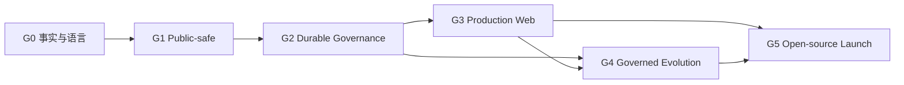

# 天枢开源 Agent OS Master Implementation Plan

> **For agentic workers:** REQUIRED SUB-SKILL: Use superpowers:subagent-driven-development (recommended) or superpowers:executing-plans to implement each approved phase task-by-task. Every phase must first be expanded into its own detailed TDD plan.

**Goal:** 将天枢收敛为一个安全可发布、任务可恢复、结果可举证、演化可门控、桌面 Web 可理解的开源自进化 Agent OS。

**Architecture:** 保留现有单节点 SQLite、事件主链、React/Ant Design 和部门隐喻；先建立版本化迁移，再抽取身份、Governance Contract、Executor Capability Manifest、ExecutionGateway、WorkspaceService、应用服务、持久裁决、RunState、副作用账本、Evidence Bundle 和系统审计等高价值边界。通过逐门验收推进，上一道门未通过，不进入下一阶段。

**Tech Stack:** Python 3.12、FastAPI、Pydantic v2、SQLite/WAL/FTS5、React 18、TypeScript、Ant Design 5、TanStack Query、Vite、Vitest、Pytest、OpenTelemetry、GitHub Actions。

## Global Constraints

- 本计划待用户审批；审批前不得修改生产代码、迁移数据库、提交或发布。
- 当前 UI 仅覆盖桌面 Web；不得投入手机端开发或验收。
- 使用现有 `web/public/brand.png`、顶部标语、右上角状态和四组十四部门；新增 `中枢总览`，不替换原部门侧栏。
- 四组十四部门属于冻结区，名称、顺序和分组均不改变；生产名称 `百官阁` 不改成 `百官图`。
- 面向用户的治理动作统一叫 `裁决`；内部 `Decree` 模型和 v1 API 保持兼容。
- 默认深色并保留浅色模式与侧栏收起/展开。
- 不新增低代码画布、RAG 平台、TUI、动态 DAG、向量数据库、Kubernetes、HA 或公开技能市场。
- 所有行为改动遵循测试先行；每个 phase 的详细计划必须包含失败测试、最小实现、回归测试和独立提交。
- 保留 SQLite 单节点边界，先证明正确性与恢复语义，再讨论分布式扩展。
- 所有安全主张必须由测试、威胁模型或可复现实验支持；不宣称绝对安全或企业级合规。
- 外部执行器必须公开 `managed / contained / observe-only` 能力等级；mandatory capability 不满足时拒绝派发，不能用事后事件冒充事前拦截。
- 新增持久表之前先通过版本化迁移、备份和 N-1 → N 数据保全门；禁止启动时破坏性重建用户数据。
- 可靠投递默认表述为 `at-least-once dispatch + idempotent effective outcome`，不得无条件承诺 exactly once。

---

## 0. 计划拆分与审批方式

本项目跨越安全、可靠性、产品 UI、自进化和开源交付，不能作为一个巨型改动一次实施。执行时拆成六个 phase-specific plan：

1. `phase-0-truth-and-language.md`
2. `phase-1-public-safe-foundation.md`
3. `phase-2-durable-governance-evidence.md`
4. `phase-3-desktop-web-productization.md`
5. `phase-4-governed-evolution-adapters.md`
6. `phase-5-open-source-launch.md`

每个 phase 完成后输出：改动摘要、测试证据、风险残留、界面截图或运行证据、下一门是否可开启。用户可以逐门批准、调整或停止。

按单主线串行估算约 15–22 周；G0 后可并行准备无业务写入的 UI tokens/状态组件，但安全、持久化、真实页面和演化门禁仍按 Gate 依赖推进。每个工期都是范围预算，不是未经基线验证的承诺。

## 1. 依赖与阶段门

| Gate | 必须证明 | 未通过时禁止 |
|---|---|---|
| G0 事实门 | 术语统一、能力矩阵诚实、基线可复现 | 宣传和大规模 UI 迁移 |
| G1 安全门 | 远程访问有身份；迁移不丢数据；危险命令与工作区变更有统一边界；执行器能力诚实；fresh install 可用 | 对外公开部署 |
| G2 可靠门 | 裁决和任务耐重启；定义故障点与 managed 边界无重复有效副作用；Evidence Bundle 可导出 | 宣称“敢放手” |
| G3 产品门 | 三页接真实 API；部门信息架构一致；核心 E2E/A11y 通过 | 录制正式产品演示 |
| G4 演化门 | 真实 challenger 路由；门禁和回滚有效；Native + 至少 1 个外部 managed 执行器同契约 | 宣称“自进化 Agent OS”已闭环 |
| G5 发布门 | 三个外部环境完成快速开始；release 制品可复现 | 正式开源宣发 |

## Phase 0 · 事实、术语与基线

**目标工期：** 3–6 个工作日。

**Produces:** canonical 术语、事实能力矩阵、可信原型/QA 基线、当前工程验证基线、版本化 migration/backup 基线。

### 0.1 术语迁移清单

**Files:**

- Modify: `CONTEXT.md`
- Create: `docs/adr/0012-decision-terminology-not-zhupi.md`
- Modify: `web/src/i18n/locales/zh-classic.json`
- Modify: `web/src/i18n/locales/zh-modern.json`
- Modify: `web/src/i18n/locales/en.json`
- Modify: `prototypes/tianshu-agent-os/src/data/mockData.js`
- Modify: `prototypes/tianshu-agent-os/src/screens/ControlCenter.jsx`
- Modify: `prototypes/tianshu-agent-os/src/screens/EdictDetail.jsx`
- Test: `prototypes/tianshu-agent-os/src/App.test.jsx`

**Requirements:**

- 用户可见 `批红 / 司礼监代批` 迁移为 `裁决 / 自动裁决`。
- `待批红 / 等待批红 / 查看并批红` 迁移为 `待裁决 / 等待裁决 / 查看并裁决`。
- 内部类名、表名、事件和 `/api/decrees` 保持兼容；文档明确 legacy mapping。

**Verification:**

- `rg -n "批红|司礼监代批" web/src prototypes/tianshu-agent-os/src CONTEXT.md` 只允许迁移说明和 `_Avoid_` 出现。
- 原型测试、构建和浏览器三页复验通过。

### 0.2 事实能力矩阵

**Files:**

- Create: `docs/launch/capability-matrix.md`
- Modify: `README.md`
- Modify: `README.en.md`
- Modify: `docs/launch/checklist.md`
- Modify: `docs/strategy/DECISIONS.md`
- Modify: `docs/launch/demo-storyboards.md`
- Modify: active public documentation that still claims mobile、批红 or per-tool governance for opaque CLI adapters

**Requirements:**

- 每项能力标记为 `稳定 / 实验 / 规划`。
- 灰度、恢复、鉴权、沙箱、外部执行器和演化能力写清真实边界。
- 当前 Claude Code/Codex headless CLI 标为 `contained + experimental`；修复前明确 `action_interception=false`、`hard_cost_cap=false`、`pre_run_restore_point=false`，且不计入 managed 执行器数量。
- 统一当前版本号和 release 目标；删除已经失真的完成式表述。

**Verification:**

- README、pyproject、web package 和 launch checklist 版本一致。
- 矩阵中的“稳定”项都有测试、演示或代码路径证据。

### 0.3 原型真实性修正门

**Files:**

- Modify: `prototypes/tianshu-agent-os/src/data/mockData.js`
- Modify: `prototypes/tianshu-agent-os/src/screens/ControlCenter.jsx`
- Modify: `prototypes/tianshu-agent-os/src/screens/EdictDetail.jsx`
- Modify: `prototypes/tianshu-agent-os/src/screens/EvolutionCenter.jsx`
- Modify: `prototypes/tianshu-agent-os/src/App.test.jsx`
- Modify: `prototypes/tianshu-agent-os/design-qa.md`
- Refresh: `prototypes/tianshu-agent-os/audit-*/`

**Acceptance:**

- 侧栏逐字对齐生产冻结区，使用 `百官阁`；Logo、标语、右上五项、主题和折叠控件不变。
- 全局旧术语零暴露；`系统可信` 和未经校准的 `置信度` 被有口径指标替代。
- Canary `18/50` 等强门未满足时晋升禁用；紧急覆盖单独进入高风险裁决。
- `design-qa.md` 只在壳层与产品语义分别通过后给出 overall passed；修正前截图明确标记为审计快照。

### 0.4 刷新工程基线

**Read/Verify:**

- `.github/workflows/ci.yml`
- `pyproject.toml`
- `web/package.json`
- `Dockerfile`
- `docs/launch/checklist.md`

**Commands:**

- `uv run ruff check .`
- `uv run ruff format --check .`
- `uv run mypy`
- `uv run lint-imports`
- `uv run pytest -m "not slow" -q`
- `cd web && npm run lint && npm run typecheck && npm test -- --run && npm run build`

**Acceptance:**

- 记录通过数、警告、覆盖率、构建 chunk 和耗时；不沿用旧快照。
- 验证过程不得无意改写 `uv.lock`；若发生漂移，先确认原因再进入后续阶段。

### 0.5 版本化迁移与备份基线

**Primary files:**

- Modify: `src/tianshu/storage/migrations.py`
- Create: `src/tianshu/storage/migration_ledger.py`
- Create/Modify: SQLite backup and restore service under `src/tianshu/storage/`
- Test: `tests/storage/test_migration_preserves_data.py`
- Test: `tests/storage/test_backup_restore.py`

**Acceptance:**

- 移除启动时 `DROP TABLE ... supervision_reports` 的破坏性路径；每个 migration 有版本、事务和幂等行为。
- 真实 N-1 fixture 升级到 N 后，监督报告、敕令、奏折、成本和画像数据不丢失。
- 升级前自动备份；迁移中断可以恢复旧库，且备份/恢复演练进入发行 smoke。

## Phase 1 · Public-safe Foundation

**目标工期：** 4–6 周。

**Consumes:** G0 事实基线。

**Produces:** 安全默认的本地/远程模式、Governance Contract v1、执行器能力分级、统一执行/工作区边界、可重复 wheel/container、首次安装自检。

### 1.1 身份与运行模式

**Primary files:**

- Create: `src/tianshu/gateway/auth.py`
- Create: `src/tianshu/models/principal.py`
- Modify: `src/tianshu/config.py`
- Modify: `src/tianshu/app.py`
- Modify: `src/tianshu/gateway/api.py`
- Modify: `src/tianshu/gateway/mcp_server.py`
- Modify: `src/tianshu/universe/launcher.py`
- Modify: `src/tianshu/cli/client.py`
- Modify: `web/src/api/client.ts`
- Modify: `web/src/hooks/useWebSocket.ts`
- Modify: `.env.example`
- Modify: deployment and reverse-proxy documentation
- Test: `tests/gateway/test_auth.py`
- Test: `tests/gateway/test_ws_auth.py`
- Test: `tests/gateway/test_mcp_auth.py`

**Interfaces:**

- Produces `Principal` and request-scoped `AuthContext` for REST、WS、MCP、CLI、Web and system audit.
- Defines `trusted-local` and `secure-remote`; remote mode cannot start without configured identity and origin policy.
- Defines a route matrix for static assets、liveness、readiness、webhooks、REST、WS and MCP, plus token issue/rotation/revoke and TLS reverse-proxy boundary.

**Acceptance:**

- 默认只监听 loopback；远程模式必须显式开启。
- 匿名 REST/WS/MCP 在 secure-remote 下全部返回 401/403。
- 非允许 Origin/Host 被拒；本地首次启动仍可完成引导。
- Web、WS 和 CLI 能携带/刷新凭证；`config.py` 与 Universe launcher 默认 loopback，secure-remote 不经受信 TLS proxy 时启动失败。

### 1.2 Governance Contract v1 与执行器能力协议

**Primary files:**

- Create: `src/tianshu/models/governance_contract.py`
- Create: `src/tianshu/executor/capabilities.py`
- Create: `src/tianshu/executor/adapters/protocol.py`
- Modify: `src/tianshu/models/edict.py`
- Modify: `src/tianshu/executor/keqing/adapter.py`
- Test: `tests/governance/test_contract_v1.py`
- Test: `tests/compat/test_executor_capabilities.py`

**Acceptance:**

- 冻结带 schema version 的 requested/effective Governance Contract，以及 legacy Edict 映射和兼容测试。
- Manifest 至少声明 action interception、workspace/network/secret control、budget enforcement、decision bridge、pause/durable resume、event fidelity、artifact export 和 side-effect receipts。
- Native 先作为 managed 参考实现；现有 Claude Code/Codex CLI 只标为 contained + experimental。
- mandatory capability 不满足时 fail closed；advisory 缺口写入 effective contract、UI 和 Evidence Bundle。

### 1.3 统一外部执行边界

**Primary files:**

- Create: `src/tianshu/executor/execution_gateway.py`
- Modify: `src/tianshu/executor/orchestrator/checks.py`
- Modify: `src/tianshu/tools/policy.py`
- Modify: `src/tianshu/executor/policy_hook.py`
- Modify: `src/tianshu/gateway/mcp_api.py`
- Modify: `src/tianshu/universe/sandbox_container.py`
- Inventory/classify: all direct subprocess sites under tools、Keqing、Universe、LSP、evals and shadow snapshot
- Create: AST/import-contract gate that forbids new direct subprocess outside approved low-level adapters
- Test: `tests/security/test_execution_gateway.py`
- Test: `tests/security/test_mcp_command_boundary.py`

**Interfaces:**

- All shell、acceptance、MCP stdio and governed Universe subprocess execution consume one execution request: command, args, cwd, env policy, network policy, timeout, actor and correlation id; unavoidable low-level adapters are explicit and audited exceptions.
- mandatory guardrail errors fail closed; advisory checks may abstain but must emit audit evidence.

**Acceptance:**

- 任意命令无法绕过 policy、clean-env、workspace boundary 和 timeout。
- secure-remote 下沙箱不可用时拒绝不可信执行，不回退宿主。
- secret 不出现在响应、事件或日志。

### 1.4 受治理工作区与变更应用

**Primary files:**

- Create: `src/tianshu/executor/workspace_service.py`
- Modify: `src/tianshu/executor/keqing/executor.py`
- Modify: `src/tianshu/executor/shadow_snapshot.py`
- Modify: `src/tianshu/models/governance_contract.py`
- Test: `tests/executor/test_workspace_staging.py`
- Test: `tests/integration/test_pre_run_rollback.py`
- Test: `tests/integration/test_governed_apply.py`

**Acceptance:**

- Contract 指定 source workspace 与 base revision；执行器只操作隔离 staging，不直接修改源工作区。
- 第一次执行前即存在恢复点；结束后生成 canonical diff、产物和环境证据。
- apply/merge 是独立受治理副作用，必须再次经过策略/裁决；失败、取消或进程崩溃时源工作区不变。
- contained CLI 的裁决只发生在进程启动、网络/工作区授权和最终 apply/merge 边界，UI 不宣称其内部逐工具已裁决。

### 1.5 Fresh install、doctor 与容器

**Primary files:**

- Modify: `pyproject.toml`
- Modify: `Dockerfile`
- Modify: `src/tianshu/cli/commands/doctor.py`
- Create: explicit mock/demo provider and startup mode under `src/tianshu/`
- Create: default persona seed service/migration
- Modify: `src/tianshu/persona/loader.py`
- Move/package: `personas/`, `templates/`, builtin skills as package resources
- Test: `tests/cli/test_doctor.py`
- Test: `tests/integration/test_fresh_install.py`
- Create: `.github/workflows/release-smoke.yml`

**Acceptance:**

- clean wheel 和 fresh container 启动后存在默认 persona、内建技能和 Web。
- 容器以 non-root 运行，runtime 不保留无关构建工具。
- `tianshu doctor` 对配置、LLM/mock、DB、端口、沙箱和依赖给出结构化结果。
- 无真实 LLM 密钥时可用 mock provider 跑通一条受治理敕令。
- 在仓库外 cwd、全新 HOME 和空 DB 下执行上述流程，证明资源与 persona 不是依赖源码目录偶然可见。

### 1.6 MCP、秘密与安全发行门禁

**Primary files:**

- Modify: `.github/workflows/ci.yml`
- Create: `.github/workflows/security.yml`
- Create: `.github/workflows/release.yml`
- Modify: `SECURITY.md`
- Create: `docs/ops/threat-model.md`
- Modify: MCP persistence to store encrypted values or secret references instead of plaintext `env_json/headers_json`
- Add: remote MCP SSRF、DNS rebinding、redirect/private-address policy and stdio command allowlist/capability grants

**Acceptance:**

- CI 包含 wheel install、container smoke、dependency/code scan 和 SBOM。
- liveness/readiness 分开；DB、scheduler 或必要沙箱故障时 readiness 失败。
- threat model 说明 trusted-local、secure-remote、MCP、外部执行器和自进化边界。
- MCP secret migration 不泄漏旧值；remote URL 和 stdio command 的版本化负向用例全部被拒绝并记录系统审计。

## Phase 2 · Durable Governance & Evidence

**目标工期：** 3–4 周。

**Consumes:** AuthContext、Governance Contract v1、Capability Manifest、ExecutionGateway、WorkspaceService、fresh install。

**Produces:** 幂等提交、持久裁决、版本化 RunState、Evidence Bundle、追加式系统审计和可靠通知。

**Architecture gate:** 新增 `application / governance / evidence` 边界时必须同步更新 `pyproject.toml` 的 import-linter contracts，并增加禁止反向依赖的契约测试；不得以新增包名掩盖循环依赖。

### 2.1 Edict Application Service 与 Outbox

**Primary files:**

- Create: `src/tianshu/application/edicts.py`
- Create: `src/tianshu/storage/unit_of_work.py`
- Modify: `src/tianshu/edict_ops.py`
- Modify: `src/tianshu/bus/event_bus.py`
- Create: `src/tianshu/storage/outbox_repo.py`
- Modify: `src/tianshu/storage/migrations.py`
- Modify: `pyproject.toml` import-linter contracts for the new application boundary
- Test: `tests/integration/test_edict_idempotency.py`
- Test: `tests/integration/test_outbox_recovery.py`

**Acceptance:**

- Web/API/CLI/Bot/MCP 入口统一调用应用服务。
- edict 与 outbox 通过同一 UnitOfWork 提交；数据库对 idempotency key 建唯一约束。
- 相同 key + 相同 request hash 返回原结果；相同 key + 不同 request hash 明确冲突，不静默复用。
- 投递采用 at-least-once；消费者通过幂等键和状态 CAS 得到一次有效业务结果，不承诺底层消息绝对只出现一次。

### 2.2 持久裁决与版本化 RunState

**Primary files:**

- Create: `src/tianshu/governance/decision_service.py`
- Create: `src/tianshu/models/run_state.py`
- Create: `src/tianshu/storage/run_state_repo.py`
- Modify: `src/tianshu/executor/approvals.py`
- Modify: `src/tianshu/executor/orchestrator/loop.py`
- Modify: `src/tianshu/executor/worker.py`
- Test: `tests/integration/test_decision_restart_recovery.py`
- Test: `tests/integration/test_outer_loop_restart_recovery.py`

**Acceptance:**

- tool decision、outer-loop decision 和 plan review 共享持久模型，通过 `kind` 区分。
- actor、理由、过期时间、payload、iteration、best output、feedback、steer 和恢复点耐重启。
- 每个请求有独立 `decision_request_id`、payload hash、version/CAS、expiry 和 late-decision 语义；并发解决者只能有一个生效。
- RunState 在危险动作前持久化 continuation：messages、tool proposal、iteration、checkpoint 和 side-effect journal cursor；不能依赖消失的 Python await 栈。
- L0/L1/L2/L3、暂停和待裁决各阶段故障注入后能恢复；`pending tool → kill → restart → decision → continue` 不重复有效副作用。

### 2.3 Durable Dispatcher、Lease 与副作用账本

**Primary files:**

- Create: `src/tianshu/storage/attempt_ledger.py`
- Create: `src/tianshu/storage/side_effect_journal.py`
- Modify: `src/tianshu/bus/event_bus.py`
- Modify: `src/tianshu/executor/worker.py`
- Modify: `src/tianshu/scheduler/scheduler.py`
- Modify: `src/tianshu/storage/scheduler_repo.py`
- Test: `tests/integration/test_claim_lease_recovery.py`
- Test: `tests/integration/test_side_effect_idempotency.py`
- Test: `tests/integration/test_scheduler_reconcile_dlq.py`

**Acceptance:**

- submitted/orphaned 任务由 claim + lease + heartbeat 管理；reconciler 处理过期 lease，达到上限进入 DLQ。
- 先记录 side-effect intent，再执行；receipt/幂等结果落库后才 ack。仅对支持幂等或 receipt 的边界承诺不重复有效结果。
- 故障注入覆盖 side effect 前、执行后 ack 前、lease 过期和进程重启；opaque contained CLI 的内部副作用明确不纳入零重复承诺。

### 2.4 Planner/DAG 质量与重规划证据

**Primary files:**

- Modify: `src/tianshu/planner/planner.py`
- Modify: `src/tianshu/executor/dag_scheduler.py`
- Create: planner quality metrics/evidence model under `src/tianshu/evals/`
- Test: `tests/planner/test_plan_amend_metrics.py`
- Test: `tests/integration/test_replan_evidence.py`

**Acceptance:**

- 记录 plan amend、replan、估时/预算偏差、失败分类和最终验收；不建设动态图运行时。
- 重规划理由、前后 diff 和触发证据进入 Evidence Bundle 与考成页面。

### 2.5 ArtifactStore 与 Evidence Bundle v1

**Primary files:**

- Create: `src/tianshu/evidence/models.py`
- Create: `src/tianshu/evidence/service.py`
- Create: `src/tianshu/storage/artifact_repo.py`
- Create: `src/tianshu/gateway/evidence_api.py`
- Modify: `src/tianshu/auditor/`
- Test: `tests/evidence/test_bundle.py`
- Test: `tests/integration/test_independent_audit_evidence.py`

**Evidence fields:**

- schema version、requested/effective contract、artifacts、changes、checks、policy decisions、cost、environment、auditor conclusion、hashes and reproduction commands.

**Acceptance:**

- 所有结案结论能追到具体证据；缺失强制证据时不能通过。
- 大工具结果写入 ArtifactStore，prompt 中只引用摘要和 URI，可无损取回。
- Evidence Bundle 使用 canonical serialization/hash；正式结案后形成不可变 close snapshot，可 JSON 导出并通过 schema validation。
- Artifact 有 producer、timestamp、environment fingerprint、digest、quota、MIME/path、retention/delete 和 redaction 策略。
- reproduction command 只是数据；实际重放必须重新经过 ExecutionGateway。威胁模型明确不防宿主或 DB 管理员篡改。

### 2.6 SystemAuditLog、OTel 与 readiness

**Primary files:**

- Create: `src/tianshu/auditor/system_log.py`
- Create: `src/tianshu/storage/system_audit_repo.py`
- Modify: `src/tianshu/observability.py`
- Modify: `src/tianshu/app.py`
- Modify: `src/tianshu/gateway/estop_api.py`
- Test: `tests/audit/test_system_audit_log.py`
- Test: `tests/gateway/test_readiness.py`

**Acceptance:**

- estop、裁决、策略、技能、MCP、凭证和演化变更记录 actor/IP/time/reason。
- 一条 trace 可重建 edict → planner → LLM → tool → policy → check → channel。
- shutdown flush tracer；敏感内容默认不进入 span。

### 2.7 通知可靠投递

**Primary files:**

- Create: `src/tianshu/notifier/delivery_outbox.py`
- Create: `src/tianshu/notifier/channel_adapter.py`
- Modify: `src/tianshu/notifier/notifier.py`
- Modify: `src/tianshu/notifier/channel_registry.py`
- Modify: `src/tianshu/gateway/bot_manager.py`
- Test: `tests/notifier/test_delivery_recovery.py`

**Acceptance:**

- 网络失败、限流和崩溃后采用 attempt ledger、退避与 DLQ；支持 provider idempotency 时保证一次有效结果。
- 不支持幂等键的渠道明确选择 at-least-once（可能重复）或 at-most-once（可能丢失），UI 显示 attempt 与不确定结果，不宣称 exactly once。
- 没有后续消息时，静默通知仍在截止点发送。
- 新增 mock channel 不修改 BotManager 核心分支。

## Phase 3 · Desktop Web Productization

**目标工期：** 3–4 周。

**Consumes:** G2 API、Evidence Bundle、RunState、readiness。

**Produces:** 生产设计系统、三张核心页面、完整部门信息架构、桌面 E2E/A11y/性能证据。

**Sequencing:** G0 通过后可以先做冻结壳、tokens 和无业务写入的状态组件；三张真实页面、裁决和演化写操作必须等待 G2 协议稳定。

### 3.1 生产设计系统与路由基础

**Primary files:**

- Modify: `web/src/theme/palette.ts`
- Modify: `web/src/styles/global.css`
- Modify: `web/src/App.tsx`
- Modify: `web/src/components/layout/AppSidebar.tsx`
- Modify: `web/src/hooks/useTheme.ts`
- Refactor: `web/src/api/client.ts` and remove page-local fetch wrappers
- Modify: `web/src/i18n/locales/zh-classic.json`
- Modify: `web/src/i18n/locales/zh-modern.json`
- Modify: `web/src/i18n/locales/en.json`
- Create: `web/src/components/governance/`
- Create: `web/src/components/states/`
- Test: `web/src/components/governance/*.test.tsx`

**Acceptance:**

- 品牌壳、标语、右上角五项和四组十四部门逐字保持不变（含 `百官阁`）；只在部门上方新增中枢总览。
- `/control` 为中枢总览，`/approvals` 为御书房 canonical，旧 `/` 重定向 `/control`；旧深链继续可用。
- 无持久偏好时默认深色；浅色、深色、展开和折叠都进入视觉回归；新页面使用三套 i18n，不硬编码中文。
- 统一 `PageHeader / GovernanceContract / DecisionPanel / EvidenceBundle / EvolutionGate`。
- 统一 `PageDataState`：loading、success-empty、success-data、stale、error、permission-denied、service-unavailable；401/403/503、correlation id 和 AuthContext 由统一 API client 传递。
- 所有重页面 route-level lazy；接口失败不得被归一为 `[] / 0` 或“未找到”。

### 3.2 首启引导与 Governance Contract 创建

**Primary files:**

- Refactor: `web/src/pages/EdictCreatePage.tsx`
- Refactor: `web/src/components/edict/EdictForm.tsx`
- Create: `web/src/pages/OnboardingPage.tsx`
- Test: `web/src/pages/EdictCreatePage.test.tsx`
- E2E: `web/e2e/fresh-install.spec.ts`

**Acceptance:**

- 空 DB/无真实 key 时，Web 引导用户选择 mock provider、创建默认 persona，并跑通首个受治理结果。
- 提交前始终展示完整 Governance Contract 摘要：执行器能力、权限、网络、source/base workspace、预算、期限、验收和恢复策略；关键项不藏在专家模式。
- 客户端不提交可伪造 actor；后端从 AuthContext 生成主体并返回 requested/effective contract。

### 3.3 中枢总览接真实 API

**Primary files:**

- Create: `web/src/pages/ControlCenterPage.tsx`
- Create: `web/src/hooks/useControlCenter.ts`
- Create/Modify: backend aggregate endpoint under `src/tianshu/gateway/`
- Test: `web/src/pages/ControlCenterPage.test.tsx`

**Acceptance:**

- 运行中、待裁决、预算、证据完整率和异常/恢复有真实口径。
- 删除不可解释 `系统可信` 与未经校准 `置信度`。
- 高风险、超预算和恢复事项按操作优先级排序。

### 3.4 敕令详情接 Evidence Bundle

**Primary files:**

- Refactor: `web/src/pages/EdictDetailPage.tsx`
- Create: `web/src/components/governance/GovernanceContractCard.tsx`
- Create: `web/src/components/governance/DecisionPanel.tsx`
- Create: `web/src/components/evidence/EvidenceBundlePanel.tsx`
- Test: `web/src/pages/EdictDetailPage.test.tsx`

**Acceptance:**

- 当前风险裁决同时显示影响、权限、恢复点和必填理由。
- 展示 requested/effective contract、执行器能力等级和 unsupported controls；contained CLI 不出现逐工具治理或硬成本上限的误导文案。
- Evidence Bundle 可浏览、下载；复现动作必须重新进入受治理执行流。
- 执行者输出与独立审计结论视觉上明确分离。

### 3.5 演化中心接真实门禁

**Primary files:**

- Refactor: `web/src/pages/UniversePage.tsx`
- Refactor: `web/src/pages/EvalsPage.tsx`
- Create: `web/src/components/evolution/EvolutionGate.tsx`
- Test: `web/src/pages/UniversePage.test.tsx`

**Acceptance:**

- 后端返回权威 `promotion_allowed + blocking_gates`；强门禁未满足时晋升不可用，覆盖门单独走高风险裁决。
- 样本、阈值、基线、delta、来源、diff 和回滚点可见。
- 真实 challenger 路由未开启时不展示虚假灰度进度。

### 3.6 十四部门收敛

**Primary pages:**

- `RoyalStudyPage.tsx`：统一治理收件箱，真实主体、理由和错误状态。
- `SchedulerPage.tsx`：错过/恢复、上次运行、retry、DLQ 和历史。
- `CabinetPage.tsx`：计划审阅、复杂度、预算/时长预估和重规划质量。
- `ConsultationPage.tsx`：持久立场、条件、证据和强制反对意见。
- `AuditDashboardPage.tsx`：任务审计、系统审计与接口故障分层。
- `SessionRulesPage.tsx`：策略 scope、expiry、参数指纹、diff、理由和撤销；高风险规则默认有限期。
- `PersonaDashboardPage.tsx` / `PersonaDetailPage.tsx`：拆分过大的页面并展示能力矩阵。
- `MemoryDashboardPage.tsx`：来源、召回、保留、FTS 重建、质量样本和 token 成本。
- `UniversePage.tsx` / `EvalsPage.tsx`：权威门禁、失败分类、真实路由和回滚。
- `SystemManagementPage.tsx`：按模型/工具/技能/MCP/插件重组。
- `HongluisiPage.tsx`：保留现有网页检索引擎/凭证，再增加客卿能力等级、符合性和健康。
- `TongzhengPage.tsx`：通知级别、免打扰、delivery attempts、retry 和 DLQ。
- `CostDashboardPage.tsx`：统一过滤、预算预测、归因、超额量和熔断。

**Acceptance:**

- 页面职责与十四部门矩阵一致；不新增泛化产品分类替换部门。
- 超过约 600 行且承担多个独立职责的页面按可测试业务区块拆分，不机械按行数拆文件。
- `PendingToolCallCard.tsx` 和 `DecreeModal.tsx` 不再硬编码 actor；裁决主体来自 AuthContext。
- 高风险/永久授权要求真实 capability、必填理由、影响范围、默认到期和恢复方式；MCP stdio 创建不再默认 enabled，必须展示 allowlist/capability 结果。
- 户部的 summary、趋势、记录和导出共享同一 period/filter contract；趋势不依赖当前分页 20 条记录；CNY 符号一致。
- 文渊阁 persona 从 API 加载，不再硬编码六个 id；动态新增/删除后选择器同步更新。
- 所有 React Query 页面区分 loading、empty、error、permission、unavailable 和 stale；接口失败不得显示为零异常或空系统。

### 3.7 Web E2E、A11y、视觉回归与性能

**Primary files:**

- Create: `web/playwright.config.ts`
- Create: `web/e2e/control-center.spec.ts`
- Create: `web/e2e/decision-flow.spec.ts`
- Create: `web/e2e/evolution-gate.spec.ts`
- Create: shell visual regression for 1440/1280、dark/light、expanded/collapsed
- Modify: `.github/workflows/ci.yml`

**Acceptance:**

- 1440 × 1024 与 1280px 桌面宽度无横向溢出和不可达操作。
- 核心流程键盘可完成，focus 可见，Dialog 焦点正确返回，状态不只靠颜色，live region 生效，200% zoom 可用；axe serious/critical 为 0，并做 VoiceOver 抽检。
- 浏览器控制台无错误；G0 性能基线冻结后，初始 JS/LCP/交互延迟未经批准不得回退超过 10%，定义测试环境下 LCP 目标 < 2.5s；重可视化不进入首屏 chunk。
- 设计 QA 无 P0/P1/P2 遗留。

## Phase 4 · Governed Evolution & Executor Neutrality

**目标工期：** 3–4 周。

**Consumes:** Evidence Bundle、RunState、真实 UI 门禁。

**Produces:** 跨对象统一候选模型、真实 Canary、首个外部 managed adapter、Native + 外部执行器兼容性证据。

### 4.1 统一 EvolutionCandidate 与技能供应链

**Primary files:**

- Create: `src/tianshu/skills/install_service.py`
- Modify: `src/tianshu/gateway/skills_api.py`
- Modify: `src/tianshu/skills/installer.py`
- Create: `src/tianshu/models/evolution_candidate.py`
- Create: `src/tianshu/evolution/candidate_service.py`
- Create: `src/tianshu/evolution/gates.py`
- Create: `src/tianshu/evolution/adapters/` for memory、skill、policy、persona and code
- Create: `src/tianshu/evolution/promotion.py`
- Modify: `src/tianshu/storage/migrations.py`
- Test: `tests/skills/test_install_service_security.py`

**Acceptance:**

- API、CLI、agent 和 zip 安装全部经过同一 guard、provenance、版本和回滚流程。
- 恶意内容不能通过 API 绕过 installer。
- memory/skill/policy/persona/code 都映射到同一候选 schema、gate evaluator、promotion/rollback handler；各对象仍保留领域差异。
- 首个公开演化 Demo 只用技能候选；代码候选永不自动晋升。

### 4.2 真实 challenger 路由与晋升

**Primary files:**

- Modify: `src/tianshu/universe/manager.py`
- Modify: `src/tianshu/universe/evolver.py`
- Create: `src/tianshu/universe/router.py`
- Test: `tests/universe/test_challenger_routing.py`
- Test: `tests/universe/test_promotion_gates.py`

**Acceptance:**

- configured 10% challenger 在足够样本下实际接近 10%，且每次 run 归因正确。
- 回归、安全、样本或证据门未满足时晋升数量为零。
- 在定义的数据规模与环境下，晋升版本 p95 60 秒内回滚，路由立即恢复 champion；测试记录真实分布。

### 4.3 首个外部 Managed Adapter

**Primary files:**

- Modify: `src/tianshu/executor/adapters/protocol.py`
- Create: `src/tianshu/executor/adapters/openhands.py`
- Refactor: `src/tianshu/executor/keqing/`
- Create: `tests/compat/executor_adapter/`
- Create: `docs/usage/executor-adapter.md`

**Acceptance:**

- Native 和 OpenHands SDK/Agent Server 候选运行同一 requested Governance Contract，记录各自 effective contract、结构化事件和同 schema Evidence Bundle。
- 只有 action interception、decision bridge、budget、workspace/network、receipt 和 durable semantics 全部通过的能力位才标为 managed；ACP/CLI 包装不会自动升级等级。
- Claude Code/Codex headless CLI 保留为 contained + experimental，只承诺已验证的进程外围能力，不计入 managed 生态数量。
- mandatory control 缺失的负向兼容测试必须拒绝派发；协议稳定后再选择 LangGraph 或 Microsoft Agent Framework 之一做 workflow adapter。

### 4.4 记忆与画像收益评测

**Primary files:**

- Create: `tests/evals/memory_recall/`
- Modify: `src/tianshu/memory/manager.py`
- Modify: memory FTS index/rebuild service and expose rebuild status
- Modify: `src/tianshu/persona/prompt_builder.py`
- Modify: `src/tianshu/persona/profile_synthesizer.py`

**Acceptance:**

- persona/profile/peer/memory/skills 各有 token budget。
- 召回质量、任务结果和 token 成本有 paired benchmark。
- 空库、索引损坏和 schema 升级后可重建 FTS，且 provenance 与删除语义保持正确。
- 向量检索只有在基准证明收益后才进入新提案。

### 4.5 成本预测与预算治理

**Primary files:**

- Modify: `src/tianshu/cost/`
- Create: cost forecast and enforcement evidence tests
- Test: `tests/cost/test_forecast_calibration.py`
- Test: `tests/integration/test_budget_enforcement_modes.py`

**Acceptance:**

- 预算显示预测区间、实际值、归因和触顶后实际超额量；不把终态计量包装成 pre-call hard cap。
- managed/contained/observed 的 budget enforcement mode 分开展示和评测。

## Phase 5 · Open-source Launch & Ecosystem

**目标工期：** 2–4 周；社区工作持续进行。

**Consumes:** G3 + G4。

**Produces:** 三个可重复 Demo、Executor SDK、release 制品、社区模板和外部验证证据。

### 5.1 三个黄金 Demo

**Files:**

- Create: `examples/leave-it-running/`
- Create: `examples/governed-evolution/`
- Create: `examples/same-contract-multiple-executors/`
- Create: `docs/launch/demo-evidence/`

**Acceptance:**

- 每个 Demo 包含输入、预期事件、风险、裁决、Evidence Bundle、成本和回滚证据。
- clean environment 连续运行 10 次至少 9 次无需人工修复。
- 每个 Demo 的版本化危险动作负向集 10/10 被策略阻断、进入裁决或因 mandatory capability 不足而拒绝派发。
- “离席办差”的逐工具裁决只使用 Native 或通过 managed 兼容套件的外部执行器；contained CLI 只演示启动/网络/工作区/apply 边界。
- “臣请自我优化”首发只演示技能候选；“同旨异客卿”同时展示 requested/effective contract、能力等级和 fail-closed。
- 只用桌面 Web 展示本轮 UI；不依赖手机端。

### 5.2 Executor SDK 与扩展规范

**Files:**

- Create: `src/tianshu/sdk/`
- Create: `templates/executor-adapter/`
- Create: `tests/compat/`
- Create: `docs/usage/compatibility-kit.md`

**Acceptance:**

- 第三方开发者可在一个工作日内完成一个 mock/new adapter。
- 只有 managed 能力位通过者才计入“治理执行器生态”；1.0 至少 Native + 1 个外部 managed，后续再扩到 3 个。

### 5.3 Release 与社区交付

**Files:**

- Modify: `pyproject.toml`
- Modify: `README.md`
- Modify: `README.en.md`
- Modify: `CHANGELOG.md`
- Modify: `docs/launch/checklist.md`
- Modify: `Dockerfile` and `uv.lock` for frozen installs and explicit core/server/all distribution profiles
- Create/Update: `NOTICE` and third-party license report
- Add: git-history secret scan、repository hygiene gate、release provenance/attestation
- Create: `.github/ISSUE_TEMPLATE/`
- Create: `.github/PULL_REQUEST_TEMPLATE.md`
- Create: `CODE_OF_CONDUCT.md`

**Acceptance:**

- tag 自动生成一致的 wheel、container、SBOM 和 release notes。
- Docker/CI 使用冻结依赖；core/server/all（含 MCP）发行组合和容器内容有明确 smoke，不再依赖浮动 `pip install .[cli]`。
- tracked `.idea`、`web/.vite` 和无关根目录 demo/temp 不进入发行；Git 历史 secret scan、许可证/NOTICE 和制品 attestation 通过。
- 至少三个全新环境按 README 独立完成 quickstart 和黄金 Demo。
- capability matrix、版本、文档和运行行为一致。

**Release stages:** G1 后可发布 Developer Preview，只承诺治理基础；G3 后发布 Governance Preview，承诺可治理/可验证；G4/G5 通过后才发布 1.0 并宣称自进化闭环。

## 全局验收指标

| 维度 | 目标 |
|---|---|
| 安装 | 定义环境下 clean clone 到首个受治理结果 p50/p95 均记录，p95 ≤ 15 分钟 |
| 治理 | 版本化红队风险集 100% 被策略阻断、进入裁决或因能力不足拒绝；不承诺识别全部未知风险 |
| 证据 | 正式结案 schema 完整率 100%，同时记录强制检查重放率、哈希校验率和审计分歧率 |
| 恢复 | 指定故障点和支持 receipt/idempotency 的 managed 边界重复有效副作用为 0；opaque CLI 明确排除 |
| 演化 | 未通过强门禁的晋升数为 0 |
| 回滚 | 定义规模与环境下晋升版本回滚 p95 ≤ 60 秒 |
| 执行器 | Native + 至少 1 个外部 managed 通过兼容性套件；contained/observed 单独统计 |
| 成本 | 记录预算触顶后的实际超额量，并按 enforcement mode 分层 |
| Web | 三个核心旅程 E2E 通过，桌面 1280/1440 可用，设计 QA 无 P0/P1/P2 |
| 开源 | 3 个外部环境独立完成 quickstart 和 Demo |

## 全局风险控制

- **范围膨胀**：每个 Gate 只接受能证明本阶段目标的工作；nice-to-have 移入后续候选池。
- **兼容破坏**：内部 `Decree`、现有 API 和旧数据采用 alias/migration，不在 UI 术语迁移时硬改。
- **安全收紧破坏本地体验**：trusted-local 保留低摩擦引导，secure-remote 强制身份和沙箱。
- **恢复逻辑引发重复执行**：先建设幂等键和副作用 journal，再开启自动 retry。
- **演化伪提升**：固定基线、样本门槛、失败用例和人工 veto；禁止只看单一 fitness。
- **UI 与后端平行演进**：G2 稳定协议后再迁移生产三页，原型只作为视觉/交互参考。
- **门禁变慢**：快速 lint/unit 与慢 smoke/E2E/安全扫描并行分层。

## 审批后第一批执行建议

批准本总计划后，不立即并行启动所有 phase。第一批只展开 Phase 0 的详细 TDD plan，并按顺序完成：

1. 术语迁移与 ADR；
2. capability matrix；
3. 原型三页文案、冻结侧栏和门禁一致性修正；
4. 当前工程基线刷新；
5. 版本化 migration/backup 基线；
6. 输出 G0 验收包供用户再次确认。

G0 通过后，才展开 Phase 1 的具体代码级计划。
