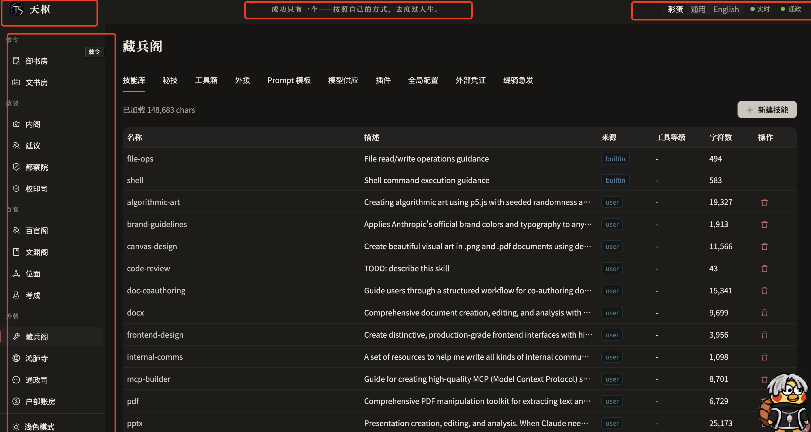
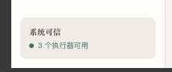

# 天枢桌面 Web 设计与图片索引

> **历史 UI 审批快照：** 这里的 12 张图片与四组十四部门壳层记录当时的设计和
> 验收证据，不是当前导航信息架构。当前产品已精简为五个一级入口，见
> [当前 Web 产品边界](../../CURRENT-STATE.md#web-产品边界)；图片保持为历史证据，
> 当前视觉/交互仍是 `user_approval_pending`。

## 权威级别

从高到低：

1. 用户冻结决策、[G3 正式计划](../plans/13-g3-desktop-web-productization.md)；
2. `assets/approved/` 的 12 张 2026-07-11 G0 通过截图；
3. 用户红框标注的生产壳层参考；
4. Web 审批设计和生产 palette；
5. Figma 初稿、比较图和旧生产页面；
6. `historical/` 修正前稿，禁止实现。

G0 图只证明桌面视觉和原型交互，不证明真实身份、持久裁决、后端 API 或自进化。
G3 正式实现必须消费真实服务端状态。

## 冻结要求

- 只做 1440×1024、1280×900 桌面 Web，不增加手机端。
- Logo 使用 `web/public/brand.png`，SHA-256：
  `3f2bb6cfdcac70092fce3a9b8b534c4a0627f444cb9db38a9651087688ace799`。
- 保留 `天枢`、`成功只有一个——按照自己的方式，去度过人生。`。
- 保留 `彩蛋 / 通用 / English / 实时 / 通政`。
- 保留 `中枢总览`、四组十四部门和左下主题/侧栏控件。
- 默认深色；深浅、展开/收起都要持久化并回归。
- 中文治理总称为“裁决”；批准/驳回是裁决结果。
- 禁用 `批红 / 朱批 / 司礼监代批`。
- 删除无口径“系统可信”“3 个执行器可用”“98.7% 可信度”。
- 原型 `mockData.js` 和截图数字不得导入或硬编码到生产 Web。

## 视觉语言

设计宪法：“墨为骨、朱为睛、纸为气”。

- 98% 界面使用墨、纸和低饱和灰阶；
- 朱砂只用于裁决、阻断、当前选中和 focus；
- 标题使用宋体体系，正文使用黑体体系，数字/ID/金额使用等宽字体；
- 暖纸白、烟墨、黛青、低饱和器物色；
- 禁止霓虹、强渐变、大面积金色、龙/宫殿纹样、玻璃拟态和重阴影；
- 动画 120–180ms，并尊重 `prefers-reduced-motion`。

当前生产 palette 副本见 [source/production-palette.ts](./source/production-palette.ts)。
旧“朱批”视觉文档只保留色彩原则，术语已由
[ADR-0012](./source/decision-terminology-adr.md) 废止。

## 三张核心页面

### 中枢总览

显示办理中、待裁决、预算、证据完整率、异常/恢复、进行中敕令、成长脉动和受控演化。
指标必须带来源、时间窗、分子/分母；零分母显示未知，不显示 100%。

### 敕令详情

显示 requested/effective Governance Contract、RunState、attempt、持久裁决、恢复点、
Evidence Bundle、变更、成本和结案。浏览器不提交 actor；高风险裁决必填理由并使用 CAS。

### 演化中心

显示 candidate、来源、基线、delta、样本、回归、安全、Evidence、rollback 和 routing truth。
G4 未证明真实 challenger 时显示“未启用”，不得显示虚假灰度百分比。

## 12 张权威 G0 图

| 文件 | 页面/状态 | 用途 |
|---|---|---|
| `control-center.dark.1440-expanded.png` | 中枢、深色、展开 | 默认桌面壳层与总览 |
| `control-center.light.1280-collapsed.png` | 中枢、浅色、收起 | 浅色与侧栏收起 |
| `edict-detail.light.1280-reason-required.png` | 敕令、空理由 | 高风险操作理由门 |
| `edict-detail.light.1280-approved-locked.png` | 敕令、已批准 | 结果与输入锁定 |
| `edict-detail.light.1280-reset-unlocked.png` | 敕令、重置 | 显式重置后解锁 |
| `edict-detail.light.1280-navigation-locked.png` | 敕令、往返 | 导航后状态仍保持 |
| `edict-detail.light.1280-rejected-local-only.png` | 敕令、驳回 | 不冒充真实持久化 |
| `edict-detail.dark.1440-expanded.png` | 敕令、深色、展开 | 完整详情布局 |
| `evolution-center.light.1280-overview-gate.png` | 演化、强门 | 18/50 时禁用晋升 |
| `evolution-center.light.1280-canary-filter.png` | 演化、筛选 | Canary 证据筛选 |
| `evolution-center.light.1280-observe-local-only.png` | 演化、观察 | 原型 local-only 边界 |
| `evolution-center.dark.1440-expanded.png` | 演化、深色、展开 | 完整演化布局 |

图片目录：[assets/approved](./assets/approved/)。文字审计见
[approved-interaction-audit.md](./approved-interaction-audit.md)。

## 用户冻结的生产壳层

该图冻结：Logo、格言、右上五项、四组十四部门、主题和折叠控件。它不冻结旧页面主内容。

## 明确反例

此卡片没有分子、分母、时间窗和下钻证据，用户已明确否决。不得换个名字重新实现。

## 目录说明

| 目录 | 属性 | Coding agent 规则 |
|---|---|---|
| `assets/approved/` | 权威视觉目标 | 实现构图/状态，示例数据不可复制 |
| `assets/references/` | 壳层、构图、比较参考 | 只使用明确标注的部分 |
| `assets/negative/` | 反需求 | 必须删除或避免 |
| `assets/historical/` | 修正前/旧生产/中间稿 | `SUPERSEDED — DO NOT IMPLEMENT` |
| `assets/brand/` | 文档 Logo 副本 | 正式代码仍引用 `web/public/brand.png` |
| `assets/launch-candidate/` | G5 发布素材候选 | 不能替换产品壳层 Logo |
| `source/` | palette、ADR、审计和历史视觉来源 | 注意旧术语状态 |

## UI 状态矩阵

| 范围 | 必须覆盖 |
|---|---|
| 壳层 | 1440/1280、深/浅、展开/收起、连接/重连/离线、ready/degraded/unavailable |
| 查询页 | loading、empty、data、stale-with-data、error、permission-denied、service-unavailable |
| 写操作 | idle、submitting、success、409/412 stale、403 denied、network uncertain、retryable/non-retryable |
| 裁决 | pending、reason-invalid、submitting、resolved-locked、expired、revoked/denied、CAS-conflict |
| Evidence | incomplete、complete、closed-immutable、download-error、governed replay created |
| 演化 | blocked、eligible、decision-required、observe、promoted、rolled-back、real-routing-disabled |
| Onboarding | required、in-progress、interrupted-resumable、configured、readiness-failed、permission-denied |

不做状态笛卡尔积。壳层保留固定视觉矩阵，组件测试覆盖其余状态，真实 Playwright 覆盖
中枢、持久裁决、Evidence 和演化阻断主旅程。

## 实现纪律

- 不复制原型巨型 CSS；从 `web/src/theme/palette.ts` 和现有组件体系增量实现。
- 不机械拆大页面，只按独立业务职责拆分。
- `web/src` 设置静态 Gate，禁止引用 `prototypes/` 和 `mockData.js`。
- API 不存在/失败时显示 unavailable/error，绝不回退示例数据。
- 裁决、晋升和 actor 只相信服务端；刷新必须恢复相同权威状态。
- 每个产品差异点至少有后端 contract test、页面 test 和浏览器证据。
- 自动 G3 Gate 通过仍记为 `user_approval_pending`，等待最终用户审批。
