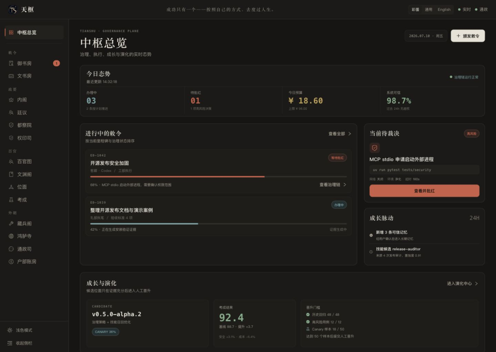
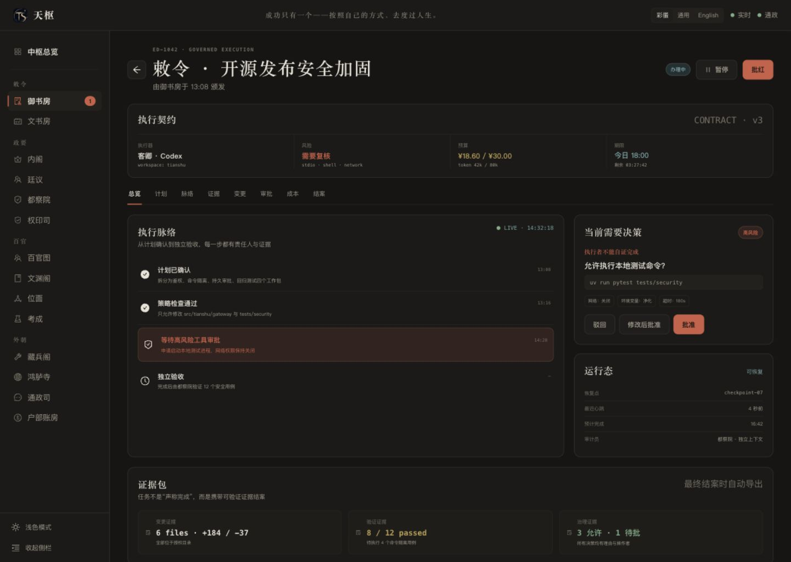
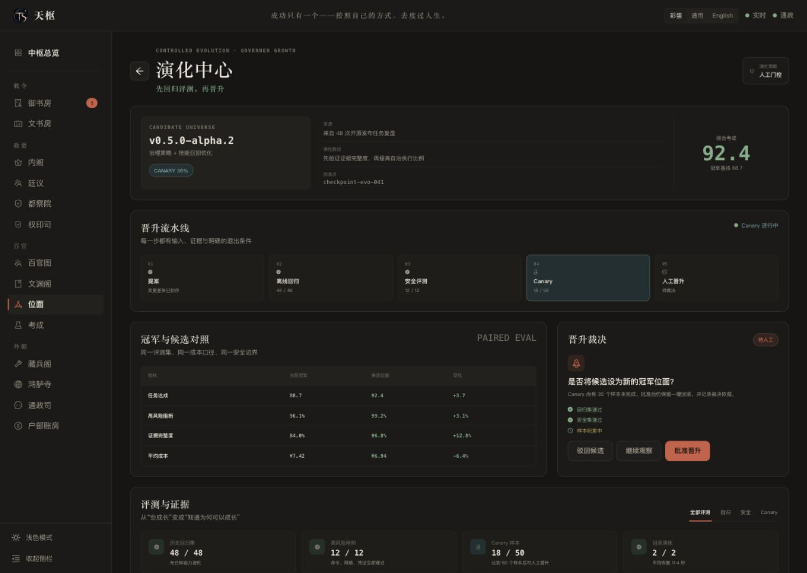

# 天枢桌面 Web 产品审计

> 状态：修正前审计快照，用于支持优化计划，不代表当前原型已通过验收。

## 审计范围

- 产品面：本地三页网页审批稿 `http://127.0.0.1:4173/`。
- 用户目标：看清全局状态、处理高风险裁决、判断候选位面是否可以晋升。
- 设备与状态：桌面 Web，1440 × 1024，深色模式，侧栏展开。
- 证据日期：2026-07-10。
- 限制：模拟数据、未接生产 API；本轮不审计手机端，也不据截图宣称完整 WCAG 合规。

## 总体结论

方向正确，三页已经把“可治理、可验证、持续成长”转成了可见产品结构。当前主要问题不是缺页面，而是四类信任缺口：治理术语尚未统一；部分指标不可解释；演化门禁与按钮状态矛盾；生产前端尚未形成可复用的状态与证据组件。

## Step 1 · 中枢总览

**健康度：良好，需修正指标与主次层级。**

### 已成立的部分

- 原有 Logo、标语、语言模式、实时状态及四组十四项的侧栏结构已保留。
- “办理中 / 待裁决 / 预算 / 治理状态”形成了清晰的第一层态势。
- 进行中敕令、待人工动作和成长演化同时可见，符合 Agent OS 管控面定位。
- 风险动作、预算和成长候选都有直达入口，核心任务入口明确。

### 主要风险

1. 原型把生产侧栏的 `百官阁` 改成 `百官图`，违反“原部门名称不动”的冻结约束。
2. 页面仍出现 `待批红 / 等待批红 / 查看并批红`，与已确认的 canonical 术语 `裁决` 冲突。
3. `系统可信 98.7%` 没有口径、分子分母和时间窗，容易构成不可验证的信任宣称。建议改为可下钻的 `治理合规率` 或 `证据完整率`。
4. 技能候选使用 `置信度 0.91`，但未说明校准方式和样本。建议改为证据数量、复用成功率和失败样本。
5. 次级文字偏小、偏暗；在深色模式下，说明文本和表格辅助信息的可读性需要实测对比度。

## Step 2 · 敕令详情

**健康度：治理链完整，裁决与证据模型仍需收口。**

### 已成立的部分

- 执行契约同时展示执行器、风险、预算、期限和工作区，具备治理入口所需上下文。
- 执行脉络明确区分计划确认、策略检查、人工裁决和独立验收。
- 当前决策面板把命令、网络、环境和超时放在同一视野内，降低误授权风险。
- 证据包将变更、验证和治理证据分开，直接表达“执行者不能自证完成”。

### 主要风险

1. 顶部 `批红`、页签 `审批`、时间线 `等待高风险工具审批` 和证据文案仍未统一为 `裁决`。
2. 对高风险批准缺少“为什么批准”的必填依据；后续审计只能看到结果，无法判断当时的权衡。
3. `修改后批准` 的修改对象、差异预览和生效范围不够明确，容易让用户误以为只是填写备注。
4. 证据项有数量但缺少来源、时间、哈希和可复现命令；作为开源差异点，需要形成可导出的 Evidence Bundle。
5. 暂停、驳回、批准等状态改变后，需要统一的进行中、成功、失败、超时和恢复反馈。

## Step 3 · 演化中心

**健康度：差异化最强，但门禁一致性是发布前阻断项。**

### 已成立的部分

- `提案 → 离线回归 → 安全评测 → Canary → 人工晋升` 将“会成长”转成可治理流程。
- champion/candidate 同口径对照、回滚点和证据列表共同构成了可信演化的核心故事。
- 页面没有把成长表达成后台自动改 prompt，而是明确保留人工门控和回滚。

### 主要风险

1. Canary 仅完成 `18 / 50`，但 `批准晋升` 仍可直接点击，和“达到门槛后晋升”的叙事冲突。未满足强制门禁时应禁用；若允许紧急覆盖，必须单独走带理由的高风险裁决。
2. `+3.7 / +3.1% / -6.4%` 没有样本数、波动范围和基线版本，容易产生伪精确感。
3. 页面需要区分硬门禁、建议门槛和信息提示；目前主要靠颜色和文字，制度层级不够明确。
4. 候选来源只写“48 次任务复盘”，还需展示具体变更 diff、提案者、触发证据和影响范围。

## 跨页面 UX 与无障碍风险

- 统一使用 `裁决`；`Decree` 仅作为现有内部兼容名，不对用户暴露。
- 所有状态必须同时使用文字、图形或图标，不只依赖朱砂、青绿等颜色。
- 核心正文建议不低于 13px，操作文字不低于 14px；次级灰需通过 WCAG AA 对比度实测。
- 核心流程需覆盖键盘顺序、可见焦点、Tab/对话框语义、状态变化播报和 200% 缩放。
- 每个生产页面必须有 loading、empty、error、permission denied、service unavailable 和 stale data 状态。
- 重页面应按路由懒加载；大表格和长时间线按需分页或虚拟化。

## 最高优先级改动

1. 恢复生产侧栏原名 `百官阁`，冻结四组十四部门名称、顺序和分组。
2. 统一 `裁决` 术语，并将所有旧称纳入迁移清单。
3. 禁止未满足强制门禁的候选直接晋升。
4. 用 `治理合规率 / 证据完整率 / 样本量` 替代不可解释的可信度和置信度。
5. 把执行契约、裁决面板、证据包、审计时间线和演化门禁沉淀为生产组件。
6. 在接入真实 API 前冻结 Evidence Bundle 与 Governance Contract 的字段。

## 证据限制

- 截图只能支持视觉层级、文案和可见交互判断；无法证明后端权限、崩溃恢复、幂等或真实灰度有效。
- 本轮未做屏幕阅读器、全键盘、浏览器缩放和自动对比度扫描；这些必须进入生产验收。
- 当前数据为原型模拟数据，任何百分比和成本数字都不是运行结果。
