# 天枢 G0 桌面 Web 验收审计

> 状态：**通过（passed）**。本结论只覆盖 G0 桌面网页审批稿，不代表生产前端、真实后端、持久化治理协议或手机端已经验收。

## 审计范围

- 产品面：`http://127.0.0.1:4173/` 的中枢总览、敕令详情、演化中心。
- 用户目标：看清全局态势，完成一次有依据、不可悄然篡改的高风险裁决，并判断候选位面能否晋升。
- 桌面视口：1440 × 1024、1280 × 900。
- 状态覆盖：深色 / 浅色、侧栏展开 / 收起、空理由校验、裁决锁定、导航往返、重置解锁、驳回真实性、晋升强门禁、评测筛选。
- 不在范围：手机端、真实 API、后端权限与持久化、屏幕阅读器、200% 缩放、自动对比度扫描。
- 证据日期：2026-07-11；使用 Codex 内置浏览器重新执行交互并覆盖截图，控制台结果也来自同一会话。
- 壳层视觉另与既有生产截图对照件 [`artifacts/qa-shell-side-by-side.png`](./assets/references/comparison-shell-full.png) 同屏核对。

## 总体结论

G0 桌面原型通过本轮验收，没有发现阻断页面审批的 P0 / P1 问题。冻结壳层、裁决语义、理由门槛、导航稳定的本地锁定状态、演化强门禁和筛选行为均与已批准方案一致。

## Step 1 · 中枢总览与冻结壳层

**健康度：通过。**

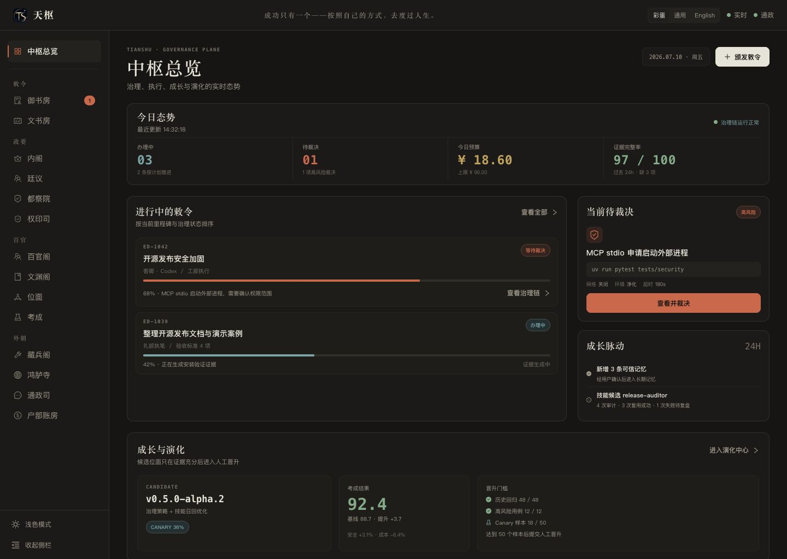

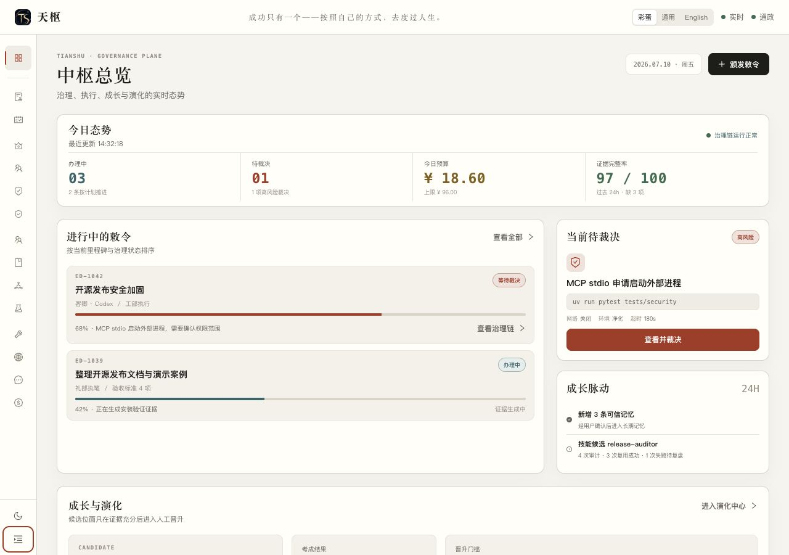

- 页面继续引用现有 `web/public/brand.png`；Logo 文件本轮无改动。
- 顶部原样保留“成功只有一个——按照自己的方式，去度过人生。”。
- 右上保留 `彩蛋 / 通用 / English / 实时 / 通政`，默认仍为 `彩蛋`。
- 左侧为 `中枢总览` 加四组十四个原部门，共 15 个可访问入口；名称、分组和 `百官阁` 均正确。
- 左下浅色 / 深色切换和侧栏收起 / 展开均可用；1280px 收起态没有遮挡主任务区。
- `证据完整率 97 / 100 · 过去 24h · 缺 3 项` 和技能复用证据都有分母、时间窗或样本说明，不再使用无口径的“可信度 / 信心分”。
- 与生产截图对照后，Logo、格言、右上控制组和部门信息架构均保持一致；新增内容只发生在主工作区。

## Step 2 · 高风险裁决必须填写理由

**健康度：通过。**

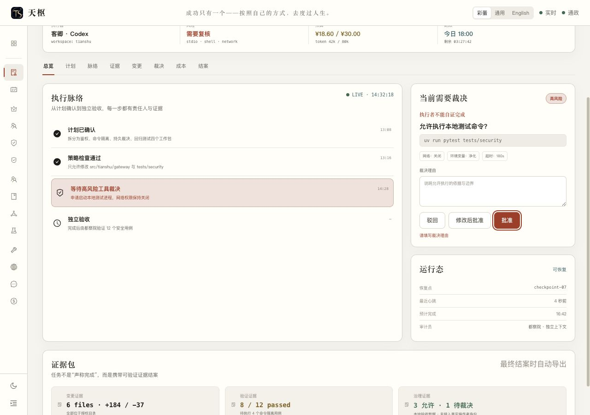

- 命令、网络、环境与超时边界在同一裁决面板内可见。
- 未填写理由直接批准时，页面阻止提交并显示“请填写裁决理由”。
- 错误提示使用文字状态，不只依赖颜色。

## Step 3 · 裁决后锁定本地验收状态

**健康度：通过。**

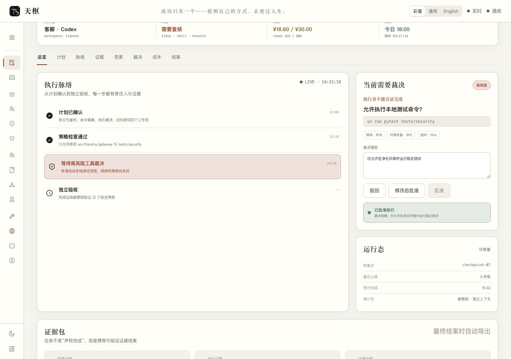

- 输入理由后可完成裁决；保存结果会去除理由首尾空白。
- 裁决结果、裁决依据同时展示。
- 理由输入框与“驳回 / 修改后批准 / 批准执行”三个动作全部禁用，不能在已裁决状态下悄然修改。
- 这是原型会话内的验收状态，不冒充真实持久化裁决或治理时间线。

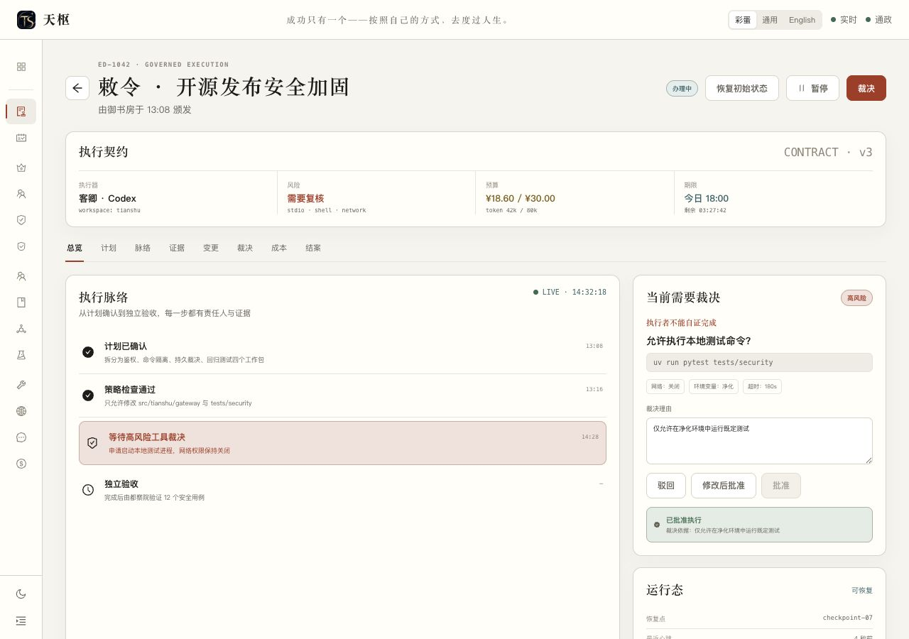

- 返回中枢总览再重新打开敕令，结果、依据与禁用态均保持；普通导航不能绕开锁定。

## Step 4 · 只有重置才能再次编辑

**健康度：通过。**

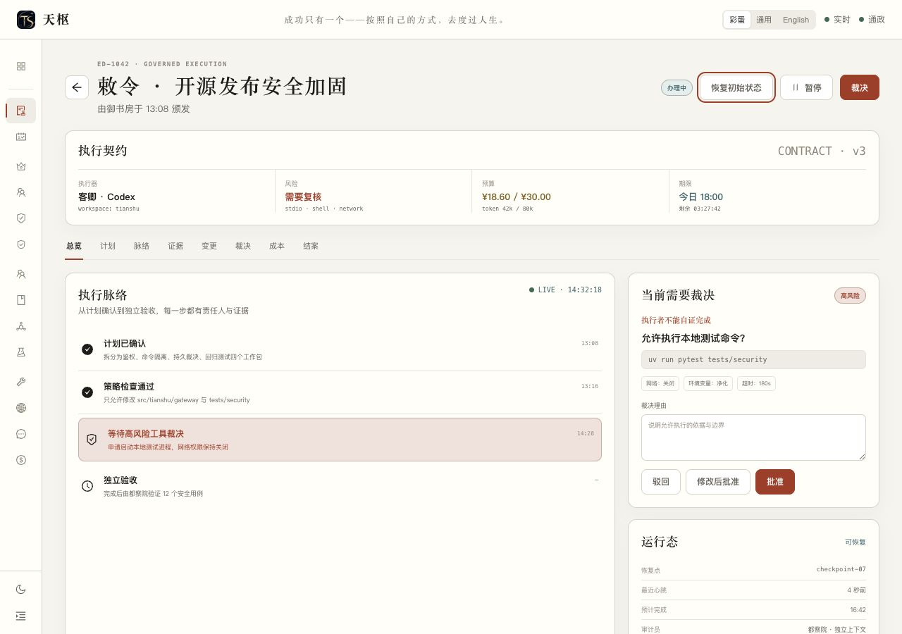

- 点击“恢复初始状态”后，理由输入框和三个裁决动作重新启用。
- 重置后的页面没有残留上一份裁决结果或理由。

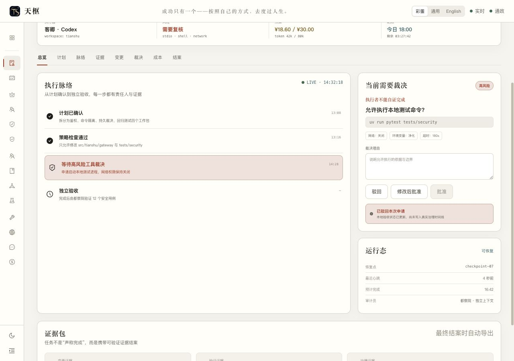

- 驳回明确显示“本地验收状态已更新，尚未写入真实治理时间线”，没有伪造持久化结果。

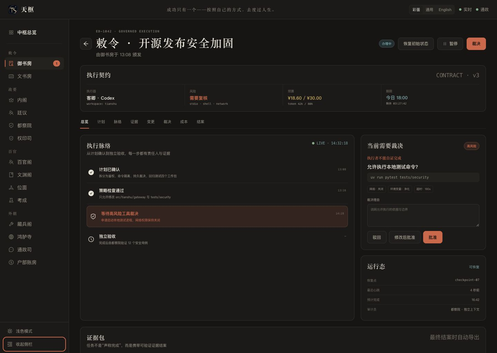

- 敕令详情在 1440 × 1024 深色展开态也完成布局复核，没有裁切、遮挡或层级错位。

## Step 5 · 可治理演化与强门禁

**健康度：通过。**

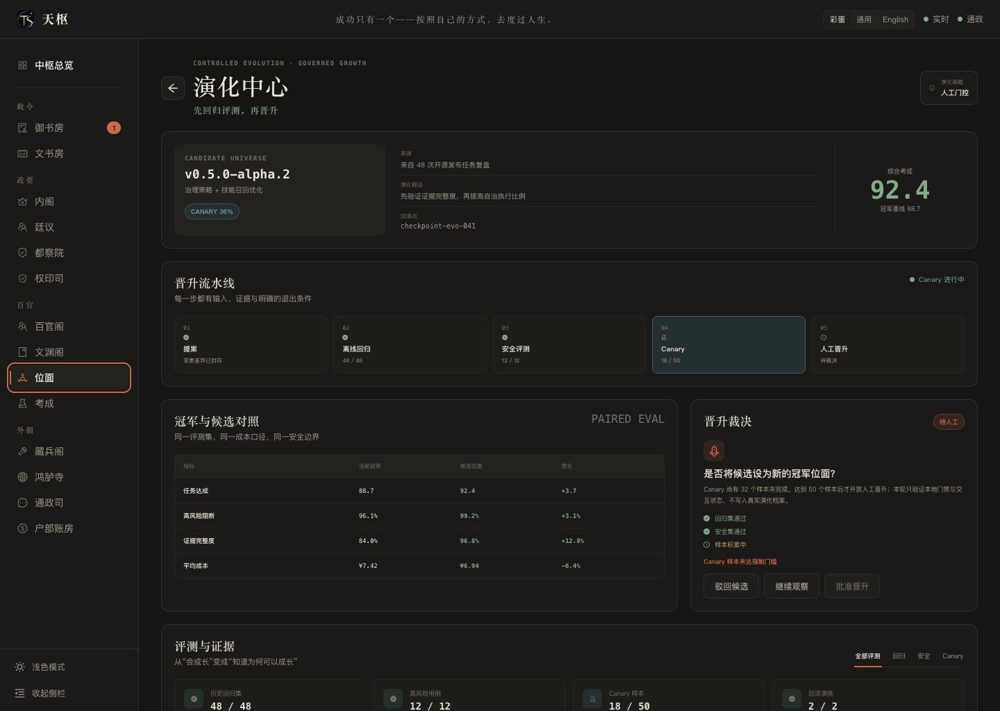

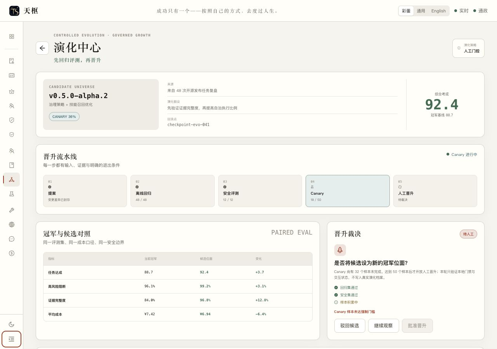

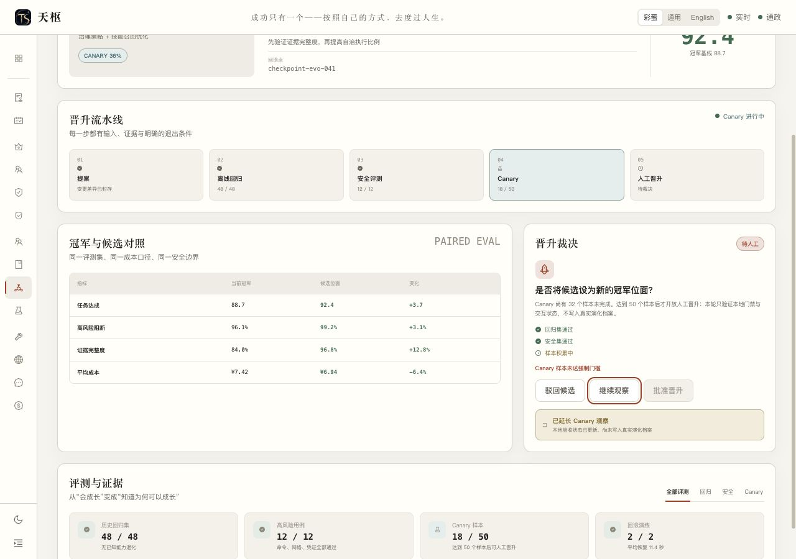

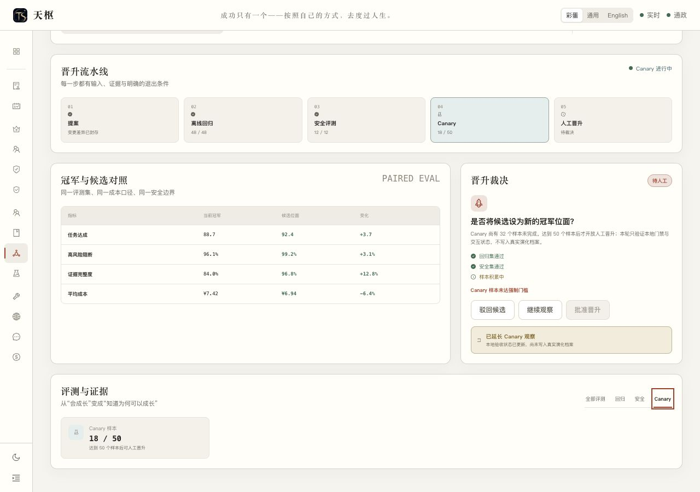

- `提案 → 离线回归 → 安全评测 → Canary → 人工晋升` 流水线完整可见。
- Canary 只有 `18 / 50` 时，“批准晋升”是原生禁用状态，并明确显示“Canary 样本未达强制门槛”。
- 文案说明只有达到 50 个样本后才开放人工晋升。
- “继续观察”只更新本地验收状态，并明确说明尚未写入真实演化档案。
- 切换到 `Canary` 筛选后，只保留 Canary 样本证据，筛选标签具有选中状态。

## 跨页面一致性

- 三个页面均保留同一 Logo、格言、右上控制组和部门侧栏。
- 可见文案中未出现 `批红 / 朱批 / 信心分 / 可信度`；治理动作统一为“裁决”。
- 深浅色与侧栏形态切换后，主任务、风险状态和主要按钮仍清楚可辨。
- 同一内置浏览器会话的控制台检查为 0 条错误、0 条警告。

## UX 与无障碍观察

### 已确认的优点

- 收起侧栏后，每个部门按钮仍有可访问名称；图标不是唯一语义来源。
- 风险、通过、待处理与禁用状态均有文字辅助，不只靠朱砂色或青绿色表达。
- 关键交互使用按钮、页签、文本框和状态区域等可识别语义。
- 主控台、裁决页、演化中心的视觉层级一致，科技感与新中式气质克制，没有新增装饰性噪音。

### 仍需后续验证

- 截图与本轮交互无法证明完整键盘顺序、屏幕阅读器播报、焦点陷阱、200% 缩放与 WCAG AA 对比度。
- 次级灰字在小字号场景仍应于生产实现中做自动对比度扫描和真实显示器复核。
- `彩蛋 / 通用 / English` 本轮只验收保留、选中态与布局，不验收完整翻译质量。

## 验收结论

**G0 桌面网页审批稿：通过。** 可以作为后续生产前端落地的视觉与交互基线；手机端、真实身份、持久化裁决、真实演化档案和后端系统能力仍按后续阶段单独验收。
