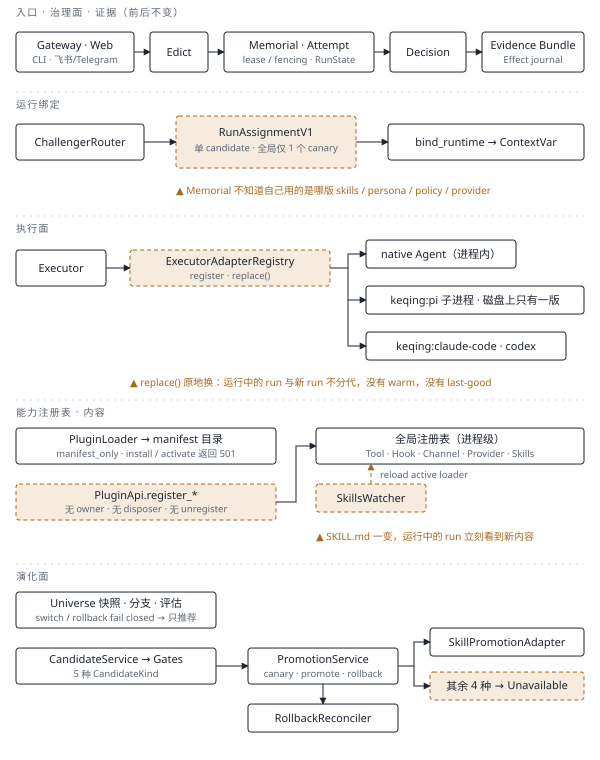
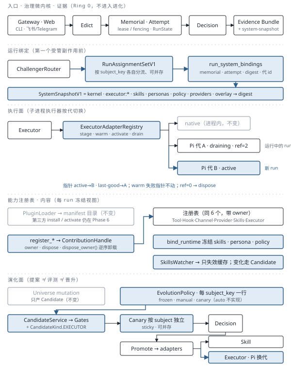
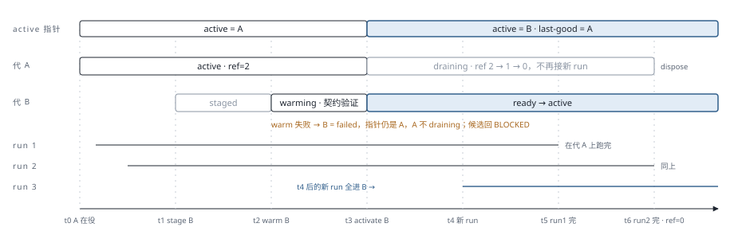

# 架构对照图：现在 → 目标

> **文档性质：目标架构的图示，不是当前能力承诺。**
> 左图是历史研究基线，以工作树 `88462b2a` 为准；右（目标）对应
> [评审与实现计划](review-and-implementation-plan.md) 中 PR-1、PR-2、PR-3a、PR-4、
> PR-3b/P5、PR-5 全部落地后的形态。

两张图用同一套横带逐行对照：**入口与治理 / 运行绑定 / 执行面 / 能力注册表与内容 /
演化面**。第一行是前后不变的治理骨架（Ring 0）；下面四行是插件化与自进化真正改动的地方。

图例：实线黑框 = 不变或保留；蓝色实框 = 新增或改变；赭色虚框 = 当前痛点；灰框 = 弱化但保留。

## 1. 现在（as-is，`88462b2a`）

> 这是实施前的 as-is，不代表 2026-08-26 实现分支。当前 checkpoint：P1/P3/P4a 已合入；
> P4b Issue #108 已完成 V34 per-subject assignment set、continuity sticky、深冻结与 truthful
> UI；PR #109 已创建、目标分支 CI 待完成；P5–P7 仍未完成。

治理骨架已经完整，但 run 只绑定一个 candidate overlay；执行器、注册表、内容三处都是
"直接换掉活体"，没有代际。

## 2. 目标（to-be，PR-1 → PR-3a → PR-4 → PR-3b/P5 → PR-5）

同一副骨架不动；新增的是一条"运行绑定 → 代际切换 → 按 subject 灰度"的纵向链路。
变化发生在版本之间，不发生在活体对象上。

## 3. 逐项差异

| 维度 | 现在 | 目标 | 落地 |
|---|---|---|---|
| 运行归因 | `RunAssignmentV1` 只记一个 candidate overlay；Evidence 有 effective contract、executor manifest、环境指纹，但没有 skills / persona / policy / provider 版本 | 每个 attempt 在第一个受管副作用前写独立 `run_generation_bindings`；snapshot 启用时另写 `run_system_bindings` 并挂 system-snapshot Evidence artifact。两者同在必须一致；snapshot 关闭时 system=0 行、marker 仍为精确 `bound []` 或代 id | PR-1 + PR-3a |
| 注册表所有权 | `register_*` 直写全局注册表；Tool / Channel 没有 unregister；`register_command` 靠 `hasattr` 临时挂属性 | `ContributionHandle(owner, dispose)`；`dispose_owner()` 逆序卸载一个插件的全部贡献 | PR-2 |
| 执行器换代 | `replace()` 原地换；没有 warm、没有 last-good；运行中的 run 与新 run 不分代 | stage → warm → activate；新 run 取新代，运行中的 run 固定旧代，exact-attempt lease 与 durable continuity roots 都释放后才 dispose；warm 失败指针不动 | PR-3a |
| 分流粒度 | 历史基线全局只允许 1 个 canary；P4b 分支已按 `(kind, subject_key)` 独立灰度并持久封存 assignment set | 按 subject 各自 canary、sticky 与 rollback；每插件一行 `EvolutionPolicy`：frozen / manual / canary | PR-4 |
| 版本漂移 | 客卿馆显示"待兼容验证"，人工确认后更新基线 | 漂移 → `CandidateKind.EXECUTOR` 候选 → Gates → per-subject canary → Decision → Executor adapter 换代 / 回 last-good | PR-3b / P5（PR-4 后） |
| 内容变更 | SkillsWatcher 直接 reload active loader，运行中的 run 会看到新内容 | run 在 bind_runtime 冻结内容视图；watcher 只失效缓存，变化走 Candidate | PR-4 之后 |
| 进程级发布 | 重启即当前代码，没有 snapshot 校验 | `tianshu serve --system-snapshot`；漂移记录，严格模式回 last-good | PR-5 |
| 不变 | Edict / Memorial / Attempt / Decision / Evidence / Effect journal / 静态 DAG / Universe fail closed / `automatic_promotion_allowed: Literal[False]` | 同左。治理微内核（Ring 0）不进入进化，`PromotionService` 只拆文件不拆职责 | — |

## 4. 换代是怎么发生的：Pi 执行器一次切换

切换只动指针，不动活体：run 1、run 2 从头到尾都在代 A；即使 exact-attempt lease 与
OPEN-continuity roots 都释放，只要 A 仍是 last-good 就继续保留；只有 last-good 已推进且其他
durable roots 也清空后才可回收。conversation / 深度任务的 follow-up 继承 root marker
的代 id，cron 每次触发取当时
的 active。warm 失败时代 B 置 `failed`、指针仍是 A、候选回 `BLOCKED`。

## 5. 落地顺序

| PR | 内容 | 估算 |
|---|---|---|
| PR-1 | `SystemSnapshotV1` 影子双写：bind_runtime 写 binding，Evidence 挂 artifact，只记漂移不拒 | ≈ 3–4 天，不改 active 行为 |
| PR-2 | `ContributionHandle`：6 个注册表补 owner / dispose，修 `register_command` | ≈ 1–2 天 |
| PR-3a | Pi 执行器代际、exact-attempt lease/marker 与 continuity 固定（不持久化整数 refcount） | ≈ 1.5–2 周 |
| PR-4 | 按 subject 灰度：拆掉"单一全局 canary"；`EvolutionPolicy` 表 frozen / manual / canary | ≈ 1.5 周 |
| PR-3b / P5 | 在 PR-4 后接入 EXECUTOR：漂移 → Candidate → Gate → per-subject canary → Decision → 晋升/回滚 | ≈ 1.5–2 周 |
| PR-5 | 进程级 snapshot 重启：`serve --system-snapshot`，严格模式回 last-good，`GenerationReconciler` 接管 process 指针 | ≈ 3 天 |

此后按 [migration-roadmap.md](migration-roadmap.md) Phase 4–6 把 Provider / Channel →
其他 Executor → Tool → Skill / Persona / Memory → 声明式 UI 逐类迁入 Capability seam；
第三方 Process / Wasm 隔离、签名 / SBOM / TUF、`auto` 模式仍是最后一阶段，前置条件不变。

图源：`docs/assets/design/self-evolving-agent-os/*.svg`（手写 SVG，可直接编辑）。
