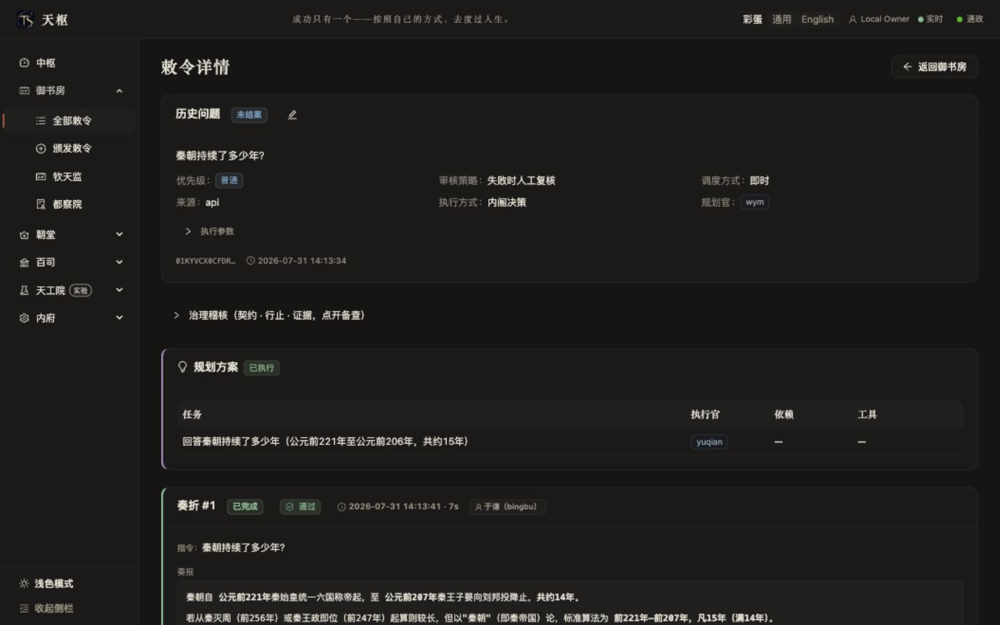

# Feature Tour

This tour covers the 20 user-facing capabilities currently exposed by Tianshu's real Web
application. Every screenshot comes from the current local implementation; genuine empty states
are preserved instead of being replaced with fabricated scores or runs. Treat
[Current State](../CURRENT-STATE.md) and the
[Capability Matrix](../launch/capability-matrix.md) as the authority for support boundaries.
Reachability does not turn an experimental capability into a stable promise or grant release
approval.

## 1. Overview

### Control Center

**Feature 1 of 20**

- **Entry**: sidebar **Control Center** → `/control`.
- **What users can do**: inspect active runs, unarchived Edicts, pending decisions, cumulative
  evidence, and the real status of long-running governance, Evolution, Universes, and guest agents;
  follow links to the related task, decision, or evidence.
- **Maturity**: available; final visual approval for the overall Web product shell is still pending.
- **Explicit boundary**: the four counts measure different facts, so a zero does not indicate failed
  synchronization. Regular users see their own scope and administrators see the global scope.
  Five-second foreground polling and WebSocket invalidation refresh the same authoritative source.
- **Related docs**: [User Guide](user-guide.md), [Web Frontend](../design/interfaces/web.md),
  [Current State](../CURRENT-STATE.md).

## 2. Tasks and Governance

### Royal Study

**Feature 2 of 20 · All Edicts**

- **Entry**: **Royal Study → All Edicts** → `/approvals`; `/edicts` is only a compatibility redirect.
- **What users can do**: search, filter by status, refresh, inspect overlapping immediate, one-time,
  recurring, long-running, conversational, and guest-agent labels, open details, and rename, edit,
  or archive tasks.
- **Maturity**: available.
- **Explicit boundary**: the default list contains only visible, unarchived tasks. "Open" means the
  task can continue, not that it is currently running. Archival hides normal listings without
  deleting governance or audit history.
- **Related docs**: [User Guide](user-guide.md),
  [Web Routes and State](../design/interfaces/web.md), [Observability](../ops/observability.md).

### Issue an Edict

**Feature 3 of 20**

- **Entry**: **Royal Study → Issue an Edict** → `/edicts/create`.
- **What users can do**: choose a quick, analysis, coding, or research task; enter the objective;
  select immediate, one-time, or recurring execution; and optionally expand expert controls for
  officials, models, budgets, tool policy, and acceptance criteria.
- **Maturity**: available.
- **Explicit boundary**: one-time execution must be scheduled in the future. Long-running tasks only
  support immediate or one-time execution, so recurrence is disabled. Expert controls remain
  optional rather than becoming a prerequisite for ordinary use.
- **Related docs**: [User Guide](user-guide.md), [Runtime Flow](../design/runtime-flow.md),
  [Scheduling Design](../design/scheduling/README.md).

### Long-running Task Governance

#### 4. Task details and continuation

- **Entry**: open `/edicts/:edictId` from the Royal Study; multi-node plans can link to
  `/dag/:dagId`.
- **What users can do**: inspect results, timeline, authoritative execution phase, plan and tool
  decisions, cost, and evidence; edit, follow up, close, withdraw, or resolve human intervention
  when the current state permits.
- **Maturity**: available.
- **Explicit boundary**: controls are state-dependent and are not always available. Only closed
  evidence bundles can be downloaded. Ownership and administrator permissions apply.
- **Related docs**: [User Guide](user-guide.md), [Runtime Flow](../design/runtime-flow.md),
  [Observability](../ops/observability.md).

#### 5. Checkpoints and supervision

- **Entry**: choose an analysis, coding, or research preset when issuing an Edict, then inspect the
  long-running governance sections in task details.
- **What users can do**: confirm the acceptance contract, inspect outer-loop iterations,
  checkpoints, and supervision reports, pause or resume, steer the next round while work is running,
  and resolve an L3 escalation.
- **Maturity**: stable with limited boundaries.
- **Explicit boundary**: only immediate and one-time scheduling are supported. Pauses take effect at
  round boundaries. Tianshu does not promise exactly-once behavior for arbitrary external side
  effects, arbitrary instruction points, or multi-node deployment.
- **Related docs**: [Long-task Walkthrough](long-task-walkthrough.md),
  [Orchestrator Design](../design/agent/orchestrator.md),
  [Troubleshooting](../ops/observability.md).

### Imperial Observatory

**Feature 6 of 20 · page title: Scheduled Work**

- **Entry**: **Royal Study → Imperial Observatory** → `/scheduler`.
- **What users can do**: manage one-time, Cron, and fixed-interval jobs; edit time, pause, resume,
  run now, inspect history, or cancel a schedule.
- **Maturity**: stable with limited boundaries.
- **Explicit boundary**: the page lists only manageable `once`, `cron`, and `interval` jobs.
  Internal cursors for immediate execution are retained for idempotency and audit but never appear
  as scheduled work. Run-now does not modify the original schedule. Scheduling is single-node.
- **Related docs**: [Scheduling Overview](../design/scheduling/README.md),
  [Scheduler Design](../design/scheduling/scheduler.md),
  [Scheduler Troubleshooting](../ops/observability.md).

### Censorate

**Feature 7 of 20**

- **Entry**: **Royal Study → Censorate** → `/audit`; task-scoped decisions and evidence remain in
  task details.
- **What users can do**: inspect usage and failure attribution, policy decisions, EventBus, workers,
  hooks, network events, audit rules, and system audit, then follow task links to decisions and
  evidence.
- **Maturity**: available within a single-host boundary.
- **Explicit boundary**: global statistics, network events, and SystemAudit require administrator
  access. Regular users only see facts for their own tasks. The tamper-evident chain is not an
  external WORM and cannot defend against a host administrator replacing the local database.
- **Related docs**: [Auditor Design](../design/auditor/README.md),
  [Tool and Decision Policy](../design/tools/policy.md), [Observability](../ops/observability.md).

## 3. Collaboration and Knowledge

### Officials

**Feature 8 of 20 · navigation: Ministry of Personnel; page: Officials**

- **Entry**: **Court → Ministry of Personnel** → `/personas`; an individual official is at
  `/personas/:personaId`.
- **What users can do**: create, edit, and delete officials or departments; inspect details and
  growth profiles; configure models, tools, skills, delegation, and routing; and preview an external
  persona import.
- **Maturity**: available; primary operations are locally Web-verified.
- **Explicit boundary**: external import takes only persona and prompt material. Discovered Skills
  are preview-only and are not installed or written to live state. High-risk tools and global memory
  access require careful authorization by the deployer.
- **Related docs**: [Persona Overview](../design/persona/README.md),
  [Officials and Routing](../design/persona/officials.md),
  [Model Registry](../design/model-registry.md).

### Consultation and Cabinet

#### 9. Consultation

- **Entry**: **Court → Consultation** → `/consultation`.
- **What users can do**: enter a topic and context, select participating officials, inspect each
  stance and key points, read the synthesis and final decision, and switch among rounds created in
  the current page session.
- **Maturity**: available; the primary flow is locally Web-verified.
- **Explicit boundary**: a real consultation invokes configured models and incurs usage. The page's
  round selector is not a complete long-term consultation archive browser and must not be presented
  as one.
- **Related docs**: [Consultation Design](../design/consultation/README.md),
  [Orchestrator Design](../design/agent/orchestrator.md), [Cost Design](../design/llm/cost.md).

#### 10. Cabinet

- **Entry**: **Court → Cabinet** → `/cabinet`.
- **What users can do**: inspect Planner volume, passthrough versus DAG distribution, average task
  count, and planning history with planner and assigned officials.
- **Maturity**: available as a read-only overview.
- **Explicit boundary**: the current Web page does not compose decisions, modify plans, or initiate
  planning. Planning is triggered by the Edict execution flow.
- **Related docs**: [Planner Design](../design/scheduling/planner.md),
  [Architecture](../design/architecture.md), [Runtime Flow](../design/runtime-flow.md).

### Academy, External Affairs, and Messaging

#### 11. Hanlin Academy (Memory Library)

- **Entry**: **Offices → Hanlin Academy** → `/memory`; the page title is Memory Library.
- **What users can do**: search memory by official, inspect access policy, conversation history, and
  statistics, delete or batch-delete entries, and run compaction or reflection.
- **Maturity**: stable with limited boundaries.
- **Explicit boundary**: the page has no direct manual memory-authoring control. Markdown is the
  source of truth and SQLite/FTS is a rebuildable index. Cross-host consistency is not promised;
  reflection may consume model resources and is rate-limited by a cooldown.
- **Related docs**: [Memory Overview](../design/memory/README.md),
  [Memory Palace](../design/memory/palace.md), [Memory Backends](../design/memory/backends.md).

#### 12. External Affairs

- **Entry**: **Offices → External Affairs** → `/hongluisi`.
- **What users can do**: inspect network-tool and provider status, configure fetch, search, fallback,
  and browser-engine preferences, review recent network events, and open credential management.
- **Maturity**: available, subject to the external environment.
- **Explicit boundary**: this is not a direct network-request console. Effective capability depends
  on tool registration, providers, credentials, and connectivity. API credentials are encrypted in
  System Management and must never appear in screenshots or documentation.
- **Related docs**: [Network Capability and Safety](../design/tools/network.md),
  [Credential Vault](../design/secrets/README.md), [Network Audit](../ops/observability.md).

#### 13. Messaging Office

- **Entry**: **Offices → Messaging** → `/tongzheng`.
- **What users can do**: create, edit, start, stop, and delete Feishu, Telegram, and other supported
  channel instances, and inspect their runtime state.
- **Maturity**: available with limited boundaries.
- **Explicit boundary**: successful local configuration or outbox acceptance does not prove final
  third-party display. The latest Web validation used an isolated eval environment and sent no real
  messages. Channel tokens, webhooks, and bot secrets must not enter screenshots or the repository.
- **Related docs**: [Channel Design](../design/interfaces/channels.md),
  [Multi-bot Operations](../ops/multi-bot.md), [Feishu Setup](../ops/feishu-setup.md),
  [Telegram Setup](../ops/telegram-setup.md).

## 4. Frontier Lab

### Evolution [Experimental]

**Feature 14 of 20 · page title: Evolution Center**

- **Entry**: **Frontier Lab [Experimental] → Evolution [Experimental]** → `/evolution`.
- **What users can do**: inspect authoritative enablement status, Skill candidates, gates, canary
  routing, promotion, and rollback evidence.
- **Maturity**: experimental.
- **Explicit boundary**: the current Web page is a read-only projection with no promotion or
  rollback controls. The system does not auto-promote candidates; non-Skill production activation
  remains closed, and full G4 is not complete.
- **Related docs**: [Current Skills Boundary](../design/skills/README.md),
  [Skill Learning](../design/skills/learning.md),
  [Capability Matrix](../launch/capability-matrix.md).

### Universes [Experimental]

**Feature 15 of 20 · navigation: Universe Platform; page: Universes**

- **Entry**: **Frontier Lab [Experimental] → Universe Platform [Experimental]** → `/universes`.
- **What users can do**: enable Universes, create Genesis, branch, generate code candidates, inspect
  diffs and evaluation history, archive, restore, or delete a Universe, and explicitly request a
  Taiyi report.
- **Maturity**: experimental.
- **Explicit boundary**: the Web page cannot switch the live runtime or promote code; candidates do
  not write themselves into live state. Taiyi GET is read-only, while an explicit POST may invoke a
  model. Eval mode rejects model-consuming generation.
- **Related docs**: [Universes Overview](../design/universe/README.md),
  [Code Variants](../design/universe/code-variant.md),
  [Universe Evolution](../design/universe/evolution.md).

### Evaluations [Trial]

**Feature 16 of 20 · page title: Evaluation Center**

- **Entry**: **Frontier Lab [Experimental] → Evaluations [Trial]** → `/evals`.
- **What users can do**: inspect real evaluation sets, runs, scores, success rates, historical
  deltas, and failure distribution.
- **Maturity**: Beta / trial.
- **Explicit boundary**: the Web page does not start model-consuming batches; batches are launched
  from the CLI. Empty state shows the real launch instructions rather than fabricated scores.
  Evaluation results do not auto-promote anything.
- **Related docs**: [Evaluation Design](../design/universe/eval.md),
  [Evaluation Operations](../ops/eval-harness.md),
  [Capability Matrix](../launch/capability-matrix.md).

### Guest Agents [Experimental]

**Feature 17 of 20 · page title: Guest Agents**

- **Entry**: **Frontier Lab [Experimental] → Guest Agents [Experimental]** → `/keqing`.
- **What users can do**: inspect the installed and verified versions, capabilities, and governance
  state of Claude Code, Codex, Pi, and OpenCode, and configure default model and per-run budget.
- **Maturity**: experimental.
- **Explicit boundary**: Tianshu does not auto-upgrade external CLIs, manage their credentials, or
  execute them from this page. Reliable pre-action interception and provider-side hard cost limits
  are unavailable. Installed version and verified compatibility baseline remain separate facts.
- **Related docs**: [Guest-agent Management Boundary](../design/keqing/management-page.md),
  [Current State](../CURRENT-STATE.md), [Capability Matrix](../launch/capability-matrix.md).

## 5. System and Cost

### System and Session Rules

#### 18. System Management

- **Entry**: **Inner Administration → System Management** → `/system`.
- **What users can do**: inspect Skills, toggle tools, manage prompts, providers, models, global
  settings, and external credentials, review plugin manifests, configure supported MCP servers, and
  inspect emergency-stop state.
- **Maturity**: mixed; stable configuration, read-only preview, experimental, and disabled
  capabilities coexist.
- **Explicit boundary**: the Skills catalog is read-only. Plugins are manifest-only and are not
  installed, loaded, or executed. Remote and open-stdio MCP remain disabled. Screenshots must never
  expose API keys, headers, tokens, or private local paths.
- **Related docs**: [Tools Overview](../design/tools/README.md),
  [Skills Boundary](../design/skills/README.md), [Plugin Boundary](../design/plugins/README.md),
  [Credential Vault](../design/secrets/README.md).

#### 19. Session Rules

- **Entry**: **Inner Administration → Session Rules** → `/session-rules`.
- **What users can do**: filter by scope and source, manually add Edict-scoped or global session
  rules, and revoke existing rules.
- **Maturity**: stable with limited boundaries.
- **Explicit boundary**: global session rules require administrator authority. After revocation,
  matching tool calls return to the decision flow. `shell_exec` / `bash` cannot receive a global
  bypass. Emergency stop is located in System Management.
- **Related docs**: [Tool and Session Policy](../design/tools/policy.md),
  [Runtime Boundaries](../ops/runtime-boundaries.md), [System Audit](../ops/observability.md).

### Cost and Budgets

**Feature 20 of 20**

- **Entry**: **Inner Administration → Cost and Budgets** → `/cost`.
- **What users can do**: inspect daily, weekly, and monthly summaries, budget progress, provider
  pricing, cost trends, and ledger records, and maintain supported budget and pricing configuration.
- **Maturity**: stable with limited boundaries.
- **Explicit boundary**: the ledger depends on provider-reported token usage and local pricing. It is
  best-effort cost governance, not an official provider invoice, prepaid balance, or provider-side
  hard limit.
- **Related docs**: [Cost Governance](../design/llm/cost.md),
  [Cost Troubleshooting](../ops/observability.md), [Current State](../CURRENT-STATE.md).

